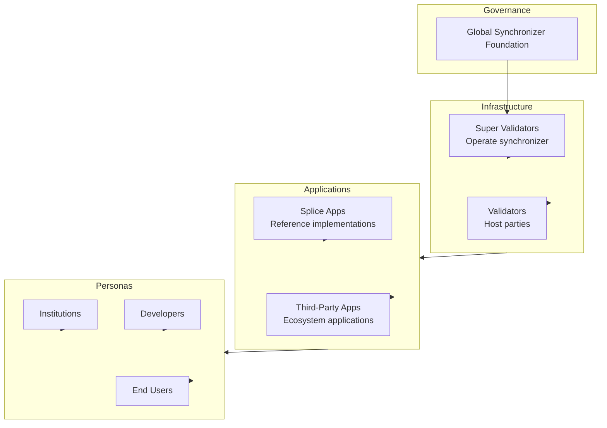

> 概览 of the Canton Network ecosystem including participants, 应用, and infrastructure

The Canton Network ecosystem encompasses the organizations, 应用, and infrastructure that make up the 网络. 本页 provides an overview of the ecosystem landscape.

## Ecosystem 概览

## 治理

### 全局同步器基金会（GSF） (GSF)

The GSF is an independent, non-profit body under the Linux Foundation that governs the 全局同步器.

| Responsibility            | 说明                           |
| ------------------------- | ------------------------------------- |
| **网络 policies**      | 设置 parameters and rules              |
| **Upgrade coordination**  | Manage 网络 upgrades               |
| **SV oversight**          | Oversee 超级验证者 participation |
| **Ecosystem 开发** | Foster 网络 growth                 |

****了解更多：** [canton.foundation](https://canton.foundation)

## 基础设施 Participants

### 超级验证者（SV）

超级验证者（SV） operate the 全局同步器 infrastructure and participate in governance.

| 角色                    | 职能                   |
| ----------------------- | -------------------------- |
| **Sequencer operation** | Order 交易         |
| **Mediator operation**  | Aggregate confirmations    |
| **治理**          | Vote on 网络 parameters |
| **Sponsorship**         | Onboard new validators     |

The current 超级验证者 set includes major financial institutions and technology 提供方.

### 验证者

验证者 host Party and run 参与者 nodes connected to the 全局同步器.

| 类型                      | 说明                                |
| ------------------------- | ------------------------------------------ |
| **企业 validators** | 运行 by organizations for their own Party |
| **服务 提供方**     | Offer validator 服务 to others         |
| **应用 operators** | 运行 validators for specific 应用   |

## 应用

### Splice 应用

[Splice](https://github.com/canton-网络/splice) is the open-source project providing reference 应用 for Canton Network.

| 应用       | 用途                       |
| ----------------- | ----------------------------- |
| **Canton Coin（CC）**   | Native token implementation   |
| **钱包**        | 用户 钱包 for CC management |
| **Scan**          | 网络 explorer              |
| **验证者 App** | 验证者 node management     |

### 应用 Categories

| 类别               | 示例                             |
| ---------------------- | ------------------------------------ |
| **Financial 服务** | Trading, settlement, custody         |
| **Asset tokenization** | Securities, real estate, commodities |
| **Supply chain**       | Trade finance, logistics             |
| **Identity**           | Digital identity, KYC                |

## 开发者 Ecosystem

### Tools and SDKs

| Tool           | 用途                  |
| -------------- | ------------------------ |
| **Daml SDK**   | Core 开发 toolkit |
| **Daml**       | Smart 合约 language  |
| **钱包 SDK** | 钱包 集成       |
| **PQS**        | 查询 optimization       |

### 开发 Resources

| Resource          | 说明                      |
| ----------------- | -------------------------------- |
| **QuickStart**    | 示例 应用 and LocalNet |
| **Documentation** | This site and related docs       |
| **Community**     | Slack, forums, 事件            |

## 网络 Statistics

Canton Network continues to grow across all metrics.

### 网络 Activity

For current 网络 statistics, visit:

* [Canton Network Explorer](https://scan.sync.global)
* [网络 Status](https://canton.foundation/sv-网络-status/)

## 参与方式

### As a 验证者

1. Review [infrastructure requirements](/global-同步器/understand/infrastructure-requirements)
2. Contact a [超级验证者](https://canton.foundation) for sponsorship
3. Complete the onboarding process
4. Begin operations

### As a 开发者

1. 启动 with the [QuickStart](/appdev/quickstart)
2. Learn [Daml](/appdev/get-started/choose-your-path)
3. Build and deploy your 应用
4. Join the 开发者 community {/* TODO: 添加 Slack link once available */}

### As an Institution

1. Evaluate Canton for your use case
2. Contact the [Canton Foundation](https://canton.foundation)
3. Explore partnership opportunities

## 生态资源

### Official Channels

| Channel                                            | 用途                              |                                             |
| -------------------------------------------------- | ------------------------------------ | ------------------------------------------- |
| [canton.网络](https://canton.网络)           | Main website                         |                                             |
| [canton.foundation](https://canton.foundation)     | Canton Foundation and validator info |                                             |
| Slack                                              | Community discussion                 | {/* TODO: 添加 Slack link once available */} |
| [GitHub](https://github.com/canton-网络/splice) | Splice source code                   |                                             |

### 事件

The Canton Network community holds regular 事件:

* 开发者 workshops
* 验证者 operations calls
* 治理 discussions

检查 [canton.网络](https://canton.网络) for upcoming 事件.

## 下一步

<CardGroup cols={2}>
  <Card title="集成 Patterns" icon="puzzle-piece" href="/集成/集成-patterns">
    Learn common 集成 approaches.
  </Card>

  <Card title="启动 Building" icon="code" href="/appdev/get-started/choose-your-path">
    Begin developing on Canton Network.
  </Card>
</CardGroup>

