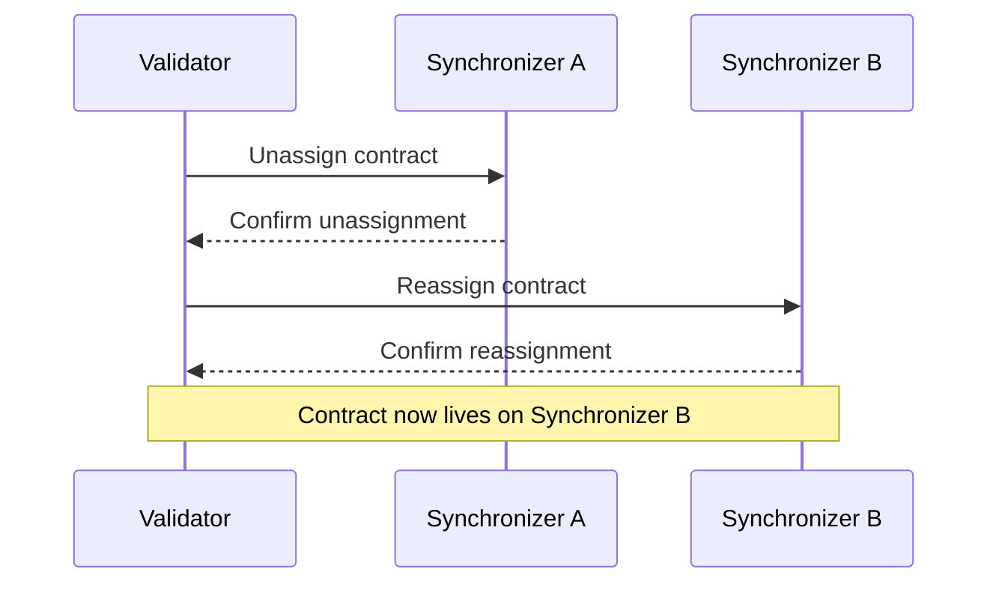

> 合约如何指派到 Synchronizer 以及如何在 Synchronizer 间移动

Canton Network 支持多个 Synchronizer 同时运行。账本上的每个合约都被指派到特定的 Synchronizer，且可根据需要在 Synchronizer 之间移动。该设计使网络能够水平扩展，并支持为不同用例部署专用 Synchronizer。

## 合约与 Synchronizer 指派

Canton 上每个活跃合约在任意时刻都恰好指派给一个 Synchronizer。该 Synchronizer 负责涉及该合约的交易排序与共识。当一笔交易触及不同 Synchronizer 上的合约时，Canton 会在两个 Synchronizer 之间协调该交易。

验证者本地存储其 Party 的合约数据。合约所指派的 Synchronizer 决定由哪个 Sequencer 和 Mediator 处理其交易，但合约数据本身仍保留在托管该合约利益相关方的验证者上。

## 取消指派与重新指派

合约可通过取消指派/重新指派协议从一个 Synchronizer 移动到另一个：

1. **取消指派（Unassignment）** — 合约从其当前 Synchronizer 上移除。在此短暂期间，该合约无法用于交易。
2. **重新指派（Reassignment）** — 合约被指派到目标 Synchronizer 并再次可用。

从合约利益相关方的视角看，该操作是原子的。合约永远不会同时存在于两个 Synchronizer 上，也永远不会处于可能丢失的状态。



## Global Synchronizer

Global Synchronizer 是 Canton Network 的主 Synchronizer，由 super-validator 在 Global Synchronizer Foundation 治理下运营。Canton Network 上大多数合约都指派给 Global Synchronizer，它也是新合约的默认 Synchronizer。

可为特定用例创建额外的 Synchronizer——例如，供希望将某些交易隔离的联盟使用的私有 Synchronizer。私有 Synchronizer 上的合约仍可通过跨 Synchronizer 交易与 Global Synchronizer 上的合约交互。

## 何时使用多个 Synchronizer

大多数应用只需 Global Synchronizer。在以下需求出现时，多个 Synchronizer 才变得相关：

* **隔离** — 将某些交易流与公共网络完全分离
* **性能** — 通过将高吞吐工作流分散到多个 Synchronizer 来降低争用
* **监管合规** — 确保某些交易仅由特定司法管辖区的特定验证者处理

# 多个 Synchronizer

## 动机

Participant 节点使用 Synchronizer 执行 Daml 交易，该 Synchronizer 可以是 Global Synchronizer 或私有运营的 Synchronizer。你可能需要多个 Synchronizer 的原因包括：

* **监管**

  某些受监管环境要求你掌控核心基础设施。或者，数据属地法律可能禁止你连接未部署在你运营区域内的 Synchronizer。

* **性能**

  不同 Synchronizer 具有不同的性能特征：有些可能侧重高吞吐，有些可能针对低延迟。你必须选择符合非功能性需求的 Synchronizer。

* **治理**

  Synchronizer 的治理可能是集中式或去中心式的。

* **成本**

  对于高吞吐用例，Global Synchronizer 的费用可能过高，你可能更倾向选择其他 Synchronizer。

* **应用限制**

  作为应用提供方，你可能决定将应用的使用限制在特定 Synchronizer 上。

为支持不同用例，一个 Participant 节点可连接多个 Synchronizer。

<div id="def-multi-sync-assignation">
  定义 合约的 **assignation（指派）**：
  对于任意 Daml 合约，托管该合约至少一名利益相关方的 participant 就用于协调该合约变更的 Synchronizer 达成一致。这一一致选定的 Synchronizer 称为该合约的 *assignation（指派）*。
</div>

更一般地，指导原则是：对于任意共享状态，维护该状态的 participant 就用于协调该状态变更的 Synchronizer 达成一致。

合约的利益相关方可同意变更合约所指派的 Synchronizer。这一称为 *reassignment（重新指派）* 的流程如下所述。重新指派是必要的，因为 Daml 交易在单个 Synchronizer 上执行，即所有输入合约都必须指派给该 Synchronizer。

## 涉及多个 Synchronizer 的交易

假设用户希望执行一笔涉及当前指派给不同 Synchronizer 的合约的 Daml 交易。可通过以下步骤执行该交易，下文将更精确地说明：

1. 找到适合该交易的 Synchronizer，记为 `S`

   `S` 应满足的条件见下文 [reassignment-validations](#reassignment-validations)。至少，所有利益相关方都应在 `S` 上托管，且每个输入合约的每个 package 都应在 `S` 上通过 vetting。

2. 将所有输入合约的 assignation 变更为 `S`（即将所有输入合约重新指派到 `S`）。

3. 在 `S` 上执行交易。

4. 如需要，将输出合约的 assignation 变更为另一个 Synchronizer。

变更合约 assignation 有两种方式：

* **自动**

  当用户提交交易时，Canton 的 Synchronizer 路由器会尝试识别可用于提交交易的最佳 Synchronizer。随后，它提交重新指派确认请求，使交易的输入合约重新指派到所选 Synchronizer。所有重新指派完成后，Synchronizer 路由器将 Daml 交易提交到所选 Synchronizer。

  注意，在此情况下，用户无需关心选择 Synchronizer 和执行重新指派。这使应用设计时无需考虑 Synchronizer。不过，应用可通过非同质拓扑（按 Synchronizer 的 package vetting 或 party 托管）以及显式披露的合约来影响路由。

* **显式**

  用户可精确控制 Synchronizer 路由，方式如下：

  * Ledger API 接受用于提交重新指派的命令。
  * 提交 Daml 交易时，用户可指定使用哪个 Synchronizer。若指定的 Synchronizer 不适合该交易，提交将失败。

### Synchronizer 的自动选择

当交易无法在单个 Synchronizer 上执行（因为并非所有输入合约都指派给同一 Synchronizer）时，Synchronizer 路由器会尝试为提交找到最佳公共 Synchronizer。

对于每个输入合约 `c``i`，记其在提交时刻的 assignation 为 `S``i`。若满足以下条件，Synchronizer `S` 对该交易是可接受的：

* 将 `c``i` 从 `S``i` 重新指派到 `S` 是有效的。
* 提交 participant 对每个 `c``i` 都是提交 party 的 reassigning participant。

在所有可接受的 Synchronizer 中，路由器将按以下优先级（重要性递减）选择：

* 优先级最高，
* 重新指派次数最少，
* Synchronizer id 最低。

### Global Synchronizer 的重要性

如上所述，要执行 Daml 交易，所有输入合约的所有利益相关方必须信任同一个 Synchronizer。此外，所有输入 package 必须在该公共 Synchronizer 上通过 vetting。Global Synchronizer 的目的是成为每个 party 都信任的标准 Synchronizer，从而可用于结算大多数交易。

## 重新指派协议

当合约 `c` 使用 Synchronizer `S` 创建时，利益相关方同意使用该 Synchronizer 协调合约的后续变更（例如 exercise 和 archive）。此时，`c` 的 assignation 为 `S`。要将 `c` 的 assignation 变更为不同的 Synchronizer `S'`，`c` 的利益相关方执行将 `c` 从 `S` 到 `S'` 的 *reassignment（重新指派）*。

本节描述重新指派协议。

### 概述

将合约 `c` 从 Synchronizer `S1`（称为 *source Synchronizer（源 Synchronizer）*）重新指派到 Synchronizer `S2`（称为 *target Synchronizer（目标 Synchronizer）*），使利益相关方能够将 assignation 从 `S1` 变更为 `S2`。该流程包含两个步骤：

* **取消指派（Unassignment）**

  合约的一名利益相关方提交从源 Synchronizer 取消指派该合约的命令。取消指派提交后，`c` 在源 Synchronizer 上处于非活跃状态，无法再使用。

  取消指派经历与交易协议相同的阶段。

* **指派（Assignment）**

  合约的一名利益相关方（不一定是提交取消指派的那一方）提交在目标 Synchronizer 上指派该合约的命令。指派提交后，`c` 在目标 Synchronizer 上变为活跃，可再次使用。

  指派经历与交易协议相同的阶段。

两个步骤可在下图可视化：

<div id="reassignment-high-level" />


因此，合约的重新指派是在两个不同 Synchronizer（源与目标）上涉及两次确认请求的**非原子**流程。取消指派成功后，合约被标记为 **pending assignment（待指派）**，在指派完成前无法使用。

在从 Ledger API 角度介绍重新指派之前，请考虑以下定义。

<div id="def-multi-sync-reassignment-counter">
  定义：**reassignment counter（重新指派计数器）**
  **reassignment counter（重新指派计数器）** 记录合约被重新指派的次数。合约创建时设为零，每次取消指派加一。取消指派事件与对应的指派事件具有相同的 reassignment counter。
</div>

### 从 Ledger API 与应用视角看重新指派

unassign 命令包含以下字段：

* 待重新指派的合约（批次中所有合约必须具有相同的签名方集合和相同的利益相关方集合），
* 源 Synchronizer（当前 assignation），
* 目标 Synchronizer。

成功的取消指派产生 unassigned 事件，包含以下字段：

* unassign id：不透明标识符，唯一标识该重新指派，用于提交 assignment。
* reassignment counter：合约被重新指派的次数。
* assignment exclusivity：在此时间之前（以目标 Synchronizer 时间计量），仅取消指派的提交者可发起 assignment。

assign 命令包含以下字段：

* unassign id，
* 源 Synchronizer（先前的 assignation），
* 目标 Synchronizer。

成功的指派产生 assigned 事件，包含以下字段：

* unassign id：可用于关联 unassigned 与 assigned 事件。
* reassignment counter：值与 unassigned 事件中相同。
* created event：合约数据（参见 `entering-leaving-visibility` 了解其用途）。

### 运行示例

为说明不同场景与定义，我们考虑一个 `Iou`，其签名方为 Bank，观察者（所有者）为 Alice，并讨论将 `Iou` 从 `S1` 重新指派到 `S2`。

网络拓扑如下：

* 五个 participant `P1`、…、`P3` 和两个 Synchronizer `S1`、`S2`。
* 托管关系如下图所示。括号中的字母表示权限（Submission、Confirmation、Observation）。

<div id="multi-synchronizer-running-example" />


### 围绕重新指派的主要定义

在介绍作为取消指派与指派请求确认一部分所执行的验证之前，我们需要若干定义。

#### 目标时间戳

处理取消指派请求时，确认 participant 需检查目标 Synchronizer 是否满足某些要求（例如所需 package 已通过 vetting）。这些要求取决于目标 Synchronizer 上的拓扑，而拓扑可能随时间变化。为确保所有相关 participant 执行相同验证并得出相同结论，取消指派请求包含目标 Synchronizer 的时间戳，用于所有与拓扑相关的验证。

定义：**target timestamp（目标时间戳）**
提交取消指派时，会在目标 Synchronizer 上请求 time proof。该时间戳用于在取消指派处理期间执行与目标 Synchronizer 相关的验证（package 已通过 vetting、利益相关方在目标 Synchronizer 上托管等）。该时间戳称为 **target timestamp（目标时间戳）**。

#### Reassigning participant

由于利益相关方可托管在多个 Participant 节点上，且拓扑可能非同质（例如，Participant 节点可能仅在其连接的部分 Synchronizer 上托管某个 party），参与重新指派的 Participant 节点可能仅是取消指派请求或仅是指派请求的 informee（参见下文关于合约进入与离开 Participant 节点可见性的讨论）。此类 Participant 节点无法执行全部验证（这需要同时连接到源与目标 Synchronizer），也无法防范双花（重新指派的合约在源与目标 Synchronizer 上同时活跃）。由此引出以下定义。

定义：**reassigning participant（重新指派 participant）**
对于合约 `c`，若满足以下条件，participant `P` 是 party `S` 的 **reassigning participant（重新指派 participant）**：

1. `S` 是 `c` 的利益相关方。
2. 在 target timestamp 时刻，`S` 由 `P` 在目标 Synchronizer 上托管。
3. `S` 由 `P` 在源 Synchronizer 上托管。

最后一项条件在提交时使用最近的拓扑快照检查，在协议第 3 阶段使用请求时刻的拓扑快照检查。

在运行示例中，`P1`、`P3` 和 `P5` 是 reassigning participant。`P2` 不是 reassigning participant，因为它未连接到目标 Synchronizer。类似地，`P4` 未连接到源 Synchronizer，因此也不是 reassigning participant。

#### Signatory unassigning participant

描述重新指派确认策略的关键要素之一，是推导 Participant 节点成为取消指派请求 confirmer 必须满足的条件。如前所述，一项要求是节点为 reassigning participant。

此外，我们只希望合约签名方确认。由于签名方可在源 Synchronizer 上 archive 合约并在目标 Synchronizer 上（重新）create，要求观察者等其他 party 确认取消指派请求不会带来额外安全性。

由此引出以下定义。

定义：**signatory unassigning participant（签名方取消指派 participant）**
对于合约 `c`，若满足以下条件，participant `P` 是 party `S` 的 **signatory unassigning participant（签名方取消指派 participant）**：

1. `S` 是 `c` 的**签名方**。
2. `P` 是 `S` 的 reassigning participant。
3. `S` 在源 Synchronizer 上由 `P` 托管，且至少具有 confirmation 权限。

在运行示例中，signatory unassigning participant 为 `P3` 和 `P5`。Participant `P1` 未托管合约的签名方，`P2` 和 `P4` 对任何 party 都不是 reassigning participant。

#### Signatory assigning participant

定义：**signatory assigning participant（签名方指派 participant）**
对于合约 `c`，若满足以下条件，participant `P` 是 party `S` 的 **signatory assigning participant（签名方指派 participant）**：

1. `S` 是 c 的**签名方**。
2. `P` 是 `S` 的 reassigning participant。
3. `S` 在目标 Synchronizer 上由 `P` 托管，且至少具有 confirmation 权限。

非正式地说，signatory assigning participant 会收到合约的取消指派与指派通知，并是指派请求的 confirmer。

在运行示例中，唯一的 signatory assigning participant 是 \`P5\`：

* `P1` 未托管合约的签名方。
* `P3` 托管签名方，但仅有 observation 权限。

### 确认策略

本节讨论哪些 informee participant 应为取消指派或指派请求发送确认响应。

由于部分验证只能由 reassigning participant 执行，且只有合约签名方应确认重新指派请求，因此取消指派的 confirmer 恰好是 signatory unassigning participant，指派的 confirmer 恰好是 signatory assigning participant。

mediator 对一名签名方期望的确认数量，恰好等于该签名方的 confirmation threshold（取消指派在源 Synchronizer 上，指派在目标 Synchronizer 上）。

### 取消指派与指派请求的验证

重新指派验证规则背后的指导原则：

* 重新指派合约不应剥夺利益相关方使用合约的能力。
* 合约取消指派后无法指派的风险应降至最低（请记住重新指派是非原子的）。

现在可形式化作为取消指派请求处理一部分需执行的验证：

* 合约 `c` 在源 Synchronizer 上处于活跃状态。
* 每个利益相关方都托管在 reassigning participant 上。
* 每个签名方 `S` 都托管在足够数量的 signatory assigning participant 上。更精确地说，若 `S` 在目标 Synchronizer 上的 confirmation threshold 为 `t`，则 `S` 至少需要 `t` 个 signatory assigning participant。这消除了 signatory assigning participant 不足、导致重新指派无法完成的风险。
* 合约对应的 package 必须在目标 Synchronizer 上通过 vetting。
* 若请求包含多个合约，批次中所有合约必须具有相同的签名方和利益相关方。

作为指派请求处理一部分需执行的验证更简单。确认 participant 需确保：

* 该 assignment 对应尚未完成的重新指派。
* 合约对应的 package 已通过 vetting。

还会执行一些并非取消指派或指派特有、常规 Daml 交易也会执行的额外验证：

* view 可正确解密，
* recipient 列表正确，
* root hash message 正确，
* 等等。

### 提交策略

若 `P` 托管 `c` 的至少一名利益相关方 `S`，且 `P` 是 `S` 的 reassigning participant，则 participant `P` 可提交合约 `c` 的重新指派（取消指派或指派）。**不**要求 `P` 以 submission 权限托管 `S`。

不要求 submission 权限即可提交重新指派的原因包括：

* 在运行示例中，当 `Iou` 重新指派到 `S2` 时，Alice 失去在其上 exercise choice 的能力，因为她在 Synchronizer `S2` 上未以 submission 权限托管。由于她可发起重新指派回 `S1`，她有途径恢复对 `Iou` exercise choice 的能力。
* 去中心化 party 无法提交 Daml 交易，但应能提交重新指派，以实现应用的可组合性。

<div className="todo">
  实现 external party 用例后补充说明 \<[https://github.com/DACH-NY/canton/issues/25878](https://github.com/DACH-NY/canton/issues/25878)>
</div>

### 合约进入与离开 participant 可见性

考虑本页的运行示例。

Participant `P2` 是取消指派确认请求的 informee participant，但不是指派请求的 informee，因为它未在 `S2` 上托管 alice。因此，从 `P2` 的视角看，指派完成时合约不会变为活跃：合约在该 participant 上变为不可用（这仅被允许是因为 Alice 在 `P1` 上同时在 `S1` 和 `S2` 托管）。在此场景中，我们说合约*离开* `P2` 的*可见性*。

现在考虑“相反”场景。Participant `P4` 是指派确认请求的 informee participant（作为在 `S2` 上托管 Bank 的 participant），并在指派过程中获知该合约。完成后，合约可在 `P4` 上使用。在此场景中，我们说合约*进入* `P4` 的*可见性*。由于 created event 包含在 assigned event 中，应用可在合约进入 Participant 节点可见性时获知合约 payload。

从 participant 的视角看，合约在其生命周期中可多次进入和离开其可见性。若 participant 上托管的所有利益相关方均为 multi-hosted，就可能发生这种情况。

### 更新流的非因果性

本节关注**更新流（updates stream）**，其中仅包含合约的（去）激活：`Created`、`Archived`、`Unassigned` 和 `Assigned`。内容可轻松扩展以覆盖还包含 non-consuming exercise 的 update tree 流。

对于合约 `c` 和托管 `c` 利益相关方的 Participant 节点，我们考虑为 `c` 在更新流上发出的所有事件列表。当仅涉及单个 Synchronizer 时，该列表最多恰好包含两个元素：

* 第一个元素是 `c` 的 `Created`（激活）。
* 当合约不活跃时，最后一个元素是 `Archived` 或 `Exercised`（去激活）。
* 激活的 record time 严格小于去激活的 record time。更一般地，更新流上的事件按其 record time 排序。

当 Participant 节点连接到多个 Synchronizer 时，更新流由所有 Synchronizer 的事件合并而成。由于无法跨 Synchronizer 比较时间，我们决定不对事件的全局排序提供任何保证。特别是：

* 不能对发生在不同 Synchronizer 上的事件的排序做任何假设。
* 排序可能因 participant 而异。

因此，在多 Synchronizer 场景下，**更新流上没有全局因果性**。

例如，考虑以下场景：

* 合约 `c` 在 Synchronizer `S1` 上创建。
* `c` 从 `S1` 取消指派到 `S2`。
* `c` 指派到 `S2`。
* `c` 被 archive。

在同时在 `S1` 和 `S2` 上托管利益相关方的 participant 的更新流上，事件可能以以下任一顺序出现：

* `created`、`unassigned`、`assigned`、`archived`
* `created`、`assigned`、`unassigned`、`archived`
* `assigned`、`created`、`unassigned`、`archived`
* `assigned`、`archived`、`created`、`unassigned`
* `created`、`assigned`、`archived`、`unassigned`
* `assigned`、`created`、`archived`、`unassigned`

特别是，`created` 事件不一定是第一个，`archived` 也不一定是最后一个。

注意，每个 Synchronizer 的事件投影是因果一致的，这意味着

* `created` 始终出现在所有 `unassigned` 或 `archived` 之前，且
* `archived` 始终出现在所有 `assigned` 或 `created` 之后，
* 不存在连续的激活或去激活（特别是没有连续的 `assigned` 或 `unassigned`）。

最后，回顾上文，Participant 节点可能通过 assignment 获知合约，因此更新流不保证包含 `Created` 或 `Archived`。

### 重新指派与争用

assignment 是一种激活，因此影响类似于 create。类似地，unassignment 是一种去激活，影响类似于 archive。特别是，assignment 和 unassignment 都会锁定合约，这意味着重新指派会与其他工作流（包括只读交易）产生争用。若重新指派由 Synchronizer 路由器在交易提交过程中自动执行，这种额外争用可能出乎意料且难以调试。建议在设计 Daml 工作流时显式考虑重新指派，以最小化争用。

## 多 Synchronizer 时间

<div className="todo">
  补充本节内容 \<[https://github.com/DACH-NY/canton/issues/25859](https://github.com/DACH-NY/canton/issues/25859)>
</div>

与账本模型的时间单调性相关

与 command dedup 时间模型对比

{/* COPIED_START source="docs-website:docs/replicated/canton/3.4/overview/explanations/canton/traffic-management.rst" hash="c8ff2996" */}

# 流量管理

Sequencer 是 Canton synchronizer 的关键组件，运营成本显著。因此 Canton 提供机制保护其免受滥用，并控制 synchronizer 各成员在一段时间内可排序的数据量。为此，synchronizer 的 sequencer 执行流量核算并强制执行流量限制。本页说明该机制。

## 提交请求

Sequencer API 提供 `SendAsync` RPC，用于在 synchronizer 上排序事件。提交请求是 SendAsync RPC 的 payload，是流量管理的主要关注点，因为 sequencer 将其大部分资源用于处理这些 RPC。

### 流量成本

流量成本旨在从两个维度衡量提交请求的处理成本：

* 接收者读取事件产生的网络流量
* 事件中 sequencer 的存储成本

流量成本考察提交请求的两个组成部分：

* 发送者

* envelope 列表。每个 envelope 包含：

  > * payload（任意字节）
  >
  > * 接收者列表（synchronizer 成员）。接收者可按以下方式寻址：
  >
  >   > * 单独寻址
  >   > * 通过组寻址。组寻址允许将特定接收者集合作为组寻址。例如，组地址 `AllMembersOfSynchronizer` 会将 payload 发送给 synchronizer 的所有成员。

提交请求的流量成本按以下方式计算（伪代码）：

```
fn calculate_submission_request_traffic_cost:
    envelopes_cost = 0

    for envelope in envelopes:
        storage_cost = envelope.payload
        network_cost = envelope.payload * envelope.recipients.size * read_vs_write_scaling_factor
        submission_request = storage_cost + network_cost
        envelopes_cost = envelopes_cost + submission_request

    return base_event_cost + envelopes_cost
```

其中 `base_event_cost` 是加到 envelope 成本上的提交请求常数成本，`read_vs_write_scaling_factor` 是根据接收者数量缩放网络成本的常数因子。两者均为 synchronizer 的配置参数，属于拓扑的一部分。详见配置章节。通常 `read_vs_write_scaling_factor` 量级约为 1/10000，用于缩小 payload 大小以反映接收者读取事件时的网络带宽。

组地址在计算成本前解析。这意味着寻址到 `AllMembersOfSynchronizer` 的消息，其网络成本将按提交请求时 synchronizer 成员数量缩放。

流量成本对 synchronizer 上排序的每个提交请求向发送者收取。提交请求包括 confirmation request、confirmation response、ACS commitment、topology request 和 time proof。

由于 time proof 在技术上为空消息，其流量成本始终等于 `base_event_cost`。

Synchronizer 成员通常向 synchronizer 发送定期 acknowledgement，确认已收到发给它们的事件。这使 sequencer 可安全 prune 事件。Acknowledgement 不产生流量成本，但受速率限制以防滥用。

## 流量核算

synchronizer 的 sequencer 联合执行流量核算。每个授权 synchronizer 成员在请求排序后，从其流量余额中扣除其提交请求的成本。上述流量参数作为 synchronizer 动态 domain 参数的一部分配置，因此可能变更。因此，请求成本可能在提交到 sequencer API 的时刻与排序时刻之间发生变化（若期间流量参数已更新）。为此，每个成员在发送时计算提交请求的预期成本，并将其包含在请求的 metadata 中。为防止流量参数并发更新时提交失败，sequencer 允许宽限期，在此期间成员计算的成本可与排序时刻的成本不同，只要提交时成本计算正确。超出此时间窗口，提交将被拒绝，必须以最新流量成本重试。该窗口时长等于 `(confirmationResponseTimeout + mediatorReactionTimeout) * 2`。有关这些参数的更多详情，请参阅动态 synchronizer 参数文档。

当节点订阅接收给定 synchronizer 的多个 sequencer 的事件时，它向所有 sequencer 请求当前流量状态，并以 Byzantine Fault Tolerant（BFT）方式比较。这为节点提供初始流量状态，随后随着从订阅中观察到自身事件被排序，节点在内存中持续更新流量状态。

### 流量强制执行

下图给出强制执行流程与场景的高层概览。


该图有几点需要强调。

强制执行发生在提交流程的两个节点：

* 步骤 1 之后，sequencer 从发送者收到提交请求。此阶段 sequencer 使用其对发送者流量状态的本地认知，决定发送者是否有足够流量。若判定发送者流量不足，在此阶段拒绝请求。

* 步骤 3 之后，每个 sequencer 从 BFT 排序层读取已排序事件。此阶段每个 sequencer 运行与步骤 1 相同的逻辑，但使用该事件排序时刻发送者的流量状态。这使每个 sequencer 能对发送者是否有足够流量做出相同的确定性决策。

  > * 若发送者流量不足，事件不会发送给其接收者，发送者收到说明原因的 deliver error。这称为“wasted sequencing”，将在指标中如此报告。
  > * 若发送者流量充足，从发送者余额扣除流量。此后取决于事件是否有效且可交付给接收者。sequencer 在事件可交付前还会执行流量控制之外的额外验证（如验证签名、接收者是否存在等）。若这些验证通过，事件被交付，发送者收到包含 `TrafficReceipt` 的 delivery receipt。该 receipt 使发送者能相应更新流量状态。若事件在其他方面无效，事件不会被交付，发送者收到说明失败原因的 delivery error。最后这种情况称为“wasted traffic”，并在指标中如此报告。

## 获取流量

### 基础流量

synchronizer 的所有成员随时间被动累积基础流量。注意，此处时间指 synchronizer 时间，而非发送者的挂钟时间。流量累积速度及成员可累积的基础流量上限由 synchronizer 的流量配置决定。基础流量通常有限，用于 bootstrap 节点并使其连接到需要最低流量的 synchronizer。大多数真实场景需要获取额外流量。

### 额外流量

可通过在至少 `SequencerSynchronizerState.threshold` 个 sequencer 的 Sequencer Admin API 上调用 `SetTrafficPurchased` RPC，为 synchronizer 的任意成员获取额外流量。`SequencerSynchronizerState` 是定义 synchronizer 活跃 sequencer 的拓扑交易。它带有 threshold，定义必须批准影响 sequencer 的变更（包括流量状态）的最少 sequencer 数量。因此，要在 synchronizer 上为成员添加额外流量，同一流量购买请求必须在可配置时间窗口内向至少 threshold 个 sequencer 提交。

<Warning>
  该请求设置成员已购买额外流量的**新绝对总值**。**不是**流量增量。例如，若 participant P1 当前额外流量为 `0`，希望购买 `1000` 额外流量额度，则金额为 `1000` 的 `SetTrafficPurchased` 请求必须被至少 `SequencerSynchronizerState.threshold` 个 sequencer 成功处理。若之后 P1 希望再增加 `500` 额外流量额度，则金额为 `1500` 的新 `SetTrafficPurchased` 请求必须被成功处理。
</Warning>

<Tip>
  获取额外流量在文档中常称为“top up（充值）”。
</Tip>

#### Serial

每个 `SetTrafficPurchased` 请求需设置 serial number。serial number 是用于确保请求幂等性并正确处理同一成员并发流量更新的整数。发送请求时，sequencer 验证 serial number 高于该成员上次使用的 serial number。若 serial 过低，请求失败，必须以正确 serial 重试。要获取当前 serial，参见观察流量。

获取额外流量需要访问 Sequencer Admin API 并在 sequencer 之间同步。在 Canton Network 中，该同步通过账本上的 Daml 工作流处理，使每个 super validator 更新获取流量成员的额外流量余额。

## 观察流量

### 流量状态

Sequencer Admin API 通过 `SequencerAdministrationService.TrafficControlState` RPC 暴露 synchronizer 所有成员的流量状态。participant 节点的 Admin API 通过 `TrafficControlService.TrafficControlState` RPC 暴露 Participant 节点的流量状态。

Participant 节点上观察到的状态相比从该 Participant 节点的 sequencer 观察到的状态略有延迟，因为 participant 从其 sequencer 订阅收到的事件更新状态，而按定义这发生在 sequencer 排序事件之后。

### 指标

sequencer 报告若干与流量相关的指标，可用于监控 synchronizer 的流量状态。参见 Canton Metrics

## 配置

流量通过每个 synchronizer 的动态 synchronizer 参数配置。

```protobuf theme={"theme":{"light":"github-light","dark":"github-dark"}}
// 可累积的基础流量最大字节数
uint64 max_base_traffic_amount = 1;

// 基础速率可累积的最大时长
// 因此 base_traffic_rate = max_base_traffic_amount / max_base_traffic_accumulation_duration
google.protobuf.Duration max_base_traffic_accumulation_duration = 3;

// 计算事件成本的读取缩放因子。单位为万分比。
uint32 read_vs_write_scaling_factor = 4;

// 用于计算提交请求最大排序时间的窗口大小
// 影响提交在调用者应重试之前预期被接受的速度
// 默认为 5 分钟
google.protobuf.Duration set_balance_request_submission_window_size = 5;

// 若为 true，流量额度不足的提交请求将不会被交付
bool enforce_rate_limiting = 6;

// 所有已排序事件的基础事件成本（字节）
// 可选
optional uint64 base_event_cost = 7;
```

如何在 how-to 章节配置流量的说明见该章节。
