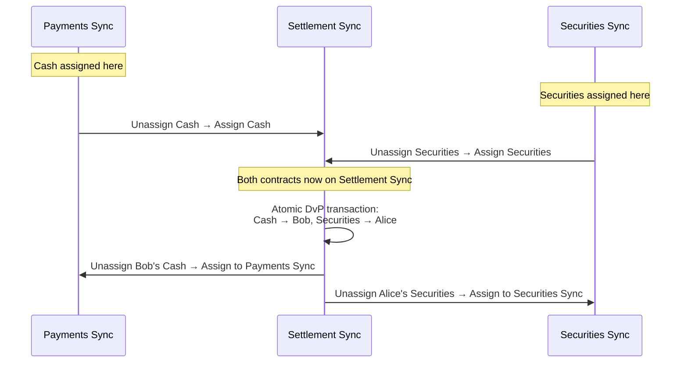

> 跨多个 Synchronizer 的 DvP 交割工作流示例，展示 Canton 重新指派协议

本页逐步说明双方资产位于不同 Synchronizer 时的 Delivery-versus-Payment (DvP) 交易，展示重新指派协议如何在不要求全部资产源于同一基础设施的前提下实现原子结算。

## 设定

**Party 与角色：**

* **Alice**（买方）— 欲 acquire 证券，持有现金
* **Bob**（卖方）— 欲出售证券，将收现金
* **PaymentBank** — 现金合约的 signatory
* **SecuritiesDepository** — 证券合约的 signatory

**Synchronizer：**

* **Payments Sync** — 由支付联盟运营；现金合约指派于此
* **Securities Sync** — 由资本市场基础设施运营；证券合约指派于此
* **Settlement Sync** — 公共 synchronizer（如 Global Synchronizer），各方与 signatory 均连接

**合约：**

* `Cash` — signatory: PaymentBank；owner: Alice。指派于 Payments Sync。
* `Securities` — signatory: SecuritiesDepository；owner: Bob。指派于 Securities Sync。

各方验证者连接与其相关的 Synchronizer。Alice 的验证者连接 Payments Sync 与 Settlement Sync。Bob 的验证者连接 Securities Sync 与 Settlement Sync。PaymentBank 与 SecuritiesDepository 的验证者连接全部三个。

## 为何需要多个 Synchronizer？

现金与证券合约位于不同 Synchronizer 出于实务原因：不同结算基础设施由不同实体治理，可能适用不同监管，性能与成本特征各异。支付网络与证券结算系统 unlikely 共用单一 Synchronizer。

Daml 交易只能消费指派于同一 Synchronizer 的合约。要原子结算 DvP——现金给 Bob、证券给 Alice、一步不可分割——须先将两合约重新指派到公共 Synchronizer。

## DvP 工作流

### 步骤 1：商定交易条款

Alice 与 Bob 商定 DvP（链下或通过 `TradeAgreement` 合约），条款指定将交换的现金与证券合约。

### 步骤 2：连接 Settlement Sync

涉及的全部验证者须连接 Settlement Sync。若 Settlement Sync 为 Global Synchronizer，多数验证者已连接。若为私有 synchronizer，Alice、Bob、PaymentBank、SecuritiesDepository 的验证者须在重新指派前建立活跃连接。

### 步骤 3：将现金重新指派到 Settlement Sync

`Cash` 从 Payments Sync 重新指派到 Settlement Sync，两阶段：

1. 在 Payments Sync **Unassignment** — 合约在 Payments Sync 失活，进入「pending assignment」。
2. 在 Settlement Sync **Assignment** — 合约在 Settlement Sync 激活。

此后 `Cash` 可用于 Settlement Sync 上的交易，不再用于 Payments Sync。

### 步骤 4：将证券重新指派到 Settlement Sync

`Securities` 经相同 unassignment/assignment 序列从 Securities Sync 移到 Settlement Sync。

### 步骤 5：原子结算

两合约现均指派于 Settlement Sync。单笔 Daml 交易执行 swap：归档原 `Cash` 与 `Securities`，创建新合约——Bob 拥有的 `Cash` 与 Alice 拥有的 `Securities`。因两输入合约在同一 Synchronizer，该交易原子：要么两笔转移均发生，要么均不发生。

### 步骤 6：重新指派回原 Synchronizer

结算后可将新合约指回原 Synchronizer：

* Bob 的新 `Cash` 从 Settlement Sync 指回 Payments Sync。
* Alice 的新 `Securities` 从 Settlement Sync 指回 Securities Sync。

此步可选。合约在 Settlement Sync 上可用，但指回更适合其生命周期的基础设施（未来转让、公司行动等）。

## 时序图

## 各状态下合约位置

| 状态                     | Cash 合约                    | Securities 合约                |
| ------------------------- | -------------------------------- | ---------------------------------- |
| 初始             | Payments Sync（owner: Alice）     | Securities Sync（owner: Bob）       |
| 重新指派现金后       | Settlement Sync（owner: Alice）   | Securities Sync（owner: Bob）       |
| 重新指派证券后 | Settlement Sync（owner: Alice）   | Settlement Sync（owner: Bob）       |
| 原子结算后   | Settlement Sync（owner: **Bob**） | Settlement Sync（owner: **Alice**） |
| 指回后       | Payments Sync（owner: Bob）       | Securities Sync（owner: Alice）     |

## 原子性边界

重新指派步骤（3、4、6）各为两步、各自独立交易。合约 unassignment 与 assignment 之间处于「pending assignment」，**不可使用**。若 assignment 失败（如拓扑变更），合约保持 pending 直至解决。

结算步骤（5）**是原子的**。Daml 交易要么全部提交要么完全不提交。不存在 Alice 已付现金未收证券或反之的状态。

关键设计：重新指派将合约移到可执行原子交易的公共 Synchronizer。重新指派本身是两笔独立交易，合约可能暂时不可用，但**不承担结算风险**——直至原子步骤执行，价值不转移。

## 延伸阅读

* [Reassignment Protocol](/overview/reference/reassignment-protocol) — unassignment 与 assignment 协议细节
* [Architecture Overview](/overview/learn/architecture) — Synchronizer、验证者与 Global Synchronizer 如何配合
