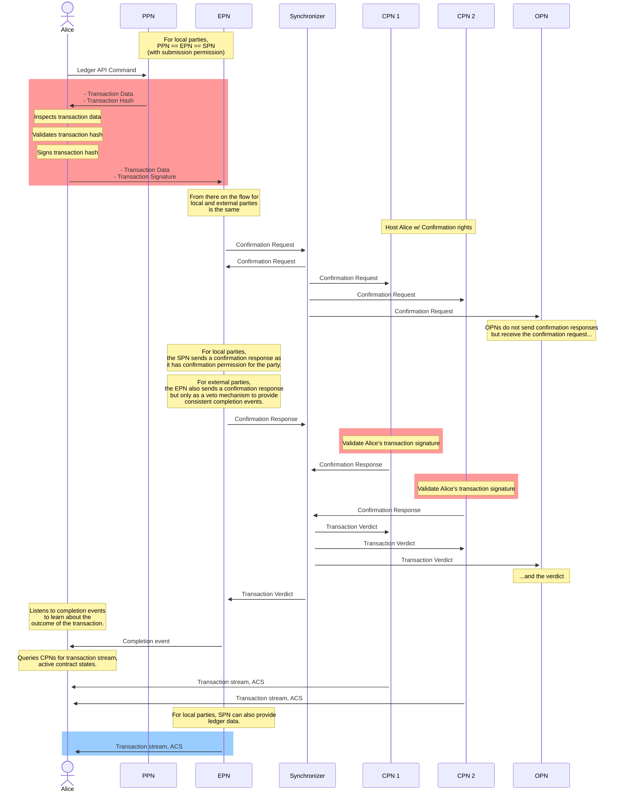

> 本地与外部 Party、托管关系，以及原生签名与外部签名的区别。

# 本地与外部 Party

在 Canton 中，**Party** 代表能在账本上创建合约并与之交互的实体。每个 Party 托管于一个或多个 **Participant 节点**，节点作为 Party 与账本的中介。不同交互需要 Party 的适当认证与授权。本节说明 Party 如何接入 Canton 协议、涉及的信任关系及其含义。

<Tip>
  关于签名密钥与授权的常见问题，见本页末尾 FAQ。
</Tip>

## 托管关系

Party 的托管关系指定各 participant 的权限与确认阈值。

Participant 代托管 Party 时可具有不同权限。

### 提交型 Participant（SPN）

具有提交权限的节点称为 **Submitting Participant Node** (SPN)。Party 委托 SPN 单方面授权向账本提交 Daml 交易。各 SPN 用自有私钥代 Party 签署并授权交易。这是 participant 最强权限；SPN 按定义亦为 CPN 与 OPN（见下）。

### 确认型 Participant（CPN）

具有确认权限的节点称为 **Confirming Participant Node** (CPN)。Party 委托 CPN 确认并授权有效交易提交账本。CPN 可用自有私钥签署确认响应，但不能为 Party 发起交易。CPN 按定义亦为 OPN。CPN 配置阈值；Canton 协议要求至少 threshold 个 CPN 确认方可使有效交易提交。单一 CPN、阈值为 1 是最简情形。

直接后果是可用性与安全的权衡：

* 阈值越高，安全越高但可用性越低：更少离线 CPN 即可阻止交易获批
* 阈值越低，可用性越高但安全越低：更少恶意 CPN 即可批准无效交易

<Note>
  因 Canton 隐私属性，仅 CPN 与 SPN 能可靠强制提交节点具有提交权限。原则上恶意 CPN 可试图代 Party 提交尽管无提交权限。多 CPN 托管且阈值 > 1 可有效缓解；对本地 Party，无 SPN 能单独授权提交，实际上使代提交不可行。
</Note>

### 观察型 Participant（OPN）

具有观察权限的节点称为 **Observing Participant Node** (OPN)。Party 委托 OPN 忠实记录并提供涉及其交易的只读访问。仅观察权限的节点不能代托管 Party 提交或确认。

## 提交密钥持有者

自行持有并控制提交签名密钥的 Party 为 submission key holder。Canton 支持注册多对提交签名密钥及阈值。关联私钥仅由 Party 控制使用；Party 负责管理维护，方式由运营方或客户端应用决定，超出 Canton 范围。通常用户使用托管商或 KMS 保护密钥。

最简情形为单密钥对、阈值 `1`，单次签名即可提交。更复杂流程可能需要多签；此时可注册多（唯一）密钥对并提高阈值。Canton 保证交易至少 threshold 个不同密钥的有效签名方可授权上链。密钥与阈值在 `PartyToKeyMapping` 拓扑交易中定义。

```protobuf theme={"theme":{"light":"github-light","dark":"github-dark"}}
// mapping a party to a key
// authorization: whoever controls the party uid
// UNIQUE(party)
message PartyToKeyMapping {
  // the party
  string party = 1;
  // the authorization threshold
  uint32 threshold = 3;
  // the designated signing keys
  repeated com.digitalasset.canton.crypto.v30.SigningPublicKey signing_keys = 4;

  reserved 2; // was synchronizer_id = 2
}
```

## 命名空间（Namespace）

Namespace 是 Canton 拓扑概念。每个 Party 存在于某 namespace，由该 namespace 根签名密钥对的公钥导出。每个 Canton 节点亦自有 namespace。Namespace 本质上定义 Party 或节点在网络上的身份。

## 本地 Party（Local party）

**本地 Party** 指有一个或多个 SPN 的 Party。其与某 SPN 共享 namespace，从而将拓扑管理委托给 SPN 运营方。本地 Party 是与 Canton 账本交互的最简方式，对托管节点信任最高，适合需要自动化代 Party 运行命令的场景——SPN 可全权提交而无需显式批准。

## 外部 Party（External party）

**外部 Party** 是 submission key holder、**无** SPN、自有唯一 namespace（由自有签名密钥控制，而非 SPN namespace）的 Party。`PartyToKeyMapping` 允许 Party 用自有密钥向账本提交交易，但**不**授予任何节点**提交权限**。这通过要求 Party 显式批准才能上链，减轻 Participant 的监管负担。外部 Party 仍须**至少一个 CPN** 代其确认交易并记录账本状态，以保持合理延迟并提供可信账本记录来源。

## 本地与外部 Party 托管对比

|       | Local Party | External Party |
| ----- | ----------- | -------------- |
| # SPN | at least 1  | 0              |
| # CPN | any number  | at least 1     |
| # OPN | any number  | any number     |

## 提交流程（Submission Flow）

本地与外部 Party 的区别在于：外部 Party 用于授权交易的私钥仅由 Party 控制（本地 Party 由 SPN 控制）。外部 Party 须用私钥显式签署每次提交，具体是签署准确代表交易若成功提交将全部 ledger 效果的 transaction tree 哈希。生成该交易需要复杂逻辑、Daml 解释引擎、最新拓扑与 ACS 等。为简化，外部 Party 提交分两步：

* **准备（Preparation）**：将 Ledger API 命令转为 Daml 交易。可由连接目标 synchronizer 且具备交易所需包的任意 Participant 执行，称为 **Preparing Participant Node (PPN)**。须具该 Party 的 `readAs` 范围方可代其准备。

* **执行（Execution）**：将交易与签名发往连接目标 synchronizer 的 Participant，该节点将交易转发给 synchronizer，称为 **Executing Participant Node (EPN)**。须具该 Party 的 `actAs` 范围方可代其执行。

读取路径（观察已提交交易）上，外部 Party 可从 CPN 或 OPN 读取交易流；为额外安全可从多个读取并以阈值交叉比对以实现拜占庭容错。

下列时序图描述本地与外部 Party 的提交流程及差异：

* 红底交互仅属外部 Party
* 蓝底交互仅属本地 Party
* 无底色交互两者共有



## 限制

* **本地 Party**：
  * 若 participant 阈值 > 1，Party 不能提交交易，仅能确认其作为利益相关方的交易。
* **外部 Party**：
  * 单根节点：仅支持单根节点交易。
  * 单提交 Party：仅支持需单一 Party 授权的交易。
* **本地与外部共有**：
  * 单次提交的 command completion 仅在用于提交的 SPN（外部 Party 为 EPN）可用
  * 单次提交的 command deduplication 仅在用于提交的 SPN（外部 Party 为 EPN）可用

## 信任模型

### 定义

* **User**：具 `actAs` 该 Party 权限的 Ledger API 用户，假定按 Party 意图忠实提交命令。
* **Party owner**：控制 Party namespace 密钥的个人或实体，假定按 Party 意图进行 Party 治理。

### 信任关系

* **SPN**：用户完全信任 SPN。例如 SPN 可在无用户批准下为本地 Party 提交并授权其须授权的任何交易。

* **CPN**：
  * 用户信任少于 threshold 个 CPN 会按 Canton 协议代托管 Party 正确批准或拒绝。
  * 若 threshold 个 CPN 恶意，可错误批准无效交易（含外部 Party 的无效外部签名）。
  * 用户信任少于 threshold 个 CPN 运营方会审查恶意或无效 Daml 包。诚实 CPN 须将新包与旧版比较；若 ACS 中有旧版创建的活跃合约，诚实 CPN 须在 vet 新版前获得 signatory 批准。若 threshold 个 CPN 运营方 vet 恶意包，可在新或现有合约上运行任意智能合约代码。

* **PPN**：用户不信任 PPN。

* **EPN**：用户不信任 EPN，例外：
  > * 从其获得的 command completions
  > * 通过 max_record_time 使用 TTL 时

例如 EPN 可故意发出错误 completion，使用户以为失败而实际已成功并重试；亦可忽略或修改 `max_record_time` 使 TTL 不按用户意图执行。

### 用户责任

通过 participant 提交命令时用户须遵循：

* **SPN 与 CPN**：Party 所有者谨慎选择 SPN 与 CPN。

* **PPN**：用户可视化 PPN 返回的 prepared transaction，确认符合意图；验证其中数据以确保可安全提交，尤其：
  * 交易对应用户意图的 ledger 效果
  * preparation time 不早于 synchronizer 当前 sequencer 时间。可靠做法是将 `preparation_time` 与以下最小值比较：
    > * 提交应用墙钟时间
    > * 至少 participant threshold 个 CPN 发出的最后 record time + synchronizer 配置的 `mediatorDeduplicationTimeout`
  * 若 prepare 请求定义 min_ledger_time，验证响应中 min_ledger_effective_time 为空或不早于请求的 `min_ledger_time`。
  * 用户按规范计算交易哈希；除非信任 PPN，否则应忽略 PPN 响应中的哈希。

* **EPN**：
  * 用户签署其从 Daml 交易计算的哈希
  * 签名密钥仅用于此目的
  * 密钥安全保存且保密
  * 用户不依赖 command completion 中的 submission ID

### 缓解

**恶意 CPN**：Party 所有者选择多个 CPN 联合托管并设 participant 阈值大于一。故障 CPN 少于阈值时威胁可缓解。Canton 要求 threshold 个 CPN 批准拟提交交易；拒绝亦须至少 threshold 个。若 Party 消费 CPN 数据（如交易流），须从至少 threshold 个不同 CPN 交叉检查以实现容错。

**恶意 EPN**：恶意 EPN 可故意发出错误 completion；目前无通用实用缓解。但自冲突交易不受此威胁，例如交易至少 archive 一个提交 Party 为 signatory 的合约时，CPN 会拒绝重提交。用户可尝试将 completion 与（可信）CPN 交易流关联；交易流仅发出已提交交易，实践中难以利用。

## FAQ

### 本地 Party 使用哪些密码学密钥？

本地 Party 授权所用密钥均由托管节点管理：

> * 提交节点的协议密钥——授权交易提交
> * 提交节点的 namespace 密钥——授权 namespace 管理
> * 确认节点的协议密钥——授权确认有效交易

### 外部 Party 使用哪些密码学密钥？

> * Party 自有密钥——授权交易提交与 namespace 管理
> * 确认节点密钥——授权确认有效交易

### 多宿主如何影响外部 Party？

外部 Party 多宿主的核心差异是 namespace 不与任何托管节点共享。涉及外部 Party 的拓扑交易须用 Party 外部 namespace 密钥签署，包括配置托管的 party-to-participant 映射。

更多见多宿主 Party 文档。

## 其他资源

* SDK External Signing Overview
* External Party Onboarding Tutorial
* External Party Transaction Submission Tutorial
* External Signing Transaction Hash
