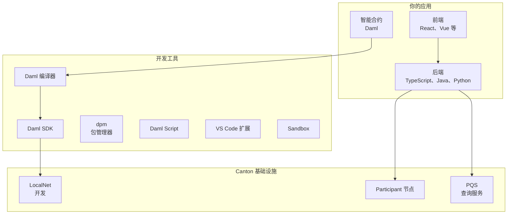
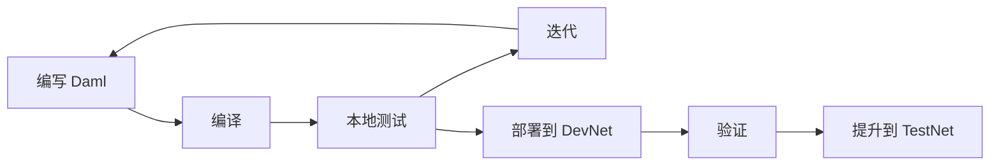

# Canton 开发技术栈

> 构建 Canton Network 应用的工具与技术概览

本页介绍构建 Canton 应用时使用的开发技术栈。理解这些组件有助于看清整体如何衔接。

## 技术栈概览



## 智能合约层

### Daml

Daml 是 Canton 的智能合约语言——面向多方工作流的函数式语言。

| 方面 | 详情 |
| --------------- | ---------------------------------------- |
| **范式** | 函数式编程 |
| **类型系统** | 强类型，支持类型推断 |
| **编译为** | Daml-LF（账本格式） |
| **主要用途** | 定义合约、choice、授权 |

**示例：**

```haskell theme={"theme":{"light":"github-light","dark":"github-dark"}}
template Token
  with
    owner : Party
    issuer : Party
    amount : Decimal
  where
    signatory issuer
    observer owner

    choice Transfer : ContractId Token
      with newOwner : Party
      controller owner
      do create this with owner = newOwner
```

### Daml 编译器

Daml 编译器（`dpm build`）将 Daml 源码编译为 DAR（Daml Archive），可部署到 participant 节点。

```bash theme={"theme":{"light":"github-light","dark":"github-dark"}}
# 编译 Daml 代码
dpm build

# 输出：包含已编译合约的 .dar 文件
```

## 应用层

### 后端集成

后端通过 Ledger API 连接 Canton。

| 选项 | 协议 | 适用场景 |
| ------------ | ------------- | --------------------------------- |
| **gRPC API** | gRPC/Protobuf | 高性能、强类型 |
| **JSON API** | HTTP/JSON | 集成更简单、适合 Web |

**语言支持：**

* TypeScript/JavaScript（`dpm codegen-js` 可生成代码）
* Java（`dpm codegen-java` 可生成代码）
* 任意语言均可通过 gRPC 或 JSON API 接入

社区还提供 Python、Rust、Go 等绑定。

### 代码生成

从 Daml 代码生成类型安全的绑定：

```bash theme={"theme":{"light":"github-light","dark":"github-dark"}}
# 生成 TypeScript 绑定
dpm codegen-js .dar -o generated

# 生成 Java 绑定
dpm codegen-java .dar -o generated
```

生成代码提供：

* 类型安全的合约表示
* 命令提交辅助
* 事件处理工具

### 前端

可使用任意 Web 框架，常见选择：

| 框架 | 说明 |
| ----------- | ------------------------------- |
| **React** | Canton 生态中最常见 |
| **Vue** | 良好替代 |
| **Angular** | 企业偏好 |

前端通常经后端连接，由后端处理 Ledger API 通信。

## 开发工具

### Daml SDK

Daml SDK 打包 Canton 开发所需组件：

| 组件 | 用途 |
| ------------------ | ------------------------------------ |
| **Daml 编译器** | 编译智能合约 |
| **Daml Script** | 测试并与合约交互 |
| **Sandbox** | 单节点 Canton 测试 |
| **Canton runtime** | 运行本地 participant |
| **Console** | 交互式管理 |
| **Templates** | 项目脚手架 |

### dpm（Daml 包管理器）

管理依赖与构建流程：

```bash theme={"theme":{"light":"github-light","dark":"github-dark"}}
# 初始化项目
dpm init

# 添加依赖
dpm add package-name

# 构建
dpm build
```

### VS Code 扩展

Daml VS Code 扩展（Daml Studio）提供：

* 语法高亮
* 类型检查
* 错误诊断
* 代码导航
* 集成终端

扩展随 DPM 自动安装。需要 VS Code 1.87 及以上。在项目目录运行 `dpm studio` 可启动 Daml Studio。

## 基础设施组件

### LocalNet

LocalNet 是用于开发的本地 Global Synchronizer 模拟：

```bash theme={"theme":{"light":"github-light","dark":"github-dark"}}
# 通过 QuickStart 启动 LocalNet
make setup
make build
make start

# 或通过 Daml SDK 运行单节点
dpm sandbox
```

LocalNet 提供：

* 本地同步器
* 本地 participant 节点
* 测试用 Canton Coin
* 无外部依赖

### Participant 节点

Participant 节点是验证者中托管 Canton 运行时的部分，负责：

* 托管你的 Party
* 存储合约数据
* 执行 Daml 逻辑
* 暴露 Ledger API

生产环境中，它作为验证者的一部分运行。

### PQS（Participant Query Store）

PQS 提供基于 SQL 的复杂数据查询：

| 用例 | Ledger API | PQS |
| -------------------- | ---------- | --------- |
| 简单查询 | 良好 | 良好 |
| 复杂聚合 | 有限 | 优秀 |
| 报表 | 困难 | 容易 |
| 实时更新 | 优秀 | 优秀 |

PQS 维护与账本状态同步的 PostgreSQL 数据库。

## 开发工作流

### 典型流程



### 步骤

1. **编写** 定义业务逻辑的 Daml 合约
2. **编译**（`daml build` 或 `dpm build`）
3. **测试**（Daml Script 或 LocalNet）
4. **构建** 后端集成
5. **部署** 到 DevNet 做集成测试
6. **提升** 经 TestNet 至 MainNet

## QuickStart 项目

[cn-quickstart](https://github.com/digital-asset/cn-quickstart) 仓库提供完整示例及构建工具：

| 组件 | 技术 |
| ------------------ | ----------------------- |
| **合约** | Daml |
| **后端** | TypeScript |
| **前端** | React |
| **基础设施** | Docker Compose LocalNet |

```bash theme={"theme":{"light":"github-light","dark":"github-dark"}}
# 克隆并运行
git clone https://github.com/digital-asset/cn-quickstart
cd cn-quickstart
direnv allow
cd quickstart
make install-daml-sdk
make setup
make build
make start
```

## 与其他平台工具对照

| 用途 | Ethereum | Canton |
| ------------------- | -------------------- | ------------------------ |
| **智能合约** | Solidity | Daml |
| **构建工具** | Hardhat/Foundry | daml build/dpm |
| **IDE** | Remix、VS Code | VS Code + Daml 扩展 |
| **测试** | Mocha、Foundry tests | Daml Script |
| **本地网络** | Hardhat node、Anvil | LocalNet、Canton Sandbox |
| **API** | JSON-RPC | Ledger API（gRPC/JSON） |
| **索引** | The Graph | PQS |

## 下一步

<CardGroup cols={2}>
  <Card title="QuickStart" icon="rocket" href="/appdev/quickstart">
    运行示例应用。
  </Card>

  <Card title="模块 3：Daml" icon="code" href="/zh/docs/canton/appdev-modules-m3-dev-environment">
    开始编写智能合约。
  </Card>
</CardGroup>

---

> 本文由 CC Privacy Club 根据 Canton Network 官方文档（CC-BY-4.0）整理翻译，仅供学习；实现细节以官方最新版本为准。
