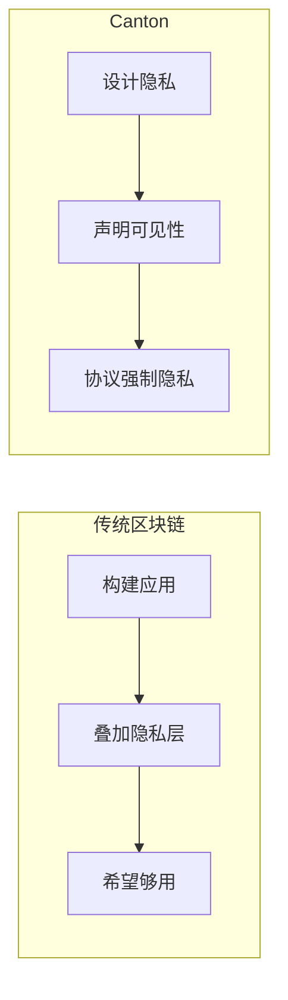

# 模块 1：理解 Canton

> 为 Canton 开发打下概念基础

本模块提供动手写 Canton 代码前所需的概念基础。即便你急于编码，花时间理解这些概念也会让你更高效。

## 模块概览

| 章节 | 目的 |
| ---------------------- | ------------------------------------- |
| **心智模型** | 建立对 Canton 工作方式的直觉 |
| **开发技术栈** | 了解工具与技术 |
| **Canton 有何不同** | 理解 Canton 的独特之处 |

## 为何本模块重要

Canton 不只是「语法不同的另一条链」。它代表分布式账本的一种根本不同思路：

* **隐私是原生能力**，而非事后补丁
* **共识是定向的**，而非全局的
* **状态是分布的**，而非复制的
* **授权是声明的**，而非手写校验

事先理解这些原则，能避免日后与架构「对着干」。

## 核心洞见

### 隐私优先

在多数区块链上，你先做应用再设法加隐私。在 Canton 上，你从隐私出发，再决定向谁、披露什么。

### 无全局状态

不存在可查询「全部信息」的单一「区块链」。每个 Party 都有自己视角下的账本。

| 传统说法 | Canton 现实 |
| ---------------------- | ----------------------------------------------------- |
| 「查区块链」 | 从*你的*验证者查询*你的*数据 |
| 「总供应量」 | 仅当应用通过 API 暴露时才可见 |
| 「全部交易」 | 仅*你的*交易 |

### 一切皆不可变

合约不会「就地修改」。当你「更新」合约时，会归档旧合约并创建新合约。这不是限制——而是隐私与完整性保证的基础。

### 显式授权

你在编译期声明各方能做什么，由协议强制执行。不同于在运行时检查调用方身份的传统系统，Canton 的授权是结构性的。

## 前置检查

继续前，你应：

* **理解** Canton 是什么（[五分钟概览](/overview/understand/five-minute-overview)）
* **了解**基本组件（[核心概念](/overview/understand/core-concepts)）
* **具备**编程经验（任意语言）

不要求有区块链经验——若有，请准备好放下部分旧习惯。

## 你将学到什么

完成本模块后，你将理解：

1. 如何思考 Canton 的隐私模型
2. Party、验证者与同步器的关系
3. 交易如何在系统中流转
4. 开发将使用哪些工具

## 学习路径

<CardGroup cols={2}>
  <Card title="心智模型" icon="brain" href="/appdev/modules/m1-mental-models">
    建立对 Canton 分布式账本思路的直觉。
  </Card>

  <Card title="开发技术栈" icon="wrench" href="/appdev/modules/m1-development-stack">
    了解你将使用的工具与技术。
  </Card>
</CardGroup>

完成本模块后，可继续：

* **[模块 2](/appdev/modules/m2-canton-for-ethereum-devs)**：若你有以太坊/区块链经验
* **[选择你的路径](/appdev/get-started/choose-your-path)**：若已准备好开始写 Daml

---

> 本文由 CC Privacy Club 根据 Canton Network 官方文档（CC-BY-4.0）整理翻译，仅供学习；实现细节以官方最新版本为准。
