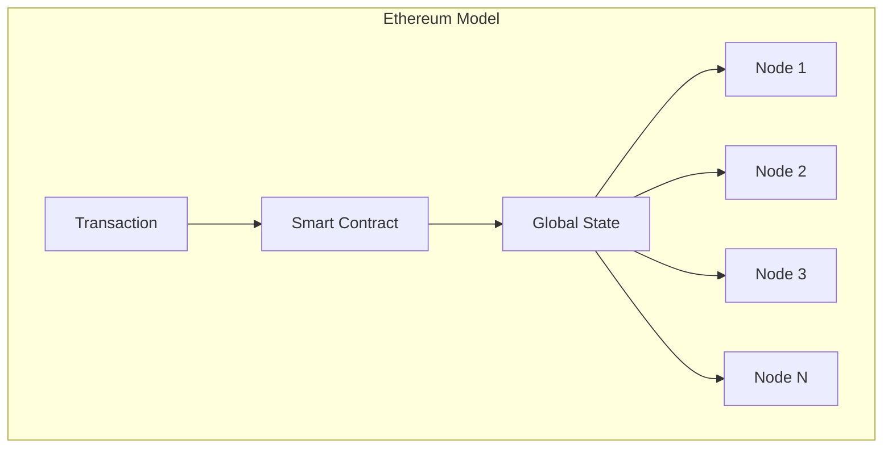
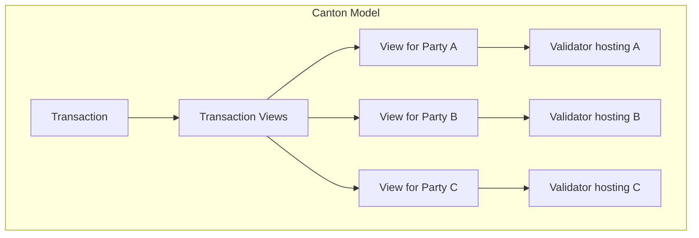
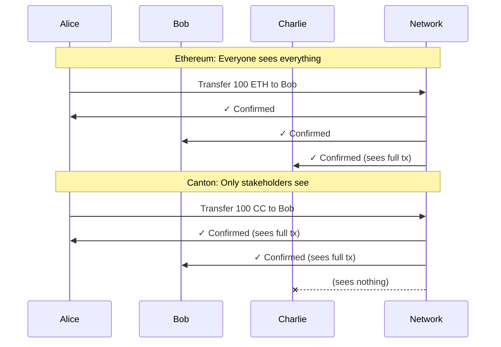

# 面向区块链开发者的 Canton

> 将以太坊与区块链知识桥接到 Canton 概念

若你来自以太坊、Solana 或其他链，Canton 会既熟悉又根本不同。本节把已知概念映射到 Canton 等价物，并标出必须转变的心智模型。

## 核心概念映射

| 以太坊概念 | Canton 等价 | Canton 说明 |
| ----------------- | ----------------------- | --------------------------------------------------- |
| Blockchain | Synchronizer（同步器） | 协调共识但不存储状态 |
| Smart Contract | Template（模板） | 定义数据模式与可执行的 Choice |
| Contract Instance | Contract（合约） | 不可变；状态变更通过新建合约实现 |
| Function | Choice | 归档和/或创建合约的动作 |
| EOA (Address) | Party | 带显式权限的密码学身份 |
| Transaction | Transaction | 仅有权 Party 看到各自相关视图 |
| Global State | Distributed State | 无全局状态；各节点只存其托管 Party 的数据 |
| Node | Validator (Participant) | 仅存储所托管 Party 的数据 |
| Gas | Traffic | 以 Canton Coin 支付的网络使用费 |

## 心智模型转变

**以太坊**：编写修改全局状态的代码；人人可见一切；合约位于任何人可调用的地址。

**Canton**：编写定义存在何种数据、可执行何种动作的模板；合约被创建与归档（从不原地修改）；仅相关 Party 可见数据；授权内建于模型，而非事后加装。





## 智能合约范式：模板 vs Solidity

Solidity 中定义可变状态与修改状态的函数：

```solidity theme={"theme":{"light":"github-light","dark":"github-dark"}}
// Solidity: Mutable state
contract Token {
    mapping(address => uint256) public balances;
    
    function transfer(address to, uint256 amount) public {
        balances[msg.sender] -= amount;
        balances[to] += amount;
    }
}
```

Daml（Canton 智能合约语言）中定义不可变合约与归档/新建 Choice：

```haskell theme={"theme":{"light":"github-light","dark":"github-dark"}}
-- Daml: Immutable contracts with choices
template Token
  with
    owner : Party
    issuer : Party
    amount : Decimal
  where
    signatory issuer
    observer owner
    
    choice Transfer : ContractId Token
      with
        newOwner : Party
      controller owner
      do
        create this with owner = newOwner
```

### 关键差异

| 方面 | Solidity | Daml |
| ---------------------- | -------------------------------- | ---------------------------------------------------- |
| **状态模型** | 可变存储变量 | 不可变合约；变更即新建合约 |
| **授权** | 运行时 `msg.sender` 检查 | 编译期 `signatory`/`controller` 声明 |
| **默认可见性** | 默认公开 | 默认私有；显式 `observer` |
| **执行控制** | 任何人可调用公开函数 | 仅声明的 controller 可 exercise Choice |

Daml 的 `Transfer` **不会**原地修改合约，而是**归档**当前合约并**创建**新所有者的新合约。不可变性是 Canton 隐私与完整性保证的基础。

## 隐私模型差异

**以太坊默认**：一切公开。

**Canton 默认**：一切私有；可见性需显式声明。



## 读取数据：无全局 RPC

以太坊上任意节点可查询任意状态；Canton 上**必须连接托管目标 Party 数据的验证者**。

<Note>
  不存在可拉取全部数据的单一「全链 RPC」。你通过自己验证者的 Ledger API 查询己方 Party 数据，必要时通过应用提供方 API 获取其数据。
</Note>

这是隐私的直接结果：若 Charlie 在账本上看不到 Alice 的数据，Charlie 的节点也没有 Alice 的数据可查。

## 授权模型

| 以太坊 | Canton |
| ------------------------------------- | ------------------------------------------------------------------- |
| `msg.sender` 决定授权 | `signatory` 与 `controller` 决定授权 |
| 任何人可调用公开函数 | 仅指定 Party 可 exercise Choice |
| 授权为运行时检查 | 编译期保证 + 运行时二次校验 |

三个关键角色：

* **Signatory（签字方）**：必须授权合约创建；始终可见；若同时为 controller 则可 exercise。
* **Observer（观察方）**：可见合约，除非同时为 controller 否则不能 exercise。
* **Controller（控制方）**：可执行特定 Choice；exercise 时可见合约。

### 授权示例

```haskell theme={"theme":{"light":"github-light","dark":"github-dark"}}
template Asset
  with
    owner : Party
    issuer : Party
    auditor : Party
  where
    signatory issuer
    observer owner, auditor
    
    choice Transfer : ContractId Asset
      with
        newOwner : Party
      controller owner
      do
        create this with owner = newOwner
```

`controller` 按 Choice 声明；同一模板可有不同 controller 的多个 Choice。

## 开发者工具对照

| 以太坊工具 | Canton 等价 | 说明 |
| ------------------- | ------------------------ | ---------------------------------------------------------------------------------------------------------------------------------------------------------------------------------------------------------------------- |
| Solidity | Daml | 函数式 vs 命令式 |
| Hardhat / Foundry | Daml SDK + dpm | 构建、测试、部署 |
| Remix | VS Code + Daml 扩展 | IDE |
| MetaMask | Wallet SDK | 用户钱包 |
| Web3.js / ethers.js | Ledger API (gRPC/JSON) | 应用集成 |
| ERC 标准 | CIPs | CIP-0056（代币）、CIP-0103（dApp 标准） |

## 多方工作流

Canton 将多方协调作为一等公民；以太坊需手动多签模式，Canton 内建于语言。

### 以太坊：手动多签

```solidity theme={"theme":{"light":"github-light","dark":"github-dark"}}
contract MultiSig {
    mapping(address => bool) public approved;
    uint256 public approvalCount;
    
    function approve() public {
        require(!approved[msg.sender], "Already approved");
        approved[msg.sender] = true;
        approvalCount++;
    }
    
    function execute() public {
        require(approvalCount >= 2, "Need 2 approvals");
    }
}
```

### Canton：原生多方

```haskell theme={"theme":{"light":"github-light","dark":"github-dark"}}
template Agreement
  with
    partyA : Party
    partyB : Party
    terms : Text
  where
    signatory partyA, partyB
    
    choice Execute : ()
      controller partyA, partyB
      do
        return ()
```

协议层强制：无双方签字无法创建，无双方同意无法 exercise `Execute`。

<Note>
  多方授权常涉及托管在不同验证者上的 Party 签名，通常采用一方提议、他方接受的工作流。详见开发者模块中的多方模式。
</Note>

## 需要「忘掉」的习惯

| 以太坊习惯 | Canton 现实 |
| ----------------------------------------- | ----------------------------------------------------------- |
| 从任意节点查询全部状态 | 从托管相关 Party 的验证者查询 |
| 修改合约存储 | 状态变更 = 新建合约；旧合约归档 |
| 用 msg.sender 隐式授权 | 显式声明 signatory/controller |
| 默认公开 | 默认私有；显式加 observer |
| 节点可互换 | 验证者只存所托管 Party 的状态 |

### 四项心智转变

1. **无全局状态查询**：不能跨网络查「所有代币」
2. **不可变合约**：变更即新建，旧合约归档
3. **显式授权**：每个动作需 signatory/controller
4. **默认隐私**：选择加入可见性，而非选择退出

## 常见陷阱

<Warning>
  区块链开发者初上 Canton 时最常犯的错误如下。
</Warning>

| 陷阱 | 原因 | 避免方式 |
| ---------------------------------------- | --------------------------------------- | ------------------------------------------------------------------------ |
| 做公开全局查询 | 习惯以太坊式全局查询 | 从一开始就按 Party 作用域设计查询 |
| 忘记多方授权 | 习惯无许可模型 | 始终问：谁必须签字？谁能执行？ |
| 试图原地修改合约 | Solidity 可变存储 | 拥抱 create/archive 模式 |
| 设计过多 Party | 以太坊地址几乎无成本 | 每个 Party 有存储开销；审慎设计 Party 结构 |

## 下一步

* **[架构概览](/overview/learn/architecture)** — Canton 组件模型
* **[隐私模型说明](/overview/learn/privacy-model)** — 子交易隐私
* **[模块 3：Daml 开发](/appdev/modules/m3-dev-environment)** — 开始写 Daml

---

> 本文由 CC Privacy Club 根据 Canton Network 官方文档（CC-BY-4.0）整理翻译，仅供学习；实现细节以官方最新版本为准。
