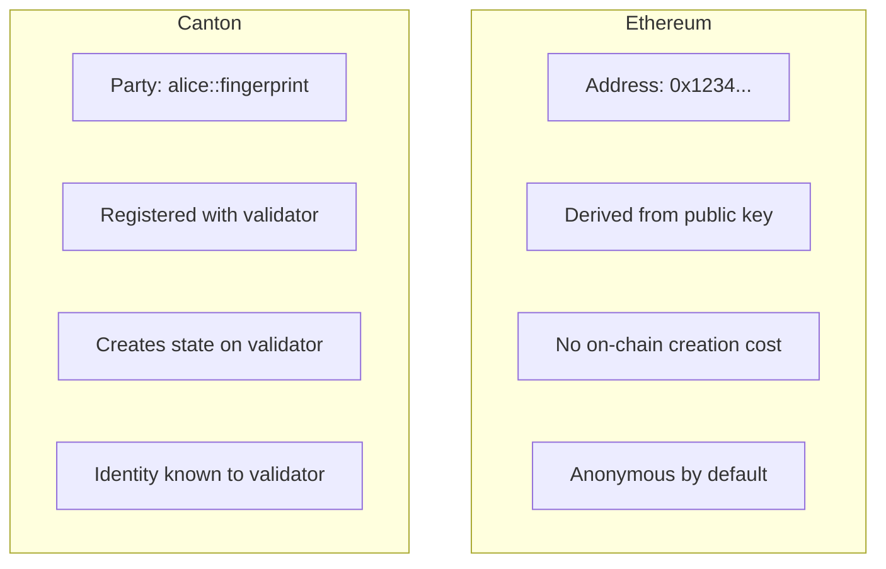

# 概念对照表

> 以太坊概念到 Canton 等价物的完整映射

遇到熟悉术语需查 Canton 对应物时，可用本页作速查。

## 核心协议概念

| 以太坊 | Canton | 关键差异 |
| ---------------- | ----------------------- | ------------------------------------------------------------------------------- |
| **Blockchain** | Synchronizer | 协调但不存储状态 |
| **Block** | 无直接对应 | 交易单独排序；参与者只收到相关视图 |
| **Node** | Validator / Participant | 只存托管 Party 数据 |
| **Global state** | Distributed state | 无全局视图；每 Party 有自己的视图 |
| **Finality** | Confirmation | 确认后确定性终结 |
| **Reorg** | 不适用 | Canton 无链重组 |

## 身份与账户

| 以太坊 | Canton | 关键差异 |
| -------------------- | ------------------------- | --------------------------------------------- |
| **EOA (Address)** | Party | 显式授权语义 |
| **Private key** | Party keys | 可在验证者本地或外部持有 |
| **msg.sender** | Controller | 编译期声明，非运行时 |
| **Contract address** | Contract ID | 唯一标识，非由部署者派生 |
| **ENS name** | Canton Name Service (CNS) | 人类可读的 Party 标识 |

### Party 与地址深入对比

**含义：**

* 不要像以太坊地址那样随意创建 Party
* 创建 Party 需与验证者交互
* Party 与以太坊地址的「假名性」不同

## 智能合约概念

| 以太坊 | Canton | 关键差异 |
| --------------------- | --------------- | --------------------------------------------- |
| **Smart contract** | Template | Daml 定义类型与 Choice |
| **Contract instance** | Contract | 不可变；变更即新建 |
| **Function** | Choice | 类型化且带授权 |
| **Constructor** | `create` | 从模板创建合约 |
| **Storage variables** | Contract fields | 实例内字段不可变 |
| **ABI** | Daml types | 类型安全接口 |

### 状态模型对比

**以太坊：可变状态** — `mapping` 原地修改。

**Canton：不可变合约** — Choice 归档当前实例并 `create` 新实例。

| 方面 | 以太坊 | Canton |
| ---------------- | ----------------------------- | ------------------------------ |
| **修改** | 更新存储 | 归档旧、创建新 |
| **历史** | 隐含于状态转移 | 合约生命周期显式 |
| **原子性** | 按交易 | 按交易 |
| **回滚** | revert | 协议层处理 |

## 交易概念

| 以太坊 | Canton | 关键差异 |
| -------------------- | --------------------- | ------------------------------------------ |
| **Transaction** | Transaction / Command | 隐私保护 |
| **Transaction hash** | Transaction ID | 唯一标识 |
| **Gas** | Traffic | Canton Coin 支付 |
| **Gas price** | Traffic cost | 按大小与复杂度 |
| **Nonce** | 不需要 | Canton 处理排序 |
| **Receipt** | Completion | 命令执行确认 |

### 交易可见性

| 以太坊 | Canton |
| ------------------------------------- | ------------------------------------------- |
| 所有节点可见完整交易 | 交易拆分为视图 |
| 人人见发送方、接收方、数据 | 每 Party 只见自己的视图 |
| 公开 mempool | 加密提交 |
| 区块浏览器展示一切 | 浏览器只展示你的交易 |

## 授权概念

| 以太坊 | Canton | 关键差异 |
| ------------------ | --------------------------------- | ------------------------------ |
| **msg.sender** | Controller | 编译期 vs 运行时 |
| **require()** | Signatory/controller 声明 | 协议强制 |
| **Ownable** | Signatory 模式 | 语言内置 |
| **Access control** | Observer/controller | 显式可见性控制 |
| **Multi-sig** | Multiple signatories | 原生多方支持 |

## 事件与数据

| 以太坊 | Canton | 关键差异 |
| ---------------------- | ------------------------- | --------------------------------- |
| **Events** | Transaction tree | 结构化动作记录 |
| **emit** | 交易内隐式记录 | 所有 create/archive 被记录 |
| **Indexed parameters** | Contract fields | 经 Ledger API/PQS 查询 |
| **Logs** | Active Contract Set (ACS) | 可查询当前状态 |
| **eth_getLogs** | GetTransactionTrees | 历史交易数据 |

## 网络概念

| 以太坊 | Canton | 关键差异 |
| ------------------------- | ---------------------- | -------------------------- |
| **MainNet** | Canton Network MainNet | 生产环境、真实价值 |
| **Testnet (Sepolia)** | DevNet / TestNet | 测试环境 |
| **Local (Hardhat/Anvil)** | LocalNet | 开发环境 |
| **RPC endpoint** | Ledger API | gRPC 或 JSON |
| **Infura/Alchemy** | Validator service | 托管基础设施 |
| **Chain ID** | Synchronizer ID | 网络标识 |

### 环境对照

| 环境 | 以太坊 | Canton |
| --------------------- | ----------------------- | ----------------------------- |
| **本地开发** | Hardhat, Anvil, Ganache | LocalNet (Daml SDK) |
| **共享测试** | Sepolia, Goerli | DevNet（需赞助） |
| **预生产** | Sepolia | TestNet（需审批） |
| **生产** | MainNet | MainNet（完整入驻） |

## 开发工具

| 以太坊 | Canton | 说明 |
| --------------------- | ------------------------ | --------------------------------------------- |
| **Solidity** | Daml | 函数式 vs 命令式 |
| **Hardhat/Foundry** | dpm + daml build | 构建与测试 |
| **Remix** | VS Code + Daml 扩展 | IDE |
| **ethers.js/web3.js** | Ledger API (gRPC/JSON) | 应用集成 |
| **MetaMask** | Wallet SDK | 用户钱包 |
| **Etherscan** | Scan API | 网络浏览 |
| **The Graph** | PQS | 索引数据 SQL 查询 |

## 常见模式

| 以太坊模式 | Canton 等价 |
| ------------------------ | ------------------------------------------------------------------------------------------------------------------ |
| **ERC-20** | Token Standard (CIP-0056) |
| **ERC-721/ERC-1155** | dApp Standard (CIP-0103) |
| **Proxy pattern** | Smart Contract Upgrade (SCU) |
| **Factory pattern** | Template 实例化 |
| **Pull payments** | Propose/accept 模式 |
| **Access control lists** | Observer 列表 |
| **Pausable** | 合约生命周期 Choice |
| **Reentrancy guard** | 不需要（顺序执行） |

## 无法直接平移的概念

| 以太坊 | Canton 现实 |
| -------------------------------------- | ----------------------------- |
| **Public by default** | Private by default |
| **Any node can query any state** | 只能查己方 Party 数据 |
| **Anonymous participation** | Party 有身份 |
| **Permissionless contract deployment** | 包由验证者 vet |
| **Flash loans** | 不同执行模型 |
| **MEV/front-running** | 交易加密，难度高得多 |

## 下一步

<CardGroup cols={2}>
  <Card title="隐私差异" icon="lock" href="/appdev/modules/m2-privacy-differences">
    Canton 与以太坊隐私模型深入对比。
  </Card>

  <Card title="智能合约范式" icon="code" href="/appdev/modules/m2-smart-contract-paradigm">
    Daml 与 Solidity 编程模型。
  </Card>
</CardGroup>

---

> 本文由 CC Privacy Club 根据 Canton Network 官方文档（CC-BY-4.0）整理翻译，仅供学习；实现细节以官方最新版本为准。
