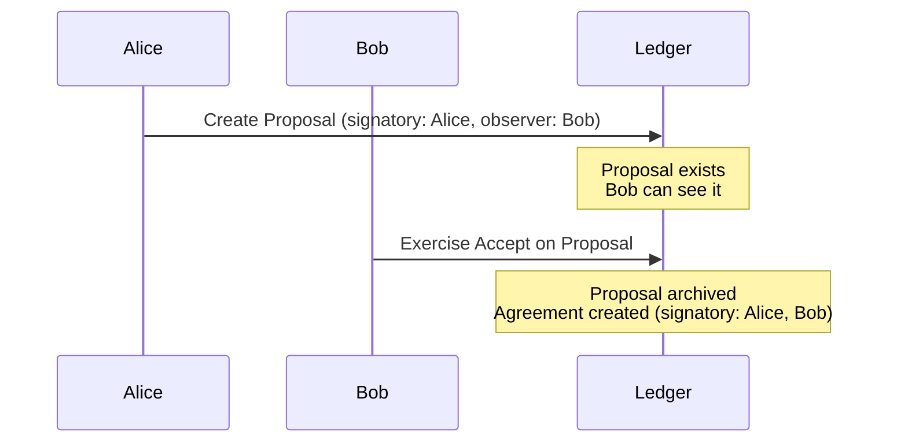
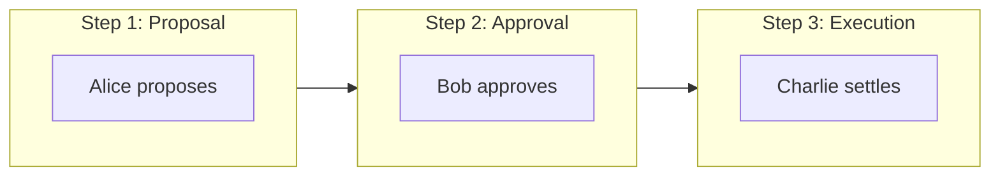

# 多方工作流

> Canton 如何处理与以太坊不同的多方工作流

多方工作流是 Canton 相对以太坊的突出优势。本节介绍关键模式与思维差异。

## 核心差异

以太坊上多方协议是**你实现的模式**；Canton 上是**协议保证**。

| 方面 | 以太坊 | Canton |
| ---------------------- | --------------------------------------------- | -------------------------------------------------- |
| **多签创建** | 部署合约后逐步收集签名 | 可逐步收集或一次性提交全部签名 |
| **授权** | 运行时 mapping 检查 | 协议层强制 |
| **原子性** | 手动状态机 | 内置全有或全无 |
| **可见性** | 各方见一切 | 各方只见自己的视图 |

## 提议-接受模式

Canton 要求所有 signatory 授权创建，无法单方面创建多方合约。标准模式是 **propose-accept**：



### Daml 示例

```haskell theme={"theme":{"light":"github-light","dark":"github-dark"}}
template TradeProposal
  with
    proposer : Party
    counterparty : Party
    asset : Text
    price : Decimal
  where
    signatory proposer
    observer counterparty

    choice Accept : ContractId Trade
      controller counterparty
      do
        create Trade with
          buyer = counterparty
          seller = proposer
          asset
          price

    choice Withdraw : ()
      controller proposer
      do pure ()

template Trade
  with
    buyer : Party
    seller : Party
    asset : Text
    price : Decimal
  where
    signatory buyer, seller
```

### 与以太坊对比

Solidity 需手动 `buyerApproved`/`sellerApproved` 与 `require`；Canton 由协议强制授权、原子状态转移，可见性自动限定在参与方。

## 委托模式

### Controller 委托

```haskell theme={"theme":{"light":"github-light","dark":"github-dark"}}
template Asset
  with
    owner : Party
    delegate : Optional Party
  where
    signatory owner

    choice Transfer : ContractId Asset
      with newOwner : Party
      controller case delegate of
        Some d -> d
        None -> owner
      do
        create this with owner = newOwner
```

### 独立委托合约

```haskell theme={"theme":{"light":"github-light","dark":"github-dark"}}
template DelegationAuthority
  with
    principal : Party
    agent : Party
    scope : [Text]
  where
    signatory principal
    observer agent

    nonconsuming choice ActOnBehalf : ()
      with action : Text
      controller agent
      do
        assertMsg "Action not in scope" (action `elem` scope)
        pure ()
```

## 多步工作流



用 `WorkflowState`（Proposed / Approved / Settled）与按阶段不同 controller 的 Choice 实现状态机。

## 原子多合约操作

```haskell theme={"theme":{"light":"github-light","dark":"github-dark"}}
choice ExecuteSwap : ()
  with
    assetA : ContractId Asset
    assetB : ContractId Asset
  controller buyer, seller
  do
    exercise assetA Transfer with newOwner = buyer
    exercise assetB Transfer with newOwner = seller
```

以太坊原子交换需托管、时间锁、失败恢复与重入防护；Canton **由协议保证原子性**——任一部分失败则全部不发生。

## 多方工作流中的隐私

单笔交易中 Alice 见全部、Bob 见 Trade 与收款、银行只见通知——各方只见相关 leg。

## 常见工作流模式

| 模式 | 用例 | 特点 |
| ------------------------- | --------------------- | ----------------------------- |
| **Propose-Accept** | 双方协议 | 简单明确同意 |
| **Propose-Accept-Settle** | 三方流程 | 顺序授权 |
| **Delegation** | 代行 | 可控权限转移 |
| **Escrow** | 条件执行 | 原子交换保证 |
| **Voting** | 集体决策 | 阈值批准 |

## 相关主题

<CardGroup cols={2}>
  <Card title="迁移清单" icon="list-check" href="/appdev/modules/m2-migration-checklist">
    从以太坊迁移的实用清单。
  </Card>

  <Card title="模块 3：Daml" icon="code" href="/appdev/modules/m3-dev-environment">
    开始编写 Daml 智能合约。
  </Card>
</CardGroup>

---

> 本文由 CC Privacy Club 根据 Canton Network 官方文档（CC-BY-4.0）整理翻译，仅供学习；实现细节以官方最新版本为准。
