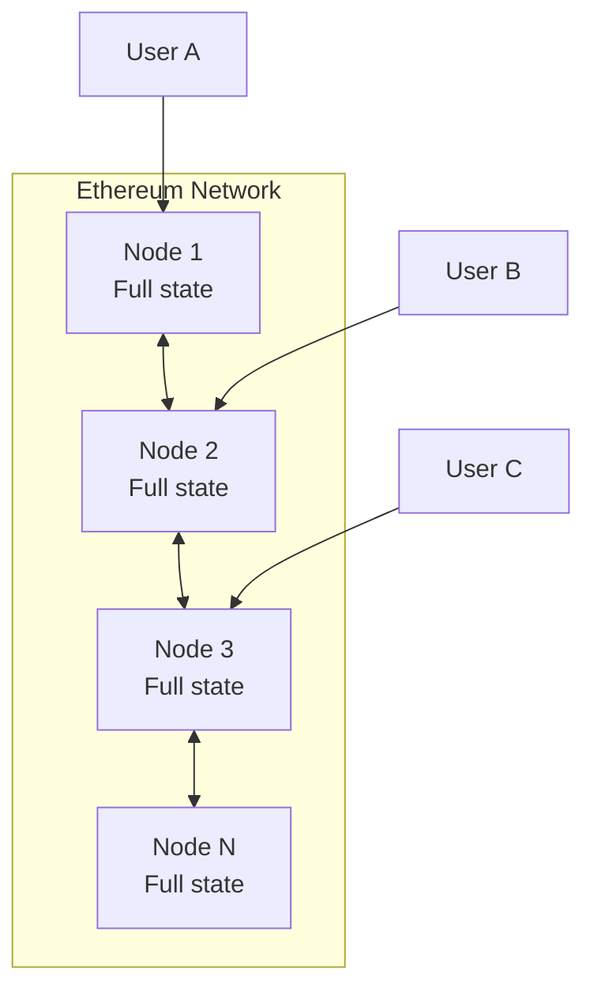
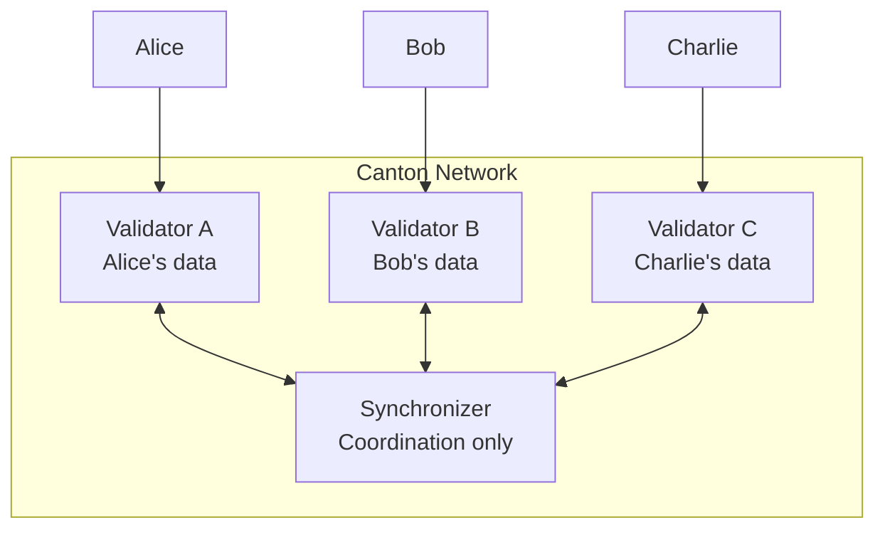

# 网络架构对比

> 理解 Canton 网络架构与以太坊的根本不同

Canton 网络架构与以太坊根本不同。本节对比架构及其对应用的影响。

## 高层架构

### 以太坊架构

**特点：** 全节点存全状态；任意节点可答任意查询；共识需全部验证者；水平扩展受限。

### Canton 架构

**特点：** 验证者只存托管 Party 数据；同步器协调但不存储；共识只涉及受影响 Party；Party 可多验证者托管（multihosting）。

## Canton 组件

**验证者**：只存托管 Party 数据，只回答托管 Party 的查询；共识中只验证影响己方 Party 的交易。

**同步器**：排序协调、不存状态；保证受影响 Party 看到一致顺序。

**与传统链的差异**：无全局状态；状态可见性限于利益相关方；只有托管验证者可查询该 Party；确认后确定性终结。

## 数据流对比

以太坊：提交 → 公开 mempool → 验证者选块执行 → 全网广播更新。

Canton：向验证者提交 → 本地执行 Daml、生成视图 → 加密提交同步器 → 分发各方视图 → 各方确认 → 提交。

## 查询架构

以太坊任意节点可 `totalSupply`、`balanceOf`、全量转账事件。

Canton 通过**己方验证者**的 Ledger API 查 `getActiveContracts({ party: myParty })`；查他人余额需成为 observer。

| 查询类型 | 以太坊 | Canton |
| ----------------------- | -------------- | -------------------------- |
| **我的余额** | 任意节点 | 我的验证者 |
| **他人余额** | 任意节点 | 须为 observer |
| **总供应量** | 任意节点 | 仅当合约设计为公开 |
| **交易历史** | 任意节点 | 仅我的交易 |

## 应用设计含义

**数据可用性**：读副本只在你的验证者；缓存仅限有权数据；分析需显式数据共享。

**用户体验**：钱包连你的验证者 API；余额查你的合约；历史为个人交易视图而非公开浏览器。

**扩展**：验证者只处理影响托管 Party 的交易；可增加验证者分散 Party 以扩容。

## 网络拓扑

以太坊：扁平 P2P，节点对等、数据相同。

Canton：分层——Super Validator 协调层、Validator 服务 Party、应用层连验证者。

## 信任模型

| 实体 | 以太坊信任 | Canton 信任 |
| --------------------- | ------------------------------ | ------------------------------------ |
| **验证者** | 见全部、验证全部 | 只见相关、验证相关 |
| **网络运营** | 出块者见一切 | 同步器不见内容 |
| **你的节点** | 信任自己的节点 | 信任自己的验证者 |
| **其他用户** | 竞争区块空间 | 交易相对独立 |

## 迁移考量

| 方面 | 所需行动 |
| ---------------------------- | -------------------------------------- |
| **状态查询** | 按 Party 作用域重设计 |
| **分析** | 需要时建立显式共享 |
| **节点基础设施** | 部署验证者而非全节点 |
| **用户入驻** | 用户连到你的验证者 |
| **第三方集成** | 经 gRPC/JSON Ledger API 访问 |

## 下一步

<CardGroup cols={2}>
  <Card title="架构深入" icon="diagram-project" href="/overview/learn/architecture">
    Canton 架构详细文档。
  </Card>

  <Card title="开始构建" icon="code" href="/appdev/modules/m3-dev-environment">
    开始编写 Daml 智能合约。
  </Card>
</CardGroup>

---

> 本文由 CC Privacy Club 根据 Canton Network 官方文档（CC-BY-4.0）整理翻译，仅供学习；实现细节以官方最新版本为准。
