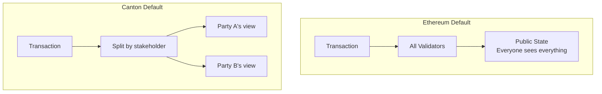

# 隐私模型差异

> 理解 Canton 隐私模型与以太坊的根本差异

隐私是 Canton 与以太坊最显著的架构差异。本节深入说明差异并指导思维调整。

## 根本差异

| 方面 | 以太坊 | Canton |
| ---------------------- | ----------------------------- | ----------------------------------------- |
| **默认可见性** | 公开 | 私有 |
| **思路** | 在公开链上叠加隐私 | 隐私内建 |
| **数据位置** | 所有节点存全部数据 | 节点只存相关数据 |
| **选择模型** | 难以选择隐私 | 显式 observer 选择可见性 |



## 默认可见性对比

### 以太坊：默认公开

交易在 mempool 可见；状态变更记入所有节点；历史人人可查；合约代码可读；所有交互对观察者可见。Solidity 的 `private` 变量仍可从存储槽读取。

### Canton：默认私有

提交内容加密；视图只发给相关验证者；状态只在托管利益相关方的验证者；合约数据仅 signatory/observer 可见；第三方除非显式声明否则一无所知。

```haskell theme={"theme":{"light":"github-light","dark":"github-dark"}}
template TrulyPrivate
  with
    owner : Party
    secretValue : Decimal
  where
    signatory owner
    -- 无 observer：仅 owner 可见
```

## 子交易隐私

**创新点**：同一笔交易的不同部分对不同 Party 可见。

例：Alice 付 Bob CC，Bob 同时付 Charlie。以太坊上人人见两笔付款与金额；Canton 上 Alice 只见 leg1，Bob 见 leg1+leg2，Charlie 只见 leg2，Carol 一无所见。

| 用例 | 以太坊问题 | Canton 方案 |
| ---------------- | ------------------------------------ | -------------------------------- |
| **交易** | 竞争对手见你的成交 | 仅对手方见交易 |
| **借贷** | 条款公开 | 仅借还双方见条款 |
| **供应链** | 各方见全部价格 | 各方只见自己那一段 |
| **合规** | 未授权方可见 | 仅将监管方加为 observer |

## 与以太坊隐私方案的对比

**L2**：运营商见全部交易；Canton 同步器不见内容；无需 L1 结算等待；信任模型为密码学分发而非信任 L2 运营方。

**零知识**：Canton 不用 ZK，而通过选择性分发视图实现隐私，编程模型更简单、无证明开销。

**私有通道（Fabric）**：通道级粒度 vs Canton 子交易级；跨通道复杂 vs 原生原子交易。

**静态加密**：密钥管理复杂、元数据仍可见、未来可能被解密；Canton 不向无权方存储数据。

## 私有账本视图

每个 Party 拥有自己的**私有账本视图**——其作为利益相关方的全部合约集合。无 `getAllTokens()` 式全局查询；总供应量仅当合约设计为可汇总时才对有权方可见。

## 同步器能见与不能见

**能见**：加密消息 blob、消息大小、时间戳、提交/拒绝结果、验证者与 Party 标识（路由用）。

**不能见**：交易内容、合约数据、所 exercise 的 Choice、金额与条款。

**信任同步器**：公平排序、向有权方投递、可用性。

**不必信任同步器**：数据隐私（只见密文）、交易校验由你的验证者完成、正确执行由协议密码学保证。

**信任你的验证者**：安全存储你的合约数据、正确代你执行、不向未授权方泄露。

<Warning>
  托管验证者能看到你 Party 的全部数据。选择验证者应像选择银行或托管方一样谨慎。
</Warning>

| 以太坊 | Canton |
| -------------------------------------------- | ---------------------------------------------------- |
| 信任验证者不审查 | 信任同步器不审查 |
| 所有验证者见一切 | 同步器只见加密视图 |
| MEV/抢跑结构性存在 | 加密提交使 MEV/抢跑难得多 |
| 任意节点可查询 | 仅信任自己的验证者查己方数据 |

## 开发者设计含义

**以太坊思维**：「如何查全局状态？」

**Canton 思维**：「我的 Party 能看什么？谁还需要可见？」

设计时明确 signatory、observer、各 Choice 的 controller，并注意 fetch 带来的 **divulgence**。

### 隐私清单

| 问题 | 设计影响 |
| ---------------------------------------- | ---------------------------------- |
| 谁需要见这份合约？ | signatory + observer |
| 谁能操作？ | 每 Choice 的 controller |
| fetch 会发生什么？ | divulgence |
| 第三方是否需要可见？ | 显式加 observer |
| 验证者是否应见一切？ | Party 托管选择 |

## 下一步

<CardGroup cols={2}>
  <Card title="智能合约范式" icon="code" href="/zh/docs/canton/appdev-modules-m2-smart-contract-paradigm">
    Daml 不可变合约模型 vs Solidity。
  </Card>

  <Card title="隐私模型深入" icon="lock" href="/zh/docs/canton/overview-learn-privacy-model">
    子交易隐私技术细节。
  </Card>
</CardGroup>

---

> 本文由 CC Privacy Club 根据 Canton Network 官方文档（CC-BY-4.0）整理翻译，仅供学习；实现细节以官方最新版本为准。
