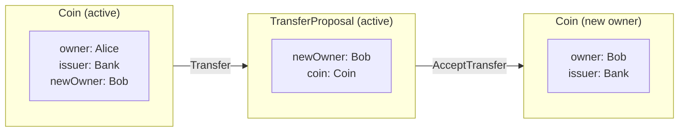
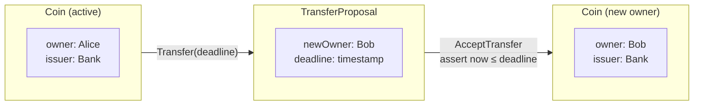
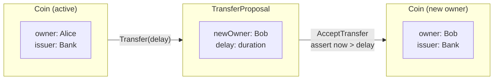
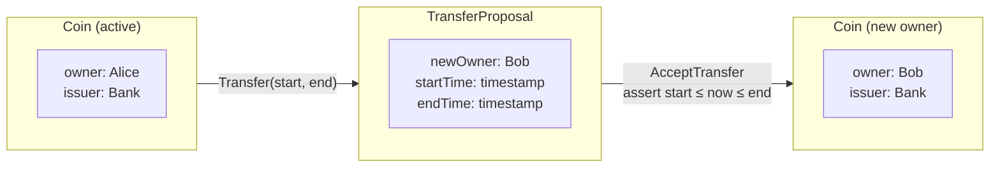

# 处理时间

> 在 Daml 合约中实现基于时间的逻辑，包括过期、截止期限与时间约束

# 如何实现时间约束

合约时间约束可用以下方式实现：

* 账本时间原语（即 `isLedgerTimeLT`、`isLedgerTimeLE`、`isLedgerTimeGT`、`isLedgerTimeGE`）或断言（即 `assertWithinDeadline`、`assertDeadlineExceeded`）

  > * 使用 ledger time 原语与断言**不会**约束交易准备与提交之间的时间界——例如适合由外部参与方签署交易的工作流。

* 或调用 `getTime`

  > * 调用 `getTime` 将交易准备与提交工作流约束为（默认）1 分钟内。
  > * 该 1 分钟为账本时间 record time 容差参数的默认值（动态 synchronizer 参数）。

以下各小节演示如何修改下列 `Coin` 与 `TransferProposal` 合约，用不同类型的 ledger 时间约束控制参与方何时允许写入账本。

Coin 合约

```haskell theme={"theme":{"light":"github-light","dark":"github-dark"}}
template Coin
  with
    owner: Party
    issuer: Party
    amount: Decimal
  where
    signatory issuer
    signatory owner

    ensure amount > 0.0
```

```haskell theme={"theme":{"light":"github-light","dark":"github-dark"}}
choice Transfer : ContractId TransferProposal
      with
        newOwner: Party
      controller owner
      do create TransferProposal
            with coin=this; newOwner
```

TransferProposal 合约

```haskell theme={"theme":{"light":"github-light","dark":"github-dark"}}
template TransferProposal
  with
    coin: Coin
    newOwner: Party
  where
    signatory coin.owner
    signatory coin.issuer
    observer newOwner
```

```haskell theme={"theme":{"light":"github-light","dark":"github-dark"}}
choice AcceptTransfer : ContractId Coin
      controller newOwner
      do
        create coin with owner = newOwner
```

```haskell theme={"theme":{"light":"github-light","dark":"github-dark"}}
choice WithdrawTransfer : ContractId Coin
      controller coin.owner
      do
        create coin
```



*带同意撤回的简单 coin 转移*

## 如何检查截止期限有效

本设计模式演示如何限制 choice 须在截止期限前执行。

### 动机

参与方须在指定截止期限前完成账本写入。

### 实现

转移提案可随时被接受。若要限制须在固定时间前接受，可为 `AcceptTransfer` choice 的执行添加守卫。

TransferProposal 合约
在 `TransferProposal` 合约中，修改 `AcceptTransfer` choice 体，断言合约截止期限有效。

```haskell theme={"theme":{"light":"github-light","dark":"github-dark"}}
choice AcceptTransfer : ContractId Coin
      controller newOwner
      do
        assertWithinDeadline "time-limited-transfer" timeLimit
        create coin with owner = newOwner
```

转移提案在 exercise `Transfer` choice 时创建，因此 `AcceptTransfer` 可执行的最晚时间须作为 choice 参数传入。

Coin 合约
在 `Coin` 合约中，`Transfer` choice 增加 deadline 参数，使 `TransferProposal` 合约具有固定生命周期。

```haskell theme={"theme":{"light":"github-light","dark":"github-dark"}}
choice Transfer : ContractId TransferProposal
      with
        newOwner: Party
        timeLimit: Time
      controller owner
      do create TransferProposal
            with coin=this; newOwner; timeLimit
```



*限时 coin 所有权转移*

## 如何检查截止期限已过

本设计模式演示如何确保 choice 仅在截止期限之后执行。

### 动机

参与方须在固定延迟之后才能执行账本写入。

### 实现

转移提案可随时被接受。若要限制仅能在固定延迟后接受，可为 `AcceptTransfer` choice 添加守卫。

TransferProposal 合约
在 `TransferProposal` 合约中，修改 `AcceptTransfer` choice 体，断言合约截止期限已超过或到达。

```haskell theme={"theme":{"light":"github-light","dark":"github-dark"}}
choice AcceptTransfer : ContractId Coin
      controller newOwner
      do
        assertDeadlineExceeded "delayed-transfer" delay
        create coin with owner = newOwner
```

转移提案在 exercise `Transfer` 时创建，因此 `AcceptTransfer` 可执行的延迟时间须作为 choice 参数传入。

Coin 合约
在 `Coin` 合约中，`Transfer` choice 增加 deadline 参数，使 `TransferProposal` 具有延迟。

```haskell theme={"theme":{"light":"github-light","dark":"github-dark"}}
choice Transfer : ContractId TransferProposal
      with
        newOwner: Party
        delay: Time
      controller owner
      do create TransferProposal
            with coin=this; newOwner; delay
```



*延迟 coin 所有权转移*

## 授予参与方限时写入权

本设计模式演示如何向参与方授予限时写入权。

### 动机

参与方需要能写入账本，但写入权仅应在特定时间窗口内授予。

### 实现

转移提案可随时被接受。若要限制仅能在给定时间窗内接受，可为 `AcceptTransfer` choice 添加守卫。

TransferProposal 合约
在 `TransferProposal` 合约中，修改 `AcceptTransfer` choice 体，断言当前 ledger time 在许可窗口内。

```haskell theme={"theme":{"light":"github-light","dark":"github-dark"}}
choice AcceptTransfer : ContractId Coin
      controller newOwner
      do
        withinWindow <- isLedgerTimeGE startTime && isLedgerTimeLT endTime
        _ <- unless withinWindow $ failWithStatus $
               FailureStatus
                 "transfer-outside-time-window"
                 InvalidGivenCurrentSystemStateOther
                 ("Ledger time is outside permitted transfer time window [" <> show startTime <> ", " <> show endTime <> ")")
                 (TextMap.fromList [("startTime", show startTime), ("endTime", show endTime)])
        create coin with owner = newOwner
```

转移提案在 exercise `Transfer` 时创建，因此 `AcceptTransfer` 可执行的区间起止时间须作为 choice 参数传入。

Coin 合约
在 `Coin` 合约中，`Transfer` choice 增加时间参数，使 `TransferProposal` 具有时间窗。

```haskell theme={"theme":{"light":"github-light","dark":"github-dark"}}
choice Transfer : ContractId TransferProposal
      with
        newOwner: Party
        startTime: Time
        duration: RelTime
      controller owner
      do create TransferProposal
            with coin=this; newOwner; startTime; addRelTime startTime duration
```



*时间窗内的 coin 所有权转移*

## 何时使用 getTime

对准备并提交交易的工作流，使用 `getTime` 须谨慎。`getTime` 会使交易绑定到 ledger time，从而约束 sequencer 对交易的重排。Global Synchronizer 配置为交易准备与提交时间窗为 1 分钟，因此使用 `getTime` 的工作流须在该 1 分钟内完成准备与提交。

若无法满足（例如用外部参与方签署交易），建议用 ledger time 原语与断言设计工作流。

### 动机

参与方须在截止期限前写入账本，且能在 1 分钟内准备并提交交易。

### 实现

转移提案可随时被接受。若要求须在固定时间前接受，可为 `AcceptTransfer` 添加守卫，通过 `getTime` 获取当前 ledger time。

TransferProposal 合约
在 `TransferProposal` 合约中，修改 `AcceptTransfer` choice 体，根据 `getTime` 返回的 ledger time 断言截止期限有效。

```haskell theme={"theme":{"light":"github-light","dark":"github-dark"}}
choice AcceptTransfer : ContractId Coin
      controller newOwner
      do
        t <- getTime
        _ <- unless (t < timeLimit) $ failWithStatus $
                       FailureStatus
                         "deadline-exceeded"
                         InvalidGivenCurrentSystemStateOther
                         ("Ledger time is after deadline " <> show timeLimit)
                         (TextMap.fromList [("timeLimit", show timeLimit)])
        create coin with owner = newOwner
```

转移提案在 exercise `Transfer` 时创建，因此 `AcceptTransfer` 的最晚可执行时间须作为 choice 参数传入。

Coin 合约
在 `Coin` 合约中，`Transfer` choice 增加 deadline 参数，使 `TransferProposal` 具有固定生命周期。

```haskell theme={"theme":{"light":"github-light","dark":"github-dark"}}
choice Transfer : ContractId TransferProposal
      with
        newOwner: Party
        timeLimit: Time
      controller owner
      do create TransferProposal
            with coin=this; newOwner; timeLimit
```

# 为合约添加约束

你常希望约束存储的数据或允许的数据变换。本节介绍 Daml 提供的两种主要机制：

* `ensure` 关键字。
* `assert`、`abort` 与 `error` 关键字。

为理解后者，你还将更多了解 `Update` 与 `Script` 类型及 `do` 块，为 `compose` 中用 `do` 块组合 choice 成复杂交易做好准备。

最后介绍账本与 Daml Script 中的时间。

<Tip>
  可运行 `dpm new intro-constraints  --template daml-intro-constraints` 将本节全部代码加载到 `intro-constraints` 文件夹。
</Tip>

## 模板前置条件

第一类限制称为*模板前置条件*，即对某模板合约可存储数据的限制。

例如，希望 `simple_iou` 中的 `SimpleIou` 只能存储正金额，可用 `ensure` 关键字强制：

```haskell theme={"theme":{"light":"github-light","dark":"github-dark"}}
-- Code from: daml/daml-intro-constraints/daml/Restrictions.daml
-- [Include actual code example here]
```

`ensure` 接受单个 `Bool` 表达式。更多限制可用 `&&`、`||`、`not` 组合。下面增加货币为三字母大写的限制：

```haskell theme={"theme":{"light":"github-light","dark":"github-dark"}}
-- Code from: daml/daml-intro-constraints/daml/Restrictions.daml
-- [Include actual code example here]
```

<Tip>
  此处的 `T` 表示通过 `import DA.Text as T` 从标准库导入的 `DA.Text`：
</Tip>

```haskell theme={"theme":{"light":"github-light","dark":"github-dark"}}
-- Code from: daml/daml-intro-constraints/daml/Restrictions.daml
-- [Include actual code example here]
```

## 断言

第二类常见限制是对数据变换的限制。

例如 `simple_iou` 允许 `owner` 向自己转让的无操作。可用 `assert` 阻止，你已在 script 上下文中见过 `assert`。

`assert` 不返回有信息量的错误，常宜用 `assertMsg` 并传入自定义错误消息：

```haskell theme={"theme":{"light":"github-light","dark":"github-dark"}}
-- Code from: daml/daml-intro-constraints/daml/Restrictions.daml
-- [Include actual code example here]
```

```haskell theme={"theme":{"light":"github-light","dark":"github-dark"}}
-- Code from: daml/daml-intro-constraints/daml/Restrictions.daml
-- [Include actual code example here]
```

类似地，可写 `Redeem` choice，允许 `owner` 在*工作日营业时间*赎回 `Iou`。下面 `Redeem` 实现确认 `getTime` 返回工作日的营业时间；全部检查通过后 choice 除归档 `SimpleIou` 外不做任何事。（假设现金在链下交割：）

```haskell theme={"theme":{"light":"github-light","dark":"github-dark"}}
-- Code from: daml/daml-intro-constraints/daml/Restrictions.daml
-- [Include actual code example here]
```

上例用 `DA.Date` 与 `DA.Time` 标准库函数将时间拆为星期与小时，检查小时在 8 至 18，且星期不是周六或周日。

下列示例展示 script 中如何 exercise `Redeem` choice：

```haskell theme={"theme":{"light":"github-light","dark":"github-dark"}}
-- Code from: daml/daml-intro-constraints/daml/Restrictions.daml
-- [Include actual code example here]
```

为测试 `Redeem` choice，上述代码用 `setTime` 与 `passTime` 设置并推进 ledger time。exercise 应根据星期与时刻失败或成功。虽直观，Daml 账本上的时间问题仍值得进一步讨论。

## Daml 账本上的时间

Daml 账本每笔交易有两个时间戳：*ledger time (LT)* 与 *record time (RT)*。

**Ledger time (LT)** 是账本模型中与交易关联的时间，由参与方确定，代表业务与应用视角的交易时间。调用 `getTime` 时返回的是 LT。LT 用于推理相关交易与提交，可与其他 LT 比较以保证模型一致性，例如保证交易不依赖尚不存在的合约（因果单调性）。

**Record time (RT)** 由持久层分配，表示交易被「物理」记录的时间，例如「底层数据库为该交易分配了某时间戳」。RT 的唯一用途是确保交易被及时记录。

每个 Daml 账本有 LT 与 RT 允许偏差的策略，称为 *skew*。分布式系统中零 skew 不可行。若偏差过大，交易会被拒绝（有界 skew 要求）。RT 除 skew 判定外不再相关。

回到*营业时间*：假设账本 skew 为 10 秒。17:59:55 临近下班，Alice 提交赎回 Iou 的交易。一秒后交易被赋予 LT 17:59:56，但持久化可能仍有几秒，例如底层存储在 18:00:06 写入，*下班后*。因 LT 在营业时间内且 LT - RT 在 skew 内，交易仍有效。

### 测试 script 中的时间

测试可用下列函数设置时间：

* `setTime`：将 ledger time 设为给定时间。
* `passTime`：接受 `RelTime`（相对时间）并按此推进 ledger。

在分布式 Daml 账本上，不保证 LT 或 RT 严格递增，仅保证 ledger time *随因果性*递增：若交易 `TX2` 依赖 `TX1`，则账本强制 `TX2` 的 LT 大于等于 `TX1` 的 LT。

下列 script 说明该思想：将逻辑时间回拨三天，然后对*尚未创建*的合约 exercise choice——应失败：

```haskell theme={"theme":{"light":"github-light","dark":"github-dark"}}
-- Code from: daml/daml-intro-constraints/daml/Restrictions.daml
-- [Include actual code example here]
```

## Action 与 `do` 块

你已在 `Script` 与 `Update` 两种上下文中见过 `do` 块与 `<-` 记号。二者都是 `Action` 的例子，函数式编程中也称 *Monad*。可用 `do` 记号方便构造 `Action`。

理解 `Action` 与 `do` 块对正确构造并测试合约模型至关重要，本节将较详细说明。

### 纯表达式与 action 对比

Daml 表达式是*纯*的：无副作用，既不读也不写外部状态。若知道作用域内所有变量值，可在纸上求出表达式值。

但使用 `<-` 记号的表达式不同。例如 `getTime` 是 `Action`，即早前的例子。

`Coin` 与 `play` 在上述中故意保持模糊。你只有 `getCoin` 这一 `Script` 中的 action 来获取 `Coin`，以及 `flipCoin` 表示最简单游戏：单次抛币得到 `Face`。

你无法在纸上玩任何 `CoinGame`，因为没有实体硬币，但可以写下游戏 script 或配方：

```haskell theme={"theme":{"light":"github-light","dark":"github-dark"}}
-- Code from: daml/daml-intro-constraints/daml/Restrictions.daml
-- [Include actual code example here]
```

`game` 表达式是抛三次硬币的 `CoinGame`：三次均为 `Heads` 则结果为 `"Win"`，否则 `"Loss"`。

在 `Script` 上下文中可用 `getCoin` action（用 LT 计算种子）并玩游戏。

*以某种方式* `Coin` 贯穿各 action。若深入理解，可查看源文件了解 `CoinGame` action 的实现（警告：用了本章尚未介绍的大量 Daml 特性）。

更一般地，若要深入学习 Action（Monad），建议学习函数式编程课程，尤其是 Haskell，见 `haskell-connection` 中的建议。

## 错误

上文介绍了 `assertMsg` 与 `abort`，表示（可能）失败的 action。Action 仅在被执行时才有效果，故下列 script 根据 `abortScript` 的值成功或失败：

```haskell theme={"theme":{"light":"github-light","dark":"github-dark"}}
-- Code from: daml/daml-intro-constraints/daml/Restrictions.daml
-- [Include actual code example here]
```

但在 action 之外的错误呢？例如实现 `pow`，将整数提升到另一正整数幂，第二参数须为正如何处理？

一种做法是让函数显式部分，返回 `Optional`：

```haskell theme={"theme":{"light":"github-light","dark":"github-dark"}}
-- Code from: daml/daml-intro-constraints/daml/Restrictions.daml
-- [Include actual code example here]
```

若需处理错误情况这是有用模式，但也强制始终处理，须从 `Optional` 提取结果。如上定义可见对便利性的影响。对除零或类似函数，灾难性失败可能更可取：

```haskell theme={"theme":{"light":"github-light","dark":"github-dark"}}
-- Code from: daml/daml-intro-constraints/daml/Restrictions.daml
-- [Include actual code example here]
```

主要缺点是未使用的错误也会导致失败。下列 script 会失败，因 `failingComputation` 被求值：

```haskell theme={"theme":{"light":"github-light","dark":"github-dark"}}
-- Code from: daml/daml-intro-constraints/daml/Restrictions.daml
-- [Include actual code example here]
```

因此 `error` 仅应用于错误情况不太可能遇到、且显式部分性会过度损害函数可用性的场景。

## 下一步

你现已能为 Daml 账本指定精确的数据与数据变换模型。在 `parties` 中，将学习如何在合约中正确引入多方、Daml 中权限如何运作，以及在互不信任实体间构建具强保证的合约模型。

---

> 本文由 CC Privacy Club 根据 Canton Network 官方文档（CC-BY-4.0）整理翻译，仅供学习；实现细节以官方最新版本为准。
