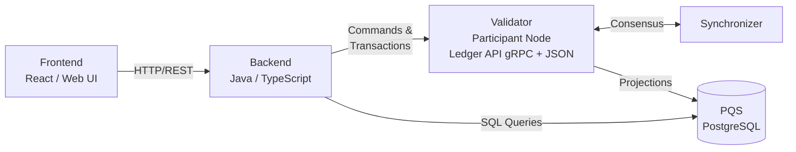

# 应用架构

> 理解 Canton Network 应用中各角色、层次及组件交互

Canton 应用采用分层架构：Daml 智能合约定义共享业务逻辑，后端中介账本访问，前端呈现用户界面。本节说明涉及角色及各层如何连接。

## 角色

多数 Canton 应用包含三类角色。

**应用提供方（App Provider）** — 构建、部署并运营应用的组织。通常运行自有 validator、托管后端并对外提供前端。因提供方 validator 托管提供方 party，它存储提供方侧合约数据并暴露后端连接的 Ledger API。

**应用用户（App User）** — 与应用合约交互的 party。可通过提供方 validator（若提供方托管用户 party）或用户自有 validator 连接；无论哪种，用户 party 须在参与相关 synchronizer 的 validator 上分配。

**终端用户（End User）** — 通过浏览器、移动应用或钱包 UI 使用应用的人。通常不管理 validator 或关心账本机制；经前端认证，由后端代为执行账本操作。

## 架构层次

Canton 应用主要有三层。

### Daml 模型

Daml 模型定义构成共享业务逻辑的合约、choice 与授权规则。经 `dpm build` 编译为 DAR 后，部署到托管相关 party 的 validator。Daml 模型是账本上存在何种数据、可执行何种操作的唯一事实来源。

### 后端

后端是连接 validator Ledger API 的服务（Java 或 TypeScript）。它提交命令（创建合约、行使 choice）并读取交易流或通过 PQS 查询合约状态。还处理认证、不宜上链的业务逻辑及与外部系统集成。

在 [cn-quickstart](https://github.com/digital-asset/cn-quickstart) 参考应用中，后端为 Spring Boot Java 服务。

### 前端

前端为与后端经 HTTP 通信的 Web 应用（此处为 React）。不直接连接 Ledger API。后端暴露 OpenAPI 定义的 REST API，前端用生成的 TypeScript 客户端消费。

这种分离将账本关注点排除在浏览器之外，并在后端集中认证与访问控制。

## 组件图

下图展示运行时各层如何连接。

* **前端** 向后端发送 HTTP 请求。
* **后端** 经 Ledger API（gRPC）提交命令并读取交易。
* **validator**（participant 节点）处理经 LAPI 提交的命令、存储托管 party 的合约数据，并与其他 validator 经 synchronizer 同步。
* **PQS** 维护账本状态的 PostgreSQL 投影，供后端用 SQL 查询。

## PQS 的定位

Ledger API 针对命令提交与流式交易更新优化。对读多负载——仪表板、报表、过滤查询、聚合——PQS 更合适。PQS 订阅 validator 交易流并将合约数据写入 PostgreSQL 表；后端用标准 SQL 查询。还可通过 SQL join 组合数据建立新投影；PQS 也保存可用于审计的历史数据。

使用 PQS 意味着读路径不与写路径争抢 Ledger API 资源，并可在合约数据上发挥 PostgreSQL 全部能力（join、索引、全文搜索）。

## 选择架构风格

cn-quickstart 采用**完全中介**架构：后端处理全部账本交互，前端只与后端通信。这是多数应用最简单的模型。

另一种为 **CQRS**：前端用 Ledger API 直接提交命令（`dpm codegen-js` 的 TypeScript 绑定），后端负责查询。前端与账本集成更紧，但需理解 party ID、contract ID 等 Canton 概念。

除非有明确理由向前端暴露账本概念，否则选择完全中介方式。

## 下一步

* [SDKs and APIs](/zh/docs/canton/appdev-modules-m4-sdks-apis) — 各层可用工具与接口
* [Backend Development](/zh/docs/canton/appdev-modules-m4-backend-dev) — 连接 Ledger API 与 PQS 的模式
* [Frontend Development](/zh/docs/canton/appdev-modules-m4-frontend-dev) — 基于后端 API 构建 React UI

---

> 本文由 CC Privacy Club 根据 Canton Network 官方文档（CC-BY-4.0）整理翻译，仅供学习；实现细节以官方最新版本为准。
