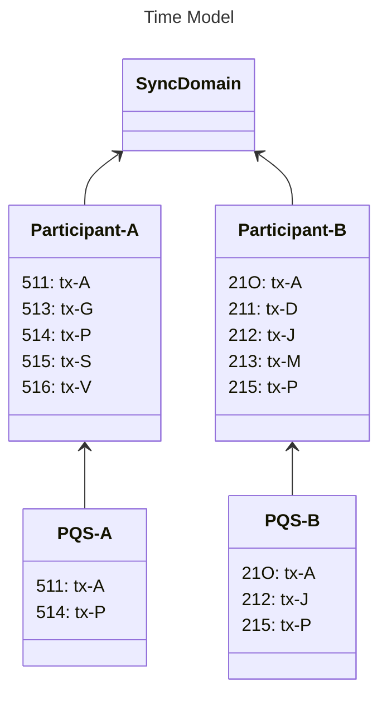

# PQS SQL

> Participant Query Store (PQS) 完整 SQL API 参考，含表函数、offset 管理、维护操作与 JSONB 索引。

PQS SQL API 直接在 PostgreSQL 数据库中配置。数据使用者通过 SQL 与其交互，而不是通过 PQS 流程本身。

PQS 数据可以跨合约表连接以构建预测（例如，将持股与账户模板连接）。时间偏移模型和历史事件函数（`creates`、`archives`、`exercises`）使 PQS 非常适合审计跟踪和合规性查询。

# SQL API

虽然数据使用者不直接与 PQS 进程通信，但他们确实使用 PQS 在数据库本身中提供的 API。该SQL API旨在为用户访问账本提供一致且稳定的接口。它由一组函数组成，这些函数应该是读者与之交互的唯一数据库工件。

## 账本时间模型

查询账本时要考虑的一个关键方面是它可以提供一段时间内的历史记录。此外，理解分布式环境中的时间可能具有挑战性，因为有许多不同的时钟可用。

### 偏移量

参与者节点使用称为“偏移量”的索引对时间进行建模。偏移量是参与者节点本地账本的唯一索引。您可以将其视为使用分类账中的特定偏移量（或索引）在分类账中选择一个项目。

偏移量是有序的，代表参与者节点账本上的交易顺序。由于隐私和过滤的原因，参与者节点的偏移序列通常看起来包含间隙。

偏移量特定于参与者节点，并且在对等参与者节点之间不一致，即使在处理公共事务时也是如此。这是因为每个参与者节点都有自己的分类账，并根据其许可的交易视图分配自己的偏移量。

偏移量在`created_at_offset`、`archived_at_offset`和`exercised_at_offset`列中表示为字符串（在Daml 2.x中）或整数（在Daml 3.3+中）（请参阅`pqs-references-types-of-returned-data`）。

### 账本时间

账本时间是保留因果顺序的近似挂钟时间（在有限的偏差内）。也就是说，如果合约是在某个时间创建的，则在该时间之后才能使用它。账本时间由`created_effective_at`、`archived_effective_at`和`exercised_effective_at`列表示（参见`pqs-references-types-of-returned-data`）。

### 交易ID

事务ID与偏移量的对应关系如下：

* 并非每个偏移量都有交易 ID。例如，被拒绝的事务的完成事件没有事务 ID，因为它不成功。
* 在给定的偏移量处最多有一个事务 ID。
* 每个事务 ID 都是唯一的，并且始终具有单个偏移量。
* 虽然偏移量是由参与者节点分配的，并且是特定于参与者节点的；交易 ID 值对于所有参与者节点都是通用的。
* 交易顺序（由关联的偏移量表示）在参与者节点之间可能有所不同。
* 交易 ID 是完全不透明的，除了标识之外不传达任何信息。

### 我应该使用哪个？

不同类型的数据分析需要不同的工具。例如，在这些类型的分析中，以下标识符可能很有用：*因果关系：**偏移**提供了对事件因果顺序的理解，与参与者确定的账本提交顺序一致。
* 系统性：**交易 ID** 需要关联多个参与者节点，作为各个交易的通用标识符。
* 时间： **Ledger Time** 以挂钟时间提供事件的排序，并且有一定的偏差。根据您对精度的需要，这可能很有用。

## PQS时间模型

PQS 提供所有三个标识符，但偏移量定义顺序。通过此 PQS 能够提供账本交易的一致视图。

偏移量深深嵌入到 SQL API 中，允许用户以提供一致性的方式查询账本。用户可以指定他们想要查询的偏移量，或者简单地查询最新的可用偏移量。

下图显示了一对参与者节点及其各自的账本。每个参与者节点都有自己的 PQS 实例，您可以看到它始终拥有其有权查看的账本部分：



您还可以看到，偏移量（前缀）对于参与者节点和 PQS 是通用的，但事务 ID（后缀）在整个过程中是共享的。

## 偏移量管理

以下函数控制账本的时间视角，并允许您控制在查询中考虑时间的方式。由于 PQS 公开了账本的最终一致视角，您可能希望查询：

* **忽略**； *最新可用*状态。
* **别针**;特定时间的账本状态。
* **跨度**；某个时间范围内的账本事件，例如审计跟踪。
* **一致性**;账本与您与账本进行的其他交互（读或写）保持一致。

以下功能允许您控制账本的时间范围。这将建立后续查询执行的上下文：

* `set_latest(offset)`：指定观察账本时包含的最新数据的偏移量。如果`NULL`它使用最新的可用版本。返回要使用的实际偏移量。如果提供的偏移量超出可用的偏移量，则会发生错误。
* `validate_offset_exists(offset)`：验证数据存储是否具有完整的历史记录，包括提供的偏移量。如果指定的偏移量不可用（太旧或太新），则返回错误。
* `set_oldest(offset)`：指定要包含在查询范围中的最旧事件的偏移量。如果`NULL`，则它使用最旧的可用值。函数返回实际使用的偏移量。如果提供的偏移量超出可用的偏移量，则会发生错误。
* `nearest_offset(time)`：一个辅助函数，用于确定给定时间（或现在之前的间隔）的偏移量。
* `pruned_offset()`：返回数据库已被修剪的偏移量，如果没有发生修剪，则返回`NULL`。

## 访问合约和练习在此范围下，以下表函数[^1]允许访问分类帐并直接在查询中使用。它们被设计为以与表或视图类似的方式使用，并允许用户专注于他们想要查询的数据，消除了偏移的影响。

* `active(name, [at_offset])`：最新偏移时存在的目标模板/界面视图的活动实例
* `creates(name, [from_offset], [to_offset])`：创建在最早和最新偏移之间发生的目标模板/界面视图的事件
* `archives(name, [from_offset], [to_offset])`：目标模板/界面视图在最早和最新偏移之间发生的归档事件
* `exercises(name, [from_offset], [to_offset])`：目标选择在最旧和最晚偏移之间发生的运动事件

<Note>
  After pruning, `archives()`, `exercises()`, and related summary functions (`summary_archives`, `summary_exercises`, `summary_transients`) default their `from_offset` to the pruned offset when available, avoiding unnecessary scans over pruned ranges. `creates()`, `summary_creates()`, and `summary_updates()` are not affected as they cover both active and archived contracts.
</Note>

`name` 标识符可以与指定的包一起使用，也可以不与指定的包一起使用：

* 完全合格：`<package>:<module>:<template|interface|choice>`
* 部分合格：`<module>:<template|interface|choice>` 或 `<template|interface|choice>`（如果明确）

<div className="caution">
  Partially qualified identifiers fail if there is an ambiguous result.
</div>

这些函数具有可选参数，允许用户指定要使用的偏移范围。提供这些参数是在会话之前使用 `set_*` 函数的替代方法。以下查询是等效的：

隐式：面向情境的探索

```sql theme={"theme":{"light":"github-light","dark":"github-dark"}}
   select set_oldest('from_offset');
   select set_latest('to_offset');
   select * from creates('package:My.Module:Template');

```

显式：有利于内联整个上下文，在单个语句中发出

```sql theme={"theme":{"light":"github-light","dark":"github-dark"}}
   select *
   from creates('package:My.Module:Template', 'from_offset', 'to_offset');

```

## 访问交易元数据

在某些情况下，可能需要访问账本交易的元数据而不是合约/练习本身。这可以通过 `transactions` 视图来完成，该视图提供上一节中描述的主表函数未直接公开的附加数据：| Name | Type | 描述 |
| --------------------------- | -------------------------- | ---------------------------------------------------------------------------------------------------------------------------------------------------------------------------------------------------------------------------------------------------------------------------------------------------------------------------------------------------------------------------------------------------------------------------------------------------------------------------------------------------------------------------------------------------------------------- |
| `ix` | `bigint` | 账本交易的内部主键 |
| `offset` | `bigint` | 账本偏移量 |
| `transaction_id` | `text` | 账本分配的交易ID || `effective_at` | `timestamp with time zone` | 账本有效时间 |
| `workflow_id` | `text` | 命令提交时使用的工作流ID |
| `trace_context` | `trace_context` | Ledger API 跟踪上下文（包含`(trace_parent: text, trace_state: text)`的用户定义类型）（请参阅`trace_context <com.daml.ledger.api.v2.Completion.trace_context>`和`pqs-trace-context-propagation`） |
| `external_transaction_hash` | `bytea` | 外部提交的交易的哈希值（参见`external_transaction_hash <com.daml.ledger.api.v2.Transaction.external_transaction_hash>`） |
| `paid_traffic_cost` | `bigint` | 提交参与节点支付的流量费用。当参与者节点不是提交者时，或者如果在参与者节点开始在 Ledger API 上提供流量成本或修复交易之前进行处理，则为 Null。当提交者的同步器不强制执行流量控制时为零。强制实施流量控制时为正（必须在定序器上设置`enforceRateLimiting = true`，以便填充`TrafficReceipt`并生成非空值）。参见`paid_traffic_cost <com.daml.ledger.api.v2.Transaction.paid_traffic_cost>`。 |通过连接适当的 `*_at_ix` 列，可以轻松有效地利用交易元数据来丰富针对合约/练习的查询，例如：

```sql theme={"theme":{"light":"github-light","dark":"github-dark"}}
   select c.contract_id, t.transaction_id, (t.trace_context).trace_parent
   from creates('package:My.Module:Template') c
   inner join transactions t on c.created_at_ix = t.ix
   where c.create_event_id = (42::bigint,0);

```

## 函数汇总

汇总功能可用于提供指定偏移范围内可用账本数据的概览：

* `summary_transients(from_offset, to_offset)`：偏移范围内每个 Daml 完全限定名称的瞬态数量。
* `summary_updates(from_offset, to_offset)`：偏移范围内每个 Daml 完全限定名称的创建和归档计数的摘要。

以下函数检索每个 `template_fqn` 的事件计数：

* `summary_active(at_offset)`
* `summary_creates(from_offset, to_offset)`
* `summary_archives(from_offset, to_offset)`
* `summary_exercises(from_offset, to_offset)`

## 查找函数

* `lookup_contract(contract_id)` 是一种无需知道其 Daml 限定名即可检索合约数据的机制。该函数返回合同和所有关联的界面视图投影，可通过 `payload_type` 列进行区分。
* `lookup_exercises(contract_id)`是一种无需知道Daml限定名即可检索选择练习数据的机制；知道合约 ID 就足够了。

## 返回数据类型

所有返回合约数据的函数都会返回以下列：| Name | Type | 描述 |
| ----------------------- | ----------------------------- | ------------------------------------------------------------------------------------------------------------------------------------------------------ |
| `template_fqn` | `text` | 模板或接口的完全限定名称 |
| `payload_type` | `'template'` or `'interface'` | 合约有效负载类型 |
| `create_event_pk` | `bigint` | 参考合约创建事件主键 |
| `create_event_id` | `(bigint, integer)` | 创建事件的可排序寻址类型`(offset, node ID)` |
| `created_at_ix` | `bigint` | 包含创建事件的交易的序数索引 |
| `created_at_offset` | `bigint` | 包含创建事件的交易的账本偏移量 |
| `created_effective_at` | `timestamp with time zone` | 包含创建事件的交易的账本有效时间 |
| `archive_event_pk` | `bigint` | 参考合约存档事件主键 |
| `archive_event_id` | `(bigint, integer)` | 归档事件的可排序寻址类型 `(offset, node ID)` |
| `archived_at_ix` | `bigint` | 包含归档事件的事务的序数索引 |
| `archived_at_offset` | `bigint` | 包含归档事件的交易的账本偏移量 |
| `archived_effective_at` | `timestamp with time zone` | 包含归档事件的交易的账本有效时间 |
| `life_ix` | `int8range` | 以序数索引表示的合约生命周期 |
| `contract_id` | `text` | 账本分配的合约 ID || `payload` | `jsonb` |合约数据的 JSONB 表示 |
| `metadata` | `bytea` |显式合约披露元数据（参见`stakeholder-contract-share`）|
| `package_name` | `text` | Daml 包名称 |
| `package_version` | `text` |代表性 Daml 包的版本 |
| `package_id` | `text` |代表包 ID。用于解码的Daml包；保证存在于连接的参与者节点上 |
| `creation_package_id` | `text` |来自分类帐的原始创建时包 ID。可能引用连接的参与者节点上不存在的包 |
| `redaction_id` | `text` |编辑流程参考|
| `signatories` | `text[]` |同意订立合同的各方 |
| `observers` | `text[]` |合同可见的其他利益相关者 |
| `witnesses` | `text[]` |收到此事件通知的各方 |
| `divulged_only` | `boolean` |表明合同是否仅泄露（`true`），或正确披露（`false`）。背景信息请参阅`da-model-divulgence`。 |#### 包 ID 和 Daml 升级

* `package_id` 是用于解码的代表性包 ID，保证存在于连接的参与者节点上。
* `creation_package_id` 是创建交易中的原始包 ID。
* `package_version`反映代表包的版本。

对于智能合约升级 (SCU)，不会发生重新编码。创建包保留在包存储中，并且仍然是代表包，因此`package_id`和`creation_package_id`是相同的。

对于主要升级（MUT），参与者节点使用新的软件包版本重新编码合同数据。在这种情况下，`package_id`引用新的代表包，而`creation_package_id`保留原始包，该包可能不再存在于参与者节点上。

所有返回锻炼数据的函数都会返回以下列：| Name | Type | 描述 |
| ------------------------- | -------------------------- | -------------------------------------------------------------------------------------------------------------------------------------------------------------------------------------------------------------- |
| `template_fqn` | `text` | 定义选项的模板的完全限定名称 |
| `choice_fqn` | `text` | 选择的完全限定名称 |
| `choice` | `text` | 选择名称 |
| `consuming` | `boolean` | 选择是否消耗 |
| `exercise_event_pk` | `bigint` | 参考选择练习事件主键 |
| `exercise_event_id` | `(bigint, integer)` | 练习事件的可订购寻址类型`(offset, node ID)` |
| `exercised_at_ix` | `bigint` | 包含行权事件的交易序数索引 |
| `exercised_at_offset` | `bigint` | 包含行权事件的交易的账本抵销 |
| `exercised_effective_at` | `timestamp with time zone` | 包含行权事件的交易的账本有效时间 |
| `contract_id` | `text` | 账本分配的合约 ID |
| `argument` | `jsonb` | 选择参数类型的 JSONB 表示形式 || `result` | `jsonb` |选择返回类型的 JSONB 表示 |
| `package_name` | `text` | Daml 包名称 |
| `package_version` | `text` |代表性 Daml 包的版本 |
| `package_id` | `text` |代表包 ID。用于解码的Daml包；保证存在于连接的参与者节点上 |
| `redaction_id` | `text` |编辑流程参考|
| `signatories` | `text[]` |同意创建合同的各方 | 执行选择的合同
| `observers` | `text[]` |其他利益相关者了解了执行选择的合同的创建 |
| `controllers`| `text[]` |集体行使这一选择的各方（参见`acting_parties <com.daml.ledger.api.v2.ExercisedEvent.acting_parties>`）|
| `witnesses` | `text[]` |收到此事件通知的各方 |
| `last_descendant_node_id` | `integer` |作为此练习事件的结果而出现的同一交易中的事件的节点 ID 的上边界（参见`last_descendant_node_id <com.daml.ledger.api.v2.ExercisedEvent.last_descendant_node_id>`）|## JSONB 编码

PQS 使用基于 Daml-LF JSON 的 Daml-LF 值编码（请参阅 `reference-json-lf-value-specification`）来存储账本。下面提供了编码的概述。

用户应查阅 PostgreSQL 文档以了解如何在 SQL 中本机使用 JSONB 数据[^2]。

账本上的值（合约有效负载和密钥、接口视图、执行参数和返回值）可以是原始类型、用户定义的记录、变体或枚举。这些类型转换为 JSON 类型[^3]，如下所示：

### 原始类型
| Daml type | JSON类型 |
| ------------ | --------------------------------------------------------------------------------------------------------------------------------------------------------------------------------------- |
| `ContractID` | 表示为 [string](https://json-schema.org/understanding-json-schema/reference/string) |
| `Int64` | 表示为 [string](https://json-schema.org/understanding-json-schema/reference/string) |
| `Decimal` | 表示为 [string](https://json-schema.org/understanding-json-schema/reference/string) |
| `List` | 表示为 [array](https://json-schema.org/understanding-json-schema/reference/array) |
| `Text` | 表示为 [string](https://json-schema.org/understanding-json-schema/reference/string) |
| `Date` | ISO 8601 日期表示为 [string](https://json-schema.org/understanding-json-schema/reference/string) |
| `Time` | ISO 8601 时间（UTC 格式）表示为 [string](https://json-schema.org/understanding-json-schema/reference/string) |
| `Bool` | 表示为 [boolean](https://json-schema.org/understanding-json-schema/reference/boolean) |
| `Party` | 表示为 [string](https://json-schema.org/understanding-json-schema/reference/string) |
| `Unit` | 表示为空对象`{}` |
| `Optional` | [nullable](https://json-schema.org/understanding-json-schema/reference/null) 值或 [array](https://json-schema.org/understanding-json-schema/reference/array) （取决于上下文） |
### User-defined types| Daml type | JSON类型 |
| --------- | --------------------------------------------------------------------------------------------------------------------------------------------------------------------------------------------------------------- |
| `Record` | 表示为 [object](https://json-schema.org/understanding-json-schema/reference/object)，其中每个创建参数的名称是一个键，参数的值是 JSON 编码的值 |
| `Variant` | 表示为 [object](https://json-schema.org/understanding-json-schema/reference/object)，使用`{"tag": "CONSTRUCTOR", "value": <JSON-encoded value>}`格式，如`{"tag": "Left", "value": true}` |
| `Enum`    | represented as [string](https://json-schema.org/understanding-json-schema/reference/string), where the value is the constructor name.                                                                           |
[^1]：[PostgreSQL 表函数](https://www.postgresql.org/docs/current/xfunc-sql.html#XFUNC-SQL-TABLE-FUNCTIONS)

[^2]：[PostgreSQL JSONB 包含](https://www.postgresql.org/docs/current/datatype-json.html#JSON-CONTAINMENT)

[^3]：[JSON 架构类型参考](https://json-schema.org/understanding-json-schema/reference/type)

## 偏移模型

验证器使用 **offset**（本地账本中的唯一整数索引）对时间进行建模。偏移量是有序的，代表交易的因果顺序。由于隐私过滤，给定验证器上的偏移序列通常包含间隙。

偏移量特定于单个验证器，并且在对等方之间不一致，即使对于常见交易也是如此。每个节点根据其许可视图分配自己的偏移量。

除了偏移量之外，PQS 还公开**账本时间**（保留因果顺序的近似挂钟时间）和**交易 ID**（所有验证器中通用的不透明标识符）。使用偏移量进行因果分析，使用交易 ID 进行跨节点关联，使用账本时间进行临时查询。

## 偏移量管理

在会话中运行查询之前调用 `set_oldest` 和 `set_latest` 以固定时间窗口，或将偏移参数直接传递给表函数（见下文）。

## Table functions for contracts and exercises

<Warning>
  Partially qualified identifiers fail if the result is ambiguous.
</Warning>

这些函数接受可选的偏移参数作为预先调用`set_oldest`/`set_latest`的替代方法。 The following two approaches are equivalent:

```sql theme={"theme":{"light":"github-light","dark":"github-dark"}}
-- Implicit: set scope first, then query
select set_oldest('from_offset');
select set_latest('to_offset');
select * from creates('package:My.Module:Template');
```

```sql theme={"theme":{"light":"github-light","dark":"github-dark"}}
-- Explicit: inline the entire context in a single statement
select *
from creates('package:My.Module:Template', 'from_offset', 'to_offset');
```

## 查找函数

## 交易视图

`transactions`视图提供上述表函数未直接公开的事务元数据。| Column | Type | 描述 |
| --------------------------- | -------------------------- | ------------------------------------------------------------------------------------------------------------ |
| `ix` | `bigint` | 账本交易的内部主键 |
| `offset` | `bigint` | 账本偏移量 |
| `transaction_id` | `text` | 账本分配的交易ID |
| `effective_at` | `timestamp with time zone` | 账本有效时间 |
| `workflow_id` | `text` | 命令提交时使用的工作流ID |
| `trace_context`             | `trace_context`            | Ledger API trace context (user-defined type containing `trace_parent` and `trace_state`)                     |
| `external_transaction_hash` | `bytea` | 外部提交的交易的哈希值 |
| `paid_traffic_cost` | `bigint` | 提交参与者节点支付的流量成本（有关完整语义，请参阅上面的第一个交易表） |
Join through the `*_at_ix` column to enrich contract or exercise data with transaction metadata:

```sql theme={"theme":{"light":"github-light","dark":"github-dark"}}
select c.contract_id, t.transaction_id, (t.trace_context).trace_parent
from creates('package:My.Module:Template') c
inner join transactions t on c.created_at_ix = t.ix
where c.create_event_id = (42::bigint, 0);
```

## 函数汇总

This section will be expanded in a future update. For PQS query patterns and usage, see the [PQS documentation](/appdev/deep-dives/query-with-pqs).

## 合约栏

This section will be expanded in a future update. Contract columns are available on tables returned by the `creates()` function. See the `transactions` table above for the join pattern.

## 练习栏

This section will be expanded in a future update. Exercise columns are available on tables returned by the `exercises()` function.

## JSONB 索引

PQS metadata columns are indexed by default, but queries on `payload` contents (the JSONB column) need custom indexes for acceptable performance. Use the `create_index_for_contract` helper to create expression indexes on the internal contract tables:

```sql theme={"theme":{"light":"github-light","dark":"github-dark"}}
call create_index_for_contract(
  'token_quantity',         -- index name suffix
  'Token',                  -- template name
  '((payload->>''quantity'')::decimal)',  -- expression
  'btree'                   -- index type (btree, hash, gin, gist)
);
```

After creating the index, run `VACUUM ANALYZE` on the underlying table so PostgreSQL collects statistics:```sql theme={"theme":{"light":"github-light","dark":"github-dark"}}
-- Determine the internal table number for your template
select __contract_tpe4name('Token');  -- returns e.g. 14

-- Then analyze
vacuum analyze __contracts_14;
```

对于文本字段上的仅相等查找，`hash` 索引更加紧凑：

```sql theme={"theme":{"light":"github-light","dark":"github-dark"}}
call create_index_for_contract(
  'token_wallet_holder',
  'Token',
  '(payload->''wallet''->>''holder'')',
  'hash'
);
```

<Note>
  When two indexed fields have a statistical dependency (for example, `wallet.holder` determines `wallet.label`), PostgreSQL may severely underestimate result cardinality. Create [extended statistics](https://www.postgresql.org/docs/current/sql-createstatistics.html) on the dependent expressions to correct this.
</Note>

## 维护功能

### 修剪

`prune_to_offset(offset)` 永久删除所有交易，直到给定的偏移量（包括给定的偏移量）。有效合约在新的抵消下得以保留；所有其他交易数据（存档合约、行权事件）均被删除。

```sql theme={"theme":{"light":"github-light","dark":"github-dark"}}
select * from prune_to_offset('<offset>');
```

与 `nearest_offset()` 结合使用，按时间戳或间隔进行剪枝：

```sql theme={"theme":{"light":"github-light","dark":"github-dark"}}
select * from prune_to_offset(nearest_offset('2024-01-30T00:00:00Z'::timestamptz));
select * from prune_to_offset(nearest_offset(interval '30 days'));
```

<Warning>
  Pruning is irreversible. The target offset must be within the bounds of the contiguous history and cannot coincide with the latest consistent checkpoint.
</Warning>

### 编辑

修订从特定合同或练习中删除敏感数据，同时保留事件元数据。

* `redact_contract(contract_id, redaction_id)`——使存档合约（及其界面视图）上的`payload`和`contract_key`无效。返回受影响的条目数。
* `redact_exercise(event_id, redaction_id)` -- 使运动赛事中的 `argument` 和 `result` 无效。

```sql theme={"theme":{"light":"github-light","dark":"github-dark"}}
select redact_contract('<contract_id>', '<redaction_id>');
select redact_exercise('<event_id>', '<redaction_id>');
```

您无法编辑有效合同，并且已编辑的合同无法再次编辑。运动项目则没有这样的限制。编辑后，查询结果中将填充`redaction_id`列，并且数据列返回`NULL`。

### 历史切片

PQS 通过 `--pipeline-ledger-start` 和 `--pipeline-ledger-stop` 命令行选项支持历史切片，使您可以请求特定范围的账本历史记录。当您需要仅覆盖特定时间窗口的 PQS 实例时，这非常有用 - 例如，使用特定季度的数据填充报告数据库，或者创建在参与者被修剪后跳过旧历史记录的轻量级实例。

起始和终止偏移有限制。如果出现以下情况，PQS 会快速失败：

* 请求的抵消范围超出了参与者的可用账本历史记录
* 起始偏移量指的是修剪过的账本上的修剪过的区域或起源
* 请求的范围将在 PQS 数据存储的现有历史记录中创建间隙（您无法跳过数据存储尚未看到的偏移量）如果您正在使用已修剪的参与者，请将 `--pipeline-ledger-start` 设置为参与者修剪点处或之后的偏移量。

### 重置

`reset_to_offset(offset)` 删除给定偏移量**之后**的所有事务，允许 PQS 从该点恢复处理。首先可以进行试运行验证：

```sql theme={"theme":{"light":"github-light","dark":"github-dark"}}
-- Dry run: inspect scope of the proposed reset
select * from validate_reset_offset('<offset>');

-- Destructive: execute the reset
select * from reset_to_offset('<offset>');
```

<Warning>
  Resetting is destructive and permanent. Stop PQS and all consuming applications before resetting. Coordinate with your validator operator, especially in disaster-recovery scenarios.
</Warning>

---

> 本文由 CC Privacy Club 根据 Canton Network 官方文档（CC-BY-4.0）整理翻译，仅供学习；实现细节以官方最新版本为准。
