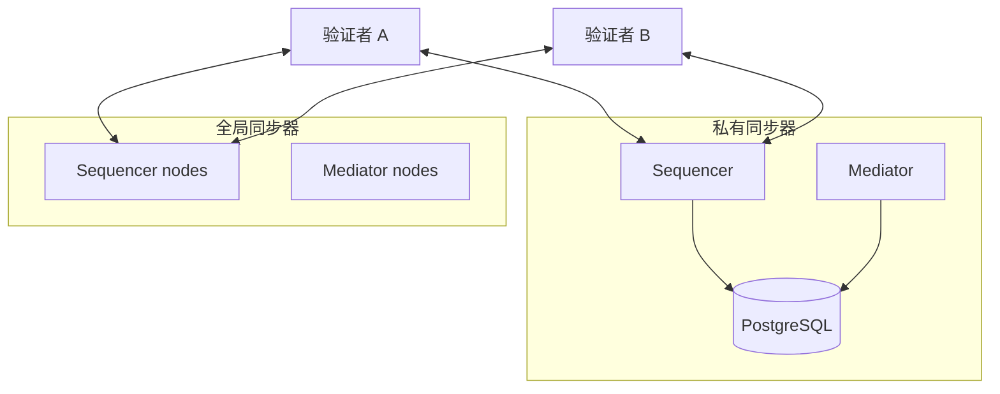
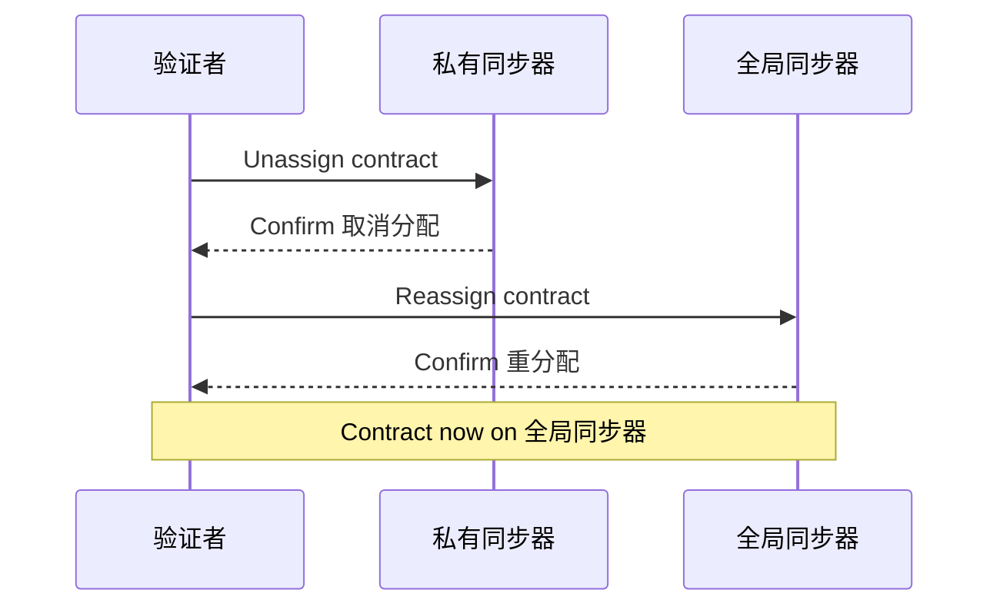

# 混合同步器模式

> 私有同步器与全局同步器并行的混合部署模式。

> 与全局同步器一起运行私有同步器，以实现混合的公共和私有工作流程

Canton Network上的常见部署模式将私有同步器与全局同步器结合起来。您的验证者连接到两者，在私有同步器上运行大容量或机密工作流程，同时通过全局同步器结算或共享结果。

## 为什么使用混合设置

全局同步器提供网络范围内的互操作性和对 Canton Coin 的访问，但并非每个工作流程都受益于在共享基础设施上运行。当您满足以下条件时，混合模式就有意义：

* **大量双边流量** - 一小部分各方之间的频繁交易（例如，两个交易对手之间的交易确认），这将消耗全局同步器上不必要的流量
* **机密处理阶段** - 中间计算步骤应保留在您控制的基础设施上，仅将最终结果发布到全局同步器
* **延迟敏感操作** - 您需要比全局同步器提供的延迟更低的工作流，因为您的私有同步器运行的节点较少
* **成本优化** — 通过在私有同步器上保持高频交互，仅将合约移至全局同步器进行结算，降低Canton Coin流量成本

## 架构概述

在混合部署中，每个验证者都维护与全局同步器和一个或多个私有同步器的连接。合约被分配给适合其当前生命周期阶段的同步器。



两个验证者都可以在任一同步器上进行交易。在私有同步器上创建的合约稍后可以使用 Canton 的取消分配/重新分配协议重新分配给全局同步器（反之亦然）。

## 合约分配策略

您可以在创建时控制合约所在的同步器，并且可以根据需要在同步器之间移动合约。

**在私人上创建，在公共上解决：**

1. 两方在私有同步器上创建并更新交易合约，交易量大且延迟低
2. 当交易准备好结算时，提交方将合约重新分配给全局同步器
3. 结算在全局同步器上执行，可以与Canton Coin以及其他网络参与者持有的合约进行交互

**在公共上创建，在私有上处理：**

1. 在全局同步器上创建合约，以便所有各方都可以发现它并与之交互
2. 一旦两方同意合作，他们将合约重新分配给私有同步器进行密集处理
3. 最终结果重新分配回全局同步器

## 交叉同步器重新分配

在同步器之间移动合约需要提交验证者连接到源同步器和目标同步器。该操作使用 Canton 的两阶段重新分配协议：



在取消分配和重新分配之间的短暂间隔内，合同不能行使。规划您的工作流程以尽量减少此窗口的影响。

## 配置

要将验证者连接到两个同步器，请注册每个同步器连接。全局同步器连接通常在加入期间配置。对于私有同步器，通过 Canton Console 或管理 API 添加连接。

通过Canton Console：```scala theme={"theme":{"light":"github-light","dark":"github-dark"}}
@ bootstrap.synchronizer(synchronizerName = "private-sync", sequencers = Seq(sequencer1), mediators = Seq(mediator1), synchronizerOwners = Seq(sequencer1), synchronizerThreshold = PositiveInt.one, staticSynchronizerParameters = StaticSynchronizerParameters.defaultsWithoutKMS(ProtocolVersion.forSynchronizer))
    res1: PhysicalSynchronizerId = private-sync::122032922613...::35-0
```

```scala theme={"theme":{"light":"github-light","dark":"github-dark"}}
@ participant1.同步器s.connect_local(sequencer1, "private-sync")
```

如果使用 Helm 进行部署，则可以在验证者值中包含其他同步器连接：

```yaml theme={"theme":{"light":"github-light","dark":"github-dark"}}
participant:
  additional同步器Connections:
    - alias: "private-sync"
      sequencerConnection: "https://sequencer.private-sync.example.com"
```

## 注意事项

* **流量成本** — 私有同步器上的交易不消耗Canton Coin。只有全局同步器上的交易才会产生流量费。
* **验证者重叠** - 合约中涉及的所有各方都必须将其验证者连接到分配该合约的同步器。相应地规划同步器拓扑。
* **排序保证** — 每个同步器都提供自己的总排序。跨同步器事务通过 Canton 协议进行同步，但比同同步器事务具有更高的延迟。
* **运营开销** — 运行私有同步器意味着除了验证者之外还需要运行Sequencer和中介器基础设施。请参阅[部署指南](https://docs.canton.network/global-synchronizer/extension-同步器s/deployment) 了解其中涉及的内容。

---

> 本文由 CC Privacy Club 根据 Canton Network 官方文档（CC-BY-4.0）整理翻译，仅供学习；实现细节以官方最新版本为准。
