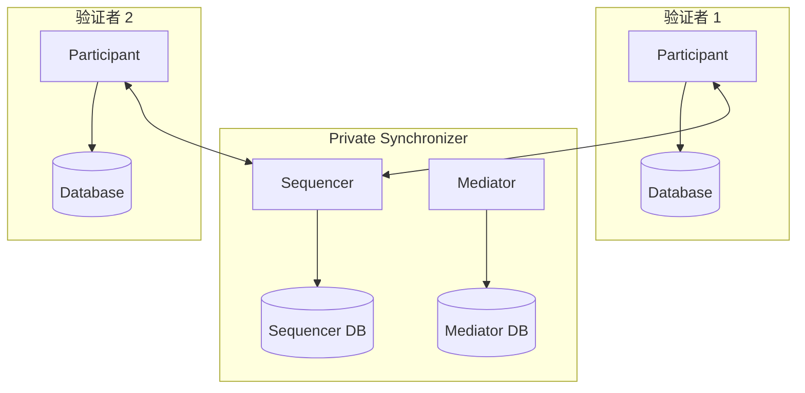

# 独立私有同步器

> 独立于全局同步器运行的私有 Canton 同步器。

> 独立于全局同步器运行私有Canton 同步器

并非每个 Canton 部署都需要连接到全局同步器。您可以为完全属于您的组织或联盟内部的工作流程运行完全独立的私有同步器。这些部署独立运行——没有 Canton Coin，不与更广泛的 Canton 网络交互，也不依赖于 全局同步器 Foundation 基础设施。

## 当独立同步器有意义时

在以下情况下，与全局同步器断开连接的专用同步器是合适的：

* **所有各方都是内部的** - 您的工作流程完全在一个组织或一组已知参与者内运行，无需与外部 Canton Network 各方进行交互
* **需要监管隔离** - 合规性规则要求交易数据和元数据保留在特定的基础设施边界内，没有外部网络连接
* **您想要 Canton 的隐私和同步模型，无需网络参与** - Canton 的子交易隐私、多方工作流程和 Daml 智能合约本身就有价值，独立于 Canton Network 生态系统
* **您正在评估 Canton** — 在启用 全局同步器 之前，运行独立同步器是测试 Canton 功能的最简单方法

## 你放弃什么

如果没有全局同步器连接，您的部署将无法：

* **使用Canton Coin** - Canton Coin是全球同步器的原生货币。独立同步器无法访问它。
* **与其他 Canton Network 参与者互操作** — 您的私人同步器上的合约无法重新分配给全局同步器或与那里的合约交互
* **参与 Canton 网络治理** - 您的验证者不是 Canton 网络拓扑的一部分

如果您稍后决定需要全局同步器连接，则可以通过将验证者连接到全局同步器并根据需要重新分配合约来添加它。请参阅[将验证者链接到多个同步器](/global-synchronizer/extension-synchronizers/linking-validator-multi-sync) 了解其工作原理。

## 架构

独立的私有同步器包括：

* **一个或多个Sequencer节点** — 为同步器提供消息排序
* **一个或多个Mediator 节点** — 收集交易确认并确定结果
* **PostgreSQL 数据库** — Sequencer和中介器状态的后端存储
* **验证者** - 仅连接到私有同步器

## 部署概述

部署独立同步器遵循与在混合设置中部署专用同步器相同的过程，减去全局同步器加入步骤。您需要：

1. 部署Sequencer和Mediator 节点及其 PostgreSQL 数据库
2. 初始化同步器标识和拓扑
3. 部署验证者并将它们连接到您的同步器
4. 在验证者上分配参与方并开始交易

有关分步说明，请参阅[私有同步器部署指南](/global-synchronizer/extension-synchronizers/deployment)。

## 与全局同步器操作的差异

运行独立同步器会通过多种方式改变您的操作模型：

* **您负责所有基础设施** — 没有超级验证者。您自己（或在您的联盟内）操作Sequencer、中介器和所有验证者。
* **无流量费** — 没有全局同步器，就没有Canton币流量计量。您的成本纯粹是基础设施成本。
* **升级时间表由您决定** — 您不受全局同步器升级时间表的约束。您可以按照自己的计划升级 Canton 版本，但建议保持最新的安全补丁。
* **更简单的拓扑** — 没有加入秘密、没有 IP 许可名单、没有赞助商关系。您可以控制完整的网络拓扑。## 扩展考虑因素

对于小型部署（几个验证者、中等交易量），具有 PostgreSQL 后端的单个Sequencer和中介器就足够了。随着交易量的增长，您可以：

* 垂直扩展 PostgreSQL 数据库（更多 CPU、内存、更快的存储）
* 为验证者数据库添加只读副本
* 如果您的专用网络需要容错，请部署多个Sequencer和中介器实例

<Note>
  集中式Sequencer（单个 PostgreSQL 后端）目前处于 Alpha 阶段。对于生产工作负载，请在提交到此订购后端之前根据预期交易量验证性能和稳定性。
</Note>

---

> 本文由 CC Privacy Club 根据 Canton Network 官方文档（CC-BY-4.0）整理翻译，仅供学习；实现细节以官方最新版本为准。
