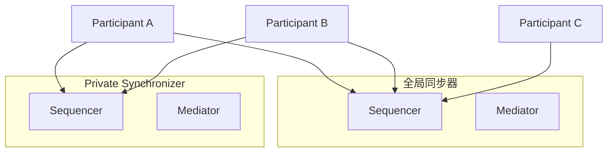

# 私有同步器

> 与全局同步器并行运行的私有（扩展）同步器。

> 在 Canton Network 上与全局同步器一起运行私有同步器

Canton Network的应用不限于全球同步器。您可以将私有同步器（也称为扩展同步器）与全局同步器一起操作，以处理需要不同隐私、性能或治理特征的工作负载。

## 为什么使用私有同步器

全球同步器是 Canton Network 的公共主干网——它为 Canton Coin、身份管理和跨组织工作流程提供同步层。但某些工作负载的要求可以通过专用同步器更好地满足：

* **隐私** - 私有同步器上的交易数据仅对利益相关方可见，而不对整个 全局同步器 网络可见。即使同步器操作员也只能看到加密的消息信封。
* **性能** — 专用同步器可以根据特定的吞吐量和延迟要求进行调整，而不会受到其他网络流量的影响
* **治理** — 您控制同步器的配置、访问策略和升级计划
* **成本** — 私有同步器流量不消耗Canton Coin流量积分

## 它们是如何工作的

私有同步器运行其自己的Sequencer和Mediator 节点。参与者连接到全局同步器（用于Canton Coin和跨网络互操作性）和一个或多个私有同步器（用于特定于应用程序的交易）。

Canton 的多同步器协议允许单个参与者同时连接到多个同步器。合约可以分配给任何连接的同步器，当不同同步器上的合约需要交互时，Canton 协议会自动处理跨同步器交易。



在此示例中，参与者 A 和 B 连接到两个同步器，并且可以在其中一个同步器上进行交易。参与者C仅连接到全局同步器，无法与私有同步器上的合约交互。

## 何时使用私有同步器

私有同步器在以下情况下有意义：

* 您的应用程序处理一组已知参与者之间的大量交易
* 监管要求强制交易数据保留在特定管辖范围或基础设施内
* 您需要独立于全局同步器负载的有保证的性能特征
* 您的工作流程涉及双边或多边协议，不需要对更广泛的网络可见

在以下情况下不需要专用同步器：

* 您的应用主要涉及Canton Coin转账（这些需要全球同步器）
* 您需要与其他 Canton Network 应用程序实现最大程度的互操作性
* 您更喜欢单个同步器连接的操作简单性

## 部署模型

### 自营

您运行自己的Sequencer和Mediator 节点。这使您可以完全控制基础架构、配置和访问策略。您负责可用性、备份和升级。

### 由第三方运营

值得信赖的第三方代表您运行同步器基础设施。您将参与者连接到他们的Sequencer端点。运营商控制着基础设施，但 Canton 的隐私模型确保他们无法看到您的交易内容 - 他们只能看到加密的消息信封。

### 多运营商 (BFT)

多个组织使用 BFT 共识协议共同操作同步器（类似于全局同步器模型，但具有较小的私有操作集）。这可以防止任何单个操作员离线或恶意行为。

## 连接到专用同步器

参与者通过 Canton Admin API 或 Canton Console 连接到专用同步器。连接需要Sequencer的端点 URL 和适当的身份验证凭据。```scala theme={"theme":{"light":"github-light","dark":"github-dark"}}
@ bootstrap.synchronizer(synchronizerName = "my-private-sync", sequencers = Seq(sequencer1), mediators = Seq(mediator1), synchronizerOwners = Seq(sequencer1), synchronizerThreshold = PositiveInt.one, staticSynchronizerParameters = StaticSynchronizerParameters.defaultsWithoutKMS(ProtocolVersion.forSynchronizer))
    res1: PhysicalSynchronizerId = my-private-sync::122032922613...::35-0
```

```scala theme={"theme":{"light":"github-light","dark":"github-dark"}}
@ participant1.synchronizers.connect_local(sequencer1, "my-private-sync")
```

```scala theme={"theme":{"light":"github-light","dark":"github-dark"}}
@ participant1.synchronizers.list_connected()
    res3: Seq[ListConnectedSynchronizersResult] = Vector(
      ListConnectedSynchronizersResult(
        synchronizerAlias = 同步器 'my-private-sync',
        physical同步器Id = my-private-sync::122032922613...::35-0,
        healthy = true
      )
    )
```

连接后，参与者可以通过在事务提交中将其指定为目标同步器来在私有同步器上创建合约。

## 与全局同步器的关系

私有同步器和全局同步器是互补的：

* **Canton Coin** 操作始终使用全局同步器
* **应用程序合约**可以存在于任一同步器上，具体取决于您的要求
* **当不同同步器上的合约需要交互时，可以进行跨同步器交易（Canton 自动处理协调）
* **参与方身份**在同步器之间共享 - 在全局同步器上注册的参与方可以在任何连接的专用同步器上使用

## 后续步骤

* [混合同步器模式](/global-synchronizer/extension-synchronizers/hybrid-同步器-pattern) — 结合公共和私有同步器
* [Deployment](/global-synchronizer/extension-synchronizers/deployment) — 部署扩展同步器基础设施
* [链接验证者](/global-synchronizer/extension-synchronizers/linking-validator-multi-sync) — 多同步器验证者配置

---

> 本文由 CC Privacy Club 根据 Canton Network 官方文档（CC-BY-4.0）整理翻译，仅供学习；实现细节以官方最新版本为准。
