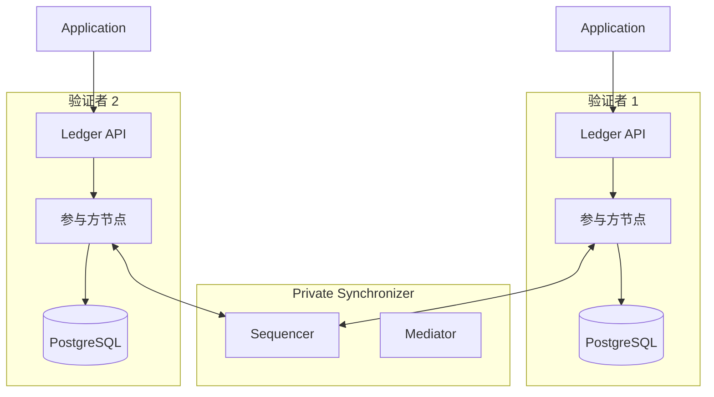

# 私有同步器上的验证者

> 仅在私有同步器上运行、不连接全局同步器的验证者。

> 在没有全局同步器连接的私有同步器上运行验证者

您可以在专用同步器上专门运行验证者，而无需连接到全局同步器。这为您提供了独立的 Canton 部署，您可以在其中控制所有基础设施并独立于 Canton 网络进行操作。

## 何时选择私有验证者

专用验证者适合特定的操作场景：

* **内部企业工作流程** — 您的 Daml 应用程序完全在一个组织内运行，所有各方都托管在您操作的验证者上
* **没有外部依赖性的联盟** - 一个封闭的组织组运行共享工作流程，无需与更广泛的 Canton 网络交互
* **监管限制** - 规则阻止连接到外部网络基础设施，或者所有交易处理必须在特定管辖范围内的基础设施上进行
* **开发和测试** — 您想要在不设置全局同步器连接的情况下构建和测试 Daml 应用程序

## 与 全局同步器 验证者有何不同

在没有全局同步器连接的情况下运行验证者可以简化操作，但会删除某些功能。

**你得到什么：**

* 完整的 Canton 协议功能 — 子交易隐私、多方工作流程、Daml 智能合约
* Ledger API 的工作方式与 全局同步器 连接的验证者相同
* 更简单的网络拓扑，无外部依赖
* 无广币流量费

**你没有得到什么：**

* 没有 Canton Coin — 您不能持有、转让或使用 Canton Coin
* 无 Splice 钱包 — 钱包应用程序需要 全局同步器 连接
* 与 Canton Network 各方没有互操作性 - 您的合约无法与 全局同步器 上的合约交互
* 没有验证者加入流程——您自己管理完整的拓扑

## 架构

专用验证者是连接到您的专用同步器的标准 Canton 参与方节点。如果没有全局同步器，则不需要验证者进程（处理 Canton Network 特定功能，如钱包管理和流量购买）。



## 部署

部署没有验证程序进程的参与方节点。为此，您可以使用 Canton 开源发行版，因为您不需要特定于 Splice 的组件。

### 头盔部署

```yaml theme={"theme":{"light":"github-light","dark":"github-dark"}}
# participant-values.yaml
participant:
  storage:
    type: postgres
    config:
      dataSourceClass: "org.postgresql.ds.PGSimpleDataSource"
      properties:
        serverName: "<postgres-host>"
        portNumber: 5432
        databaseName: "participant_db"
        user: "participant_user"
        password: "<password>"
  ledgerApi:
    port: 5001
    tls:
      certChainFile: "/certs/tls.crt"
      privateKeyFile: "/certs/tls.key"
  同步器Connections:
    - alias: "private-sync"
      sequencerConnection: "https://sequencer.private-sync.example.com"
```

```bash theme={"theme":{"light":"github-light","dark":"github-dark"}}
helm install participant canton/canton-participant \
  -f participant-values.yaml \
  --namespace canton
```

### 连接到同步器

参与者启动后，会自动连接到配置的同步器。验证连接：

```scala theme={"theme":{"light":"github-light","dark":"github-dark"}}
@ bootstrap.synchronizer(synchronizerName = "private-sync", sequencers = Seq(sequencer1), mediators = Seq(mediator1), synchronizerOwners = Seq(sequencer1), synchronizerThreshold = PositiveInt.one, staticSynchronizerParameters = StaticSynchronizerParameters.defaultsWithoutKMS(ProtocolVersion.forSynchronizer))
    res1: PhysicalSynchronizerId = private-sync::122032922613...::35-0
``````scala theme={"theme":{"light":"github-light","dark":"github-dark"}}
@ participant1.synchronizers.list_connected()
    res2: Seq[ListConnectedSynchronizersResult] = Vector(
      ListConnectedSynchronizersResult(
        synchronizerAlias = 同步器 'private-sync',
        physical同步器Id = private-sync::122032922613...::35-0,
        healthy = true
      )
    )
```

## 在专用和全局同步器连接之间进行选择

使用这个决策框架：

* **您的任何一方是否需要与外部 Canton Network 各方进行交易？** 如果是，您需要 全局同步器 连接。请考虑使用[混合模式](/global-synchronizer/extension-synchronizers/hybrid-同步器-pattern)。
* **您是否需要Canton Coin进行支付或结算？** 如果是，您需要全球同步器连接。
* **您将来可能需要网络连接吗？** 如果可能，请立即部署标准验证者并稍后连接到全局同步器。添加同步器连接是无中断的 - 请参阅[链接到多个同步器](/zh/docs/canton/global-synchronizer-extension-synchronizers-linking-validator-multi-sync)。
* **您的用例完全是内部的，没有可预见的外部交互吗？** 专用验证者是更简单的选择。

## 稍后迁移到全局同步器

如果您的要求发生变化，您可以将验证者连接到全局同步器，而不会中断您的私有同步器工作流程：

1. 完成 全局同步器 入职流程（赞助、IP 许可名单、入职秘密）
2. 将 全局同步器 连接添加到您的验证者
3. 将需要全网可见性的合约从私有同步器重新分配到全局同步器
4. 继续在私有同步器上运行私有工作流程

添加全局同步器连接不会影响私有同步器上的现有应用程序和合约。

---

> 本文由 CC Privacy Club 根据 Canton Network 官方文档（CC-BY-4.0）整理翻译，仅供学习；实现细节以官方最新版本为准。
