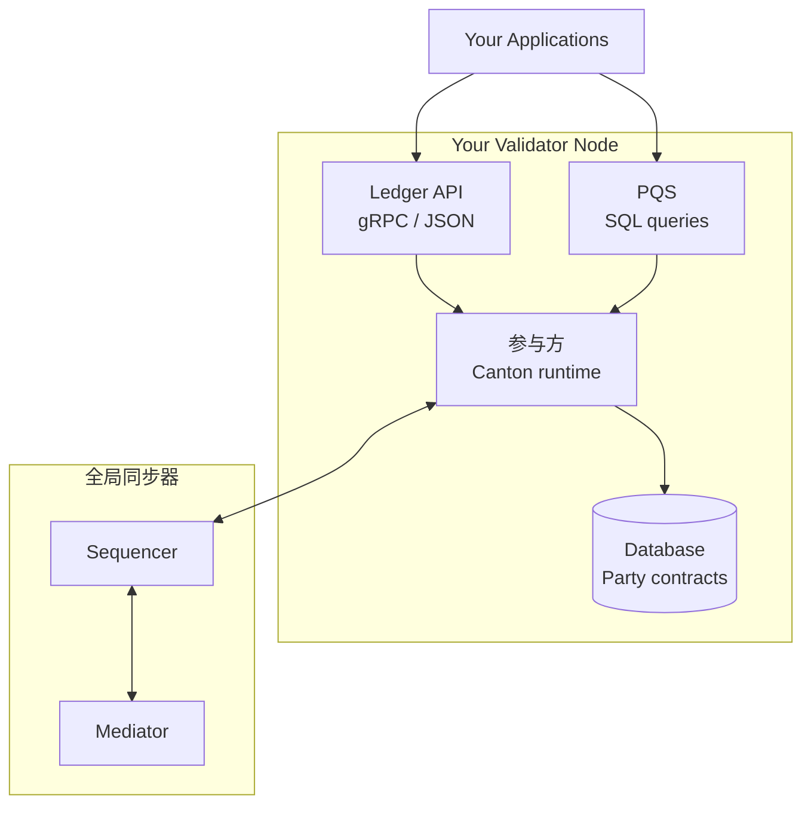
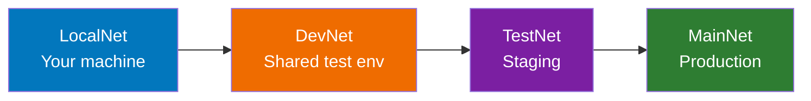

# 节点运维入门

> 全局同步器上验证者节点运维入门指南。

全局同步器是 Canton 网络的公共协调层，由一组去中心化的验证者运营。本节介绍在该网络上操作节点的含义。

## 什么是验证者？

**验证者**（也称为参与者节点）是具有以下功能的基础设施：

* **托管 Party**：存储其所托管 Party 的合约数据
* **参与共识**：确认影响其 Party 的交易
* **公开 API**：为应用程序提供 Ledger API 访问
* **连接到全局同步器**：提供与 Canton 网络上其他验证者的连接

## 验证者与超级验证者

**验证者：**

* 托管 Party 并存储合约
* 为应用暴露 Ledger API
* 由应用运营商和企业运营

**超级验证者：**

* 运营同步器基础设施（Sequencer、Mediator 节点）
* 参与网络治理
* 由主要机构和认可运营商运营

作为验证者，您：

* 运行你自己的参与者节点
* 为您的用户/应用程序托管 party
* 使用Canton Coin支付流量费
* 希望您的节点能够使用网络强制的版本进行更新
* **不** 运营同步器组件（Sequencer/Mediator）
* **不** 直接参与网络治理
* **不** 运行 BFT 共识节点

## 网络环境

Canton Network 在四种环境中运行：

* **LocalNet**：本地开发环境，任何人都可以访问，使用本地测试CC
* **DevNet**：集成测试环境，需要VPN和赞助，使用faucet进行测试CC
* **TestNet**：预发布环境，需要申请流程，使用faucet进行测试CC
* **MainNet**：生产环境，需要完整入驻，CC具有真正的价值

### 进阶路径

**在环境之间移动需要：**

* **LocalNet → DevNet**：VPN 凭证、超级验证者赞助
* **DevNet → TestNet**：申请审批、IP 白名单
* **TestNet → MainNet**：完整的启动流程，运营准备就绪

## 运营模式

运行验证者基础设施有两个主要选项：

### 选项 1：自托管

在您自己的（或云）服务器上运行您自己的验证者基础设施。

|方面|详情 |
| ------------------ | ------------------------------------------- |
| **控制** |完全控制基础设施|
| **责任** |您管理运营、升级、安全 |
| **要求** |技术专长、业务能力|
| **成本** |基础设施成本+运营开销|

**最适合：** 具有 DevOps/SRE 能力、特定合规性要求或需要完全控制的组织。

### 选项 2：节点即服务

使用提供商来托管和管理您的验证者基础设施。

|方面|详情 |
| ------------------ | -------------------------------------------------- |
| **控制** |配置控制；提供商管理运营|
| **责任** |提供商处理升级、可用性 |
| **要求** |与提供商签订的合同 |
| **成本** |服务费|

**最适合：** 专注于应用程序开发的团队、没有基础设施专业知识的组织。

## 运行验证者涉及什么

### 日常运营|任务|频率|描述 |
| ---------------------- | -------------- | ----------------------------------- |
| **监控** |连续 |健康检查、性能指标 |
| **日志管理** |连续 |捕获和分析日志 |
| **升级** |每周-每月 |与网络版本保持同步|
| **流量管理** |根据需要|确保Canton Coin费用余额 |
| **备份** |常规|数据库和身份备份|

### 升级期望

全局同步器频繁升级：

|类型 |频率|影响 |
| -------------------- | -------------- | ----------------------------------- |
| **小更新** |每周-每月 |通常向后兼容 |
| **功能发布** |每季度 |可能需要更改配置 |
| **安全补丁** |根据需要|关键；需要快速部署|

<Warning>
  验证者必须跟上网络升级的步伐。落后版本可能会导致网络断开。
</Warning>

## 开始使用

### 先决条件

在部署验证者之前，请确保您拥有：

1. **赞助**：超级验证者必须赞助您的入驻
2. **基础设施**：满足[基础设施要求](/global-synchronizer/understand/infrastructure-requirements)
3. **技术能力**：有能力运营容器化服务的团队
4. **Canton Coin**：流量费用预算（测试网/主网）

### 入驻流程

1. **联系超级验证者**赞助商（[canton.foundation 列表](https://canton.foundation)）
2. **提供您的出口 IP** 以用于网络白名单
3. **等待列入许可名单**（通常 2-7 天）
4. **从赞助商那里获取入驻密钥**
5. **使用入驻配置部署验证者**
6. **验证连接**并开始操作

<Note>
  DevNet 是推荐的测试起点。 DevNet 机密可以通过 API 获取，有效期为 1 小时。测试网和主网机密需要赞助商手动提供。
</Note>

## 主要职责

作为验证者操作员，您负责：

|责任|描述 |
| ---------------- | ------------------------------------------------------ |
| **可用性** |保持您的节点运行和连接 |
| **安全** |保护您的基础设施和密钥 |
| **升级** |及时了解网络版本 |
| **流量** |维持Canton Coin 费用余额 |
| **合规性** |满足您所在司法管辖区的任何监管要求 |

## 您无需担心什么

全局同步器处理：

* **共识**：超级验证者运行 BFT 共识
* **治理**：全局同步器基金会 (GSF) 管理网络参数。 GSF 是管理 全局同步器 的非盈利基金会。
* **排序**：同步器对交易进行排序
* **中介**：同步器管理确认

## 后续步骤

<CardGroup cols={2}>
  <Card title="基础设施要求" icon="server" href="/global-synchronizer/understand/infrastructure-requirements">
    硬件、软件和网络要求。
  </Card>

  <Card title="验证者角色" icon="user-gear" href="/global-synchronizer/understand/validator-roles">
    了解您作为验证者的职责。
  </Card>
</CardGroup>

---

> 本文由 CC Privacy Club 根据 Canton Network 官方文档（CC-BY-4.0）整理翻译，仅供学习；实现细节以官方最新版本为准。
