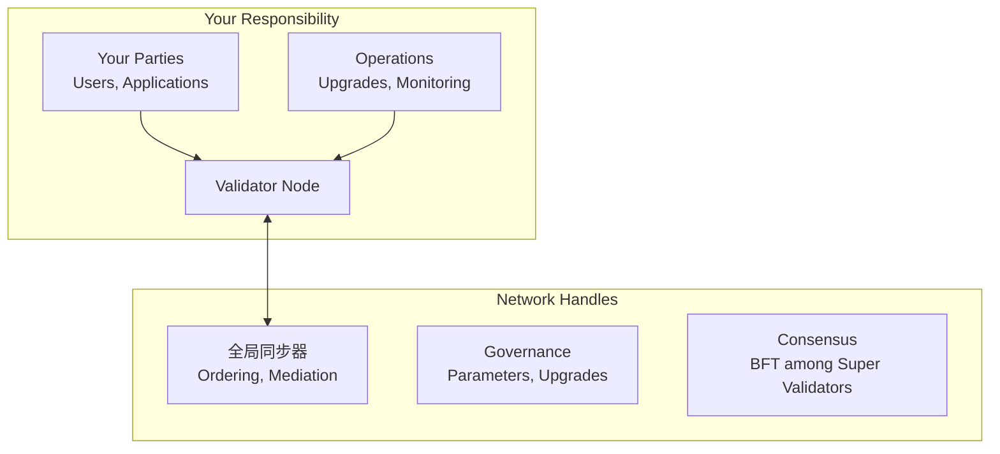

# 验证者角色与职责

> 验证者在 Canton Network 上的角色、职责与运维期望。

在 Canton Network 上运营验证者需要承担特定的角色、责任和期望。本页阐明了验证者的期望与网络处理的内容。

## 验证者的角色

作为验证者，您操作一个**参与者节点**：

1. **为用户和应用程序托管 party**
2. **存储各方的合同数据**
3. **验证影响您各方的交易**
4. **连接同步器**进行协调
5. **公开 API** 供应用程序与账本交互

## 你的职责是什么

### 基础设施运营

* **节点可用性**：保持验证者运行和连接
* **性能**：确保为您的工作负载提供足够的资源
* **升级**：保持最新的网络版本
* **监控**：跟踪运行状况、性能和错误
* **备份**：数据库和身份的定期备份
* **安全**：保护基础设施、密钥和访问

### Party 管理

* **入职**：在验证者上创建和管理各方
* **密钥管理**：各方密钥的安全存储
* **访问控制**：控制谁可以充当哪些方
* **数据保管**：您的验证者存储各方的数据

### 流量（交易费用）

* **Canton Coin余额**：维持足够的CC用于运营
* **充值**：需要时补充流量
* **成本管理**：监控和优化流量使用

## 您不承担什么责任

### 由全局同步器处理

|功能|谁来处理|
| ---------------------------- | ---------------------- |
| **交易排序** |同步器 Sequencer|
| **确认聚合** |同步器 Mediator|
| **BFT 共识** |超级验证者 |
| **网络参数** | GSF 治理 |
| **升级协调** | GSF 和 SV |

### 信任模型

作为验证者，您相信：

* 同步器公平地排序交易
* 超级验证者保持可用性
* 网络参数设置适当
* 升级得到适当协调

您不需要：

* 运行共识节点
* 验证所有网络交易
* 参与治理投票
* 操作同步器基础设施

## 运营预期

### 可用性

|期望|详情 |
| ----------------------- | -------------------------------------------------- |
| **正常运行时间目标** |规划 99% 以上的可用性 |
| **计划维护** |低流量期间的协调 |
| **事件响应** |监控并响应问题 |

<Note>
  当您的验证者离线时，您的各方无法进行交易。仔细规划维护时段并与用户沟通。
</Note>

### 版本时效

网络升级频繁。验证者必须跟上：

|时间表 |行动|
| ------------------- | -------------------------------------------------------- |
| **1周内** |应用安全补丁 |
| **两周内** |应用小更新 |
| **截止日期之前** |主要版本升级（提前公告）|

<Warning>
  运行过时版本的验证者可能会与网络断开连接。监控公告并计划升级窗口。
</Warning>

### 沟通

与网络保持连接：

|频道|目的|
| ---------------------------------- | ---------------------------------------------------- |
| **#验证者操作** |用于运营讨论的 Slack 频道 |
| **邮件列表** |公告的lists.sync.global |
| **发行说明** |跟踪变更和要求 |

## 安全责任

### 您的安全范围|资产|您的责任 |
| ---------------------------- | ------------------------------------------------ |
| **验证者基础设施** |强化、修补、访问控制 |
| **Party 密钥** |安全生成、存储、轮换 |
| **数据库** |加密、访问控制、备份 |
| **API 访问** |身份验证、授权、TLS |
| **网络边界** |防火墙、DDoS 防护 |

### 不是你的责任

|资产|处理人 |
| ------------------------------------------- | ---------------------------------- |
| **同步器安全** |超级验证者 |
| **协议安全** |Canton/拼接开发 |
| **网络范围内的 DoS 防护** |同步器操作员|

## 合规性注意事项

根据您的管辖范围和用例：

|考虑|行动|
| ------------------------ | -------------------------------------------------------- |
| **数据驻留** |确保验证者位置符合要求 |
| **审核要求** |维护日志和记录 |
| **了解您的客户/反洗钱** |如果需要，为您的 party实施 |
| **监管报告** |建立必要的能力|

<Note>
  Canton 的隐私模型通过确保数据保留在授权方手中来帮助遵守法规。但是，您仍然对自己的监管义务负责。
</Note>

## 成本

运营验证者涉及多种成本类别：

### 基础设施成本

|组件|典型范围|
| ------------ | ------------------ |
| **计算** | $200-$2000/月 |
| **数据库** | $100-$500/月 |
| **网络** | $50-$200/月 |
| **存储** |随数据量变化 |

### 网络成本

|成本|描述 |
| ---------------- | ------------------------------------------------ |
| **流量费** |交易用Canton Coin |
| **变量** |基于交易量和规模 |

### 运营成本

|成本|描述 |
| ------------- | ---------------------------------------------------- |
| **人员** |监控、升级、事件的时间 |
| **工具** |监控、记录、警报 |

## 支持资源

### 社区支持

|资源 |描述 |
| ----------------- | -------------------------------------------------------- |
| **Slack** | #validator-operations 用于同行支持 |
| **论坛** |技术问题论坛.canton.network |
| **文档** |这个网站|

### 商业支持

|等级 |联系我们 |
| ----------------- | ------------------------------------------------------------------------------------------- |
| **酌情** | [da-support@digitalasset.com](mailto:da-support@digitalasset.com)（尽力而为）|
| **SLA** | [support@digitalasset.com](mailto:support@digitalasset.com)（企业）|

## 成为验证者

### 先决条件

1. **技术能力**：有能力运营容器化服务的团队
2. **基础设施**：满足[基础设施要求](/global-synchronizer/understand/infrastructure-requirements)
3. **赞助**：超级验证者愿意赞助
4. **Canton币**：流量费预算

### 流程

1. **联系超级验证者**（[canton.foundation 列表](https://canton.foundation)）
2. **讨论您的用例**和入职要求
3. **根据要求准备基础设施**
4. **在赞助下完成入职**
5. **开始运营**并维护您的节点

## 后续步骤

<CardGroup cols={2}>
  <Card title="验证者部署" icon="server" href="/global-synchronizer/understand/introduction">
    开始部署您的验证者节点。
  </Card>

  <Card title="基础设施要求" icon="list-check" href="/global-synchronizer/understand/infrastructure-requirements">
    查看详细的基础设施要求。
  </Card>
</CardGroup>

---

> 本文由 CC Privacy Club 根据 Canton Network 官方文档（CC-BY-4.0）整理翻译，仅供学习；实现细节以官方最新版本为准。
