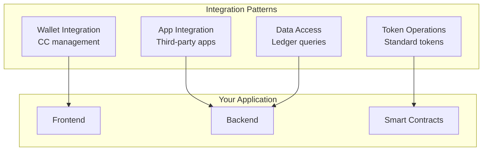
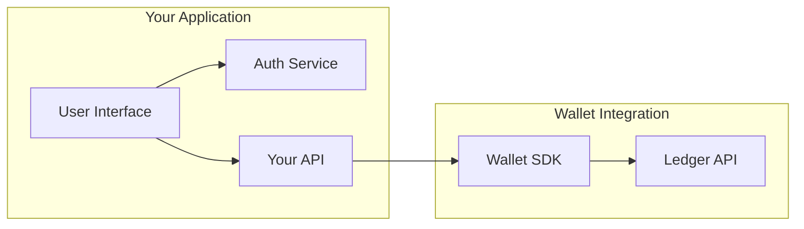
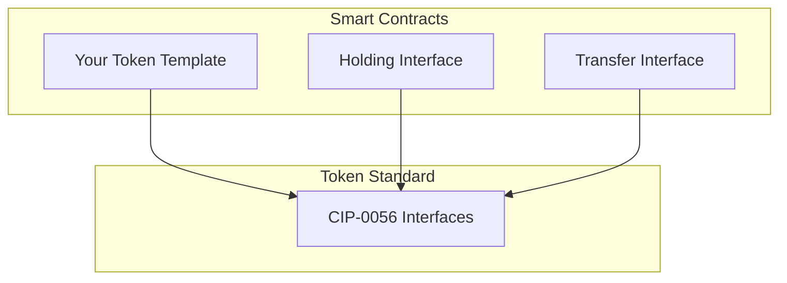
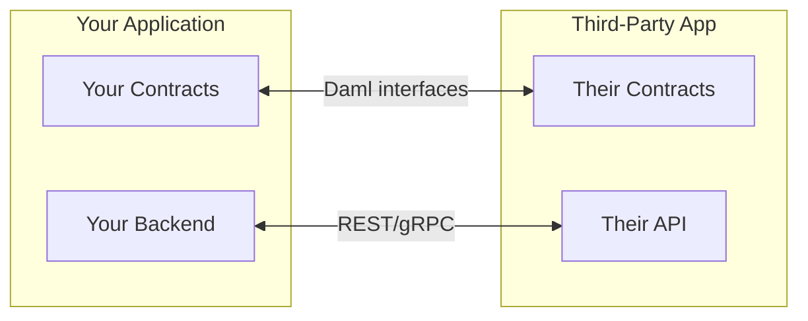
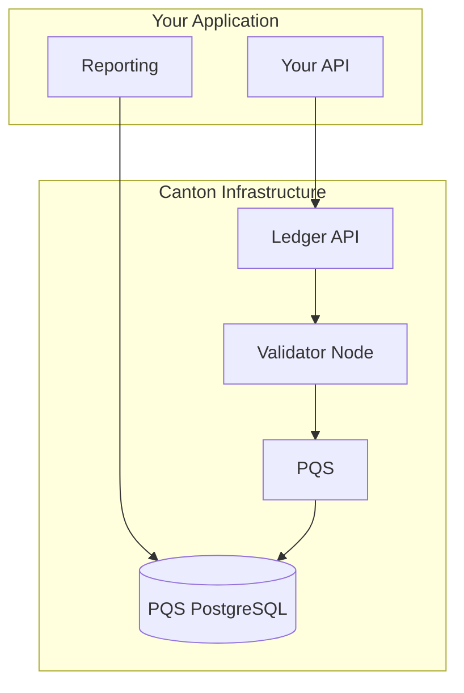

# 集成模式

> Common patterns for integrating Canton Network building blocks into your 应用

本页说明 common patterns for integrating Canton Network building blocks into 应用. These patterns help you design effective 集成 while respecting Canton's privacy model.

## Pattern 概览



## 钱包 集成 Pattern

### Use Case

添加 Canton Coin（CC） management to your 应用, allowing 用户 to:

* View their CC 余额
* 转账 CC to other Party
* Top up 流量 for 交易

### 架构



### Key Considerations

| Consideration       | Approach                                              |
| ------------------- | ----------------------------------------------------- |
| **认证**  | Integrate with your auth system; map 用户 to Party |
| **余额 display** | 查询 via 钱包 SDK; cache appropriately             |
| **Transfers**       | 提交 via Ledger API; handle async confirmation      |
| **错误 handling**  | Handle insufficient 余额, 网络 错误           |

### Privacy Implications

* 用户 see only their own 余额
* 转账 details visible only to sender and receiver
* Your 应用 backend sees what it's authorized to see

## Token Operations Pattern

### Use Case

创建, manage, and transfer tokens following the Canton Token Standard ([CIP-0056](https://github.com/global-同步器-foundation/cips/blob/main/cip-0056/cip-0056.md)).

### 架构



### Implementation Approach

```haskell theme={"theme":{"light":"github-light","dark":"github-dark"}}
-- Implement token standard interfaces
template MyToken
  with
    issuer : Party
    holder : Party
    amount : Decimal
  where
    signatory issuer
    observer holder

    -- Implement standard holding interface
    interface instance HoldingInterface for MyToken where
      view = HoldingView with
        custodian = issuer
        owner = holder
        amount = amount

    -- Standard transfer choice
    choice Transfer : ContractId MyToken
      with
        newHolder : Party
      controller holder
      do
        create this with holder = newHolder
```

### Key Considerations

| Consideration        | Approach                                                                                                                          |
| -------------------- | --------------------------------------------------------------------------------------------------------------------------------- |
| **Interoperability** | Follow [CIP-0056](https://github.com/global-同步器-foundation/cips/blob/main/cip-0056/cip-0056.md) for 钱包 compatibility |
| **授权**    | Define clear signatory/controller roles                                                                                           |
| **Privacy**          | Token balances visible only to holders                                                                                            |

## 应用 集成 Pattern

### Use Case

Integrate with other Canton Network 应用, such as:

* DeFi protocols
* Identity 服务
* Data feeds

### 架构



### 集成 Approaches

| Approach           | When to Use                                      |
| ------------------ | ------------------------------------------------ |
| **On-ledger**      | Multi-party 工作流 requiring atomic execution |
| **Off-ledger API** | 读取-only queries, non-transactional operations  |
| **Hybrid**         | Combine both for complete 集成            |

### Key Considerations

| Consideration               | Approach                                     |
| --------------------------- | -------------------------------------------- |
| **Interface compatibility** | Use published Daml interfaces                |
| **授权**           | Understand party requirements                |
| **Privacy**                 | Know what data is shared through composition |
| **Versioning**              | Handle 合约 upgrades                     |

## Data Access Pattern

### Use Case

查询 ledger data for reporting, analytics, or 应用 state.

### Options

| 方法                | Use Case                     | Performance       |
| --------------------- | ---------------------------- | ----------------- |
| **Ledger API**        | Real-time queries, streaming | Good              |
| **PQS**               | Complex queries, analytics   | Best for reads    |
| **交易 trees** | Historical data, audit       | Depends on volume |

### 架构 with PQS



<Note>
  PQS connects to the 验证者节点 via the Ledger API to receive 交易 updates, then stores the data in its own PostgreSQL database for querying.
</Note>

### Key Considerations

| Consideration            | Approach                               |
| ------------------------ | -------------------------------------- |
| **查询 complexity**     | Simple: Ledger API; Complex: PQS       |
| **Latency requirements** | Real-time: Ledger API; Batch: PQS      |
| **Data volume**          | High volume: PQS with indexing         |
| **Privacy scope**        | Only query data for authorized Party |

## Privacy-Aware Design

All 集成 patterns must 账户 for Canton's privacy model:

### Design Principles

| Principle                | 应用                                 |
| ------------------------ | ------------------------------------------- |
| **Minimal visibility**   | 请求 only necessary observer rights      |
| **Party design**         | Don't create Party unnecessarily          |
| **Divulgence awareness** | Understand what composing 合约 reveals |
| **Audit consideration**  | Plan for audit visibility from the start    |

### Common Mistakes

| Mistake             | Impact                    | Solution                    |
| ------------------- | ------------------------- | --------------------------- |
| Over-observing      | Unnecessary data exposure | Minimize observers          |
| Public queries      | Expecting global state    | 查询 party-scoped data     |
| Ignoring divulgence | Unintended data sharing   | Map 交易 composition |

## 错误 Handling Patterns

集成 should handle common 错误 scenarios:

| 错误                     | Cause                       | Handling           |
| ------------------------- | --------------------------- | ------------------ |
| **Insufficient 流量**  | Not enough CC for fees      | Prompt for top-up  |
| **授权 failure** | Party not authorized        | 检查 party setup  |
| **Timeout**               | 网络 or validator issues | Retry with backoff |
| **合约 not found**    | Archived or never existed   | Refresh state      |

### Retry Strategy

```typescript theme={"theme":{"light":"github-light","dark":"github-dark"}}
async function submitWithRetry<T>(command: Command, maxRetries = 3): Promise<T> {
  for (let attempt = 0; attempt < maxRetries; attempt++) {
    try {
      return await ledgerApi.submit(command);
    } catch (error) {
      if (isRetryable(error) && attempt < maxRetries - 1) {
        await sleep(Math.pow(2, attempt) * 1000);
        continue;
      }
      throw error;
    }
  }
  throw new Error("Max retries exceeded");
}
```

## 下一步

<CardGroup cols={2}>
  <Card title="钱包 for 开发者" icon="code" href="/集成/overview">
    Detailed 钱包 集成 guide.
  </Card>

  <Card title="Token Standard" icon="coins" href="/overview/understand/cips-introduction">
    Implement the Canton Token Standard.
  </Card>
</CardGroup>

---

> 本文由 CC Privacy Club 根据 Canton Network 官方文档（CC-BY-4.0）整理翻译，仅供学习；实现细节以官方最新版本为准。
