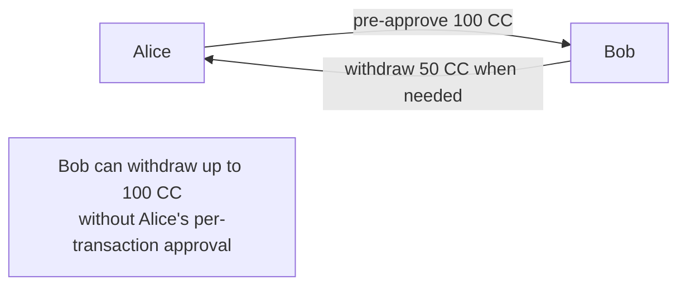
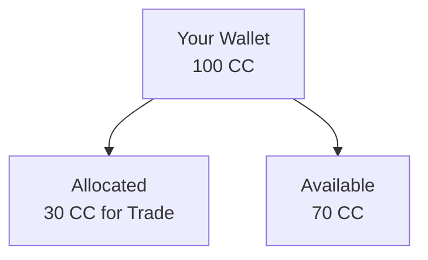
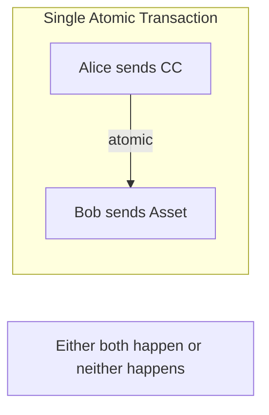
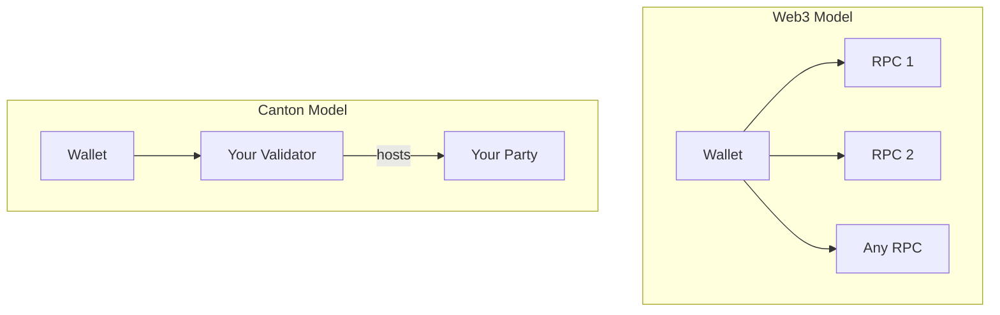

# Canton 钱包与 Web3 钱包

> Understanding the key differences between Canton and traditional crypto wallets

Canton wallets work differently from Web3 wallets like MetaMask. 本页 explains the key differences and what they mean for 用户 and 开发者.

## Fundamental Differences

| Aspect                  | Web3 Wallets            | Canton Wallets                                         |
| ----------------------- | ----------------------- | ------------------------------------------------------ |
| **Data visibility**     | Balances public         | Balances private                                       |
| **交易 privacy** | All 交易 public | Only you see your 交易                         |
| **网络 model**       | 连接 to any RPC      | 连接 to the validator with your party               |
| **Identity**            | Pseudonymous address    | Party identifier                                       |
| **转账 model**      | Single-step send        | Single-step or multi-step (pre-approvals, allocations) |

## Privacy Model

### Web3: Public by Default

On Ethereum, your 钱包:

* Has a public address anyone can see
* Shows 余额 to anyone who queries
* All 交易 visible on block explorers
* 交易 patterns analyzable

```
Anyone can query: 0x123...abc has 45.67 ETH
Anyone can see: 0x123...abc sent 5 ETH to 0x456...def
```

### Canton: Private by Default

On Canton, your 钱包:

* Has a party identifier visible only to you
* 余额 visible only to you (and entitled Party)
* 交易 visible only to participants
* No public 交易 history

```
Only you can see: Your party has 100 CC
Only participants see: You transferred 20 CC to another party
```

## 转账 Capabilities

Canton wallets support transfer patterns not possible in traditional wallets.

### Multi-Step Transfers

Traditional transfer: Send X now.

Canton supports complex 工作流:

| Pattern           | 说明                              |
| ----------------- | ---------------------------------------- |
| **Pre-approvals** | Authorize future transfers up to a limit |
| **Allocations**   | Reserve tokens for specific purposes     |
| **DvP**           | Atomic delivery-vs-payment exchanges     |
| **Conditional**   | Transfers triggered by conditions        |

### Pre-Approvals

Allow another party to withdraw up to a certain amount:



**Use cases:**

* Subscription payments
* Recurring transfers
* Automated 应用 flows

### Allocations

Reserve tokens for a specific purpose:



**Use cases:**

* Trade settlement
* Escrow arrangements
* Multi-step 工作流

### Delivery vs. Payment (DvP)

Atomic exchange of different assets:



**Why this matters:**

* No settlement risk
* No trust required between Party
* Complex exchanges in single 交易

## Connection Model

### Web3: Any RPC

Web3 wallets connect to any compatible RPC 端点:

* Infura, Alchemy, or self-hosted
* Can switch 提供方 freely
* Any node can answer queries

### Canton: Your 验证者

Canton wallets connect to a specific validator:

* The validator hosting your party
* Can't freely switch (party is hosted somewhere specific)
* Only your validator has your data



## Identity Model

### Web3: Address-Based

* Address derived from public key
* Anyone can generate addresses
* Pseudonymous (address is identity)

### Canton: Party-Based

* Party identifier tied to validator hosting
* Party creation involves validator
* Not pseudonymous in the same way

<Note>
  For local Party (where the validator holds the keys), the validator signs on behalf of the party. For external Party, keys are held externally and require explicit signing.
</Note>

| Web3 Address                                 | Canton Party                                                                  |
| -------------------------------------------- | ----------------------------------------------------------------------------- |
| `0x742d35Cc6634C0532925a3b844Bc454e4438f44e` | `alice::1220f2fe29866fd6a0009ecc8a64ccdc09f1958bd0f801166baaee469d1251b2eb72` |

## Explorer Differences

### Web3: Global Explorer

Block explorers show all 网络 activity:

* Any 交易
* Any address 余额
* Any 合约 state

### Canton: Personal Explorer

Canton explorers show your activity:

* Your 交易 only
* Your balances
* Your 合约

<Note>
  There's no equivalent of Etherscan showing all 网络 交易. This is by design—privacy is fundamental.
</Note>

## Implications for 用户

| 若你're used to...         | On Canton...                   |
| ---------------------------- | ------------------------------ |
| Checking any address 余额 | 你可以 only check your own    |
| Viewing all 交易     | You see only your 交易 |
| Connecting to any RPC        | You connect to your validator  |
| Simple send 交易     | You have more transfer options |

## Implications for 开发者

| 若你're building... | Consider...                            |
| --------------------- | -------------------------------------- |
| 钱包 集成    | Use 钱包 SDK for Canton patterns     |
| 交易 display   | Show only 用户's 交易          |
| 余额 queries       | 查询 用户's party only                |
| Multi-step 工作流  | Leverage pre-approvals and allocations |

## 下一步

<CardGroup cols={2}>
  <Card title="钱包 for 开发者" icon="code" href="/集成/overview">
    Integrate 钱包 functionality into your app.
  </Card>

  <Card title="代币标准" icon="coins" href="/zh/docs/canton/overview-understand-cips-introduction">
    Understand the Canton 代币标准.
  </Card>
</CardGroup>

---

> 本文由 CC Privacy Club 根据 Canton Network 官方文档（CC-BY-4.0）整理翻译，仅供学习；实现细节以官方最新版本为准。
