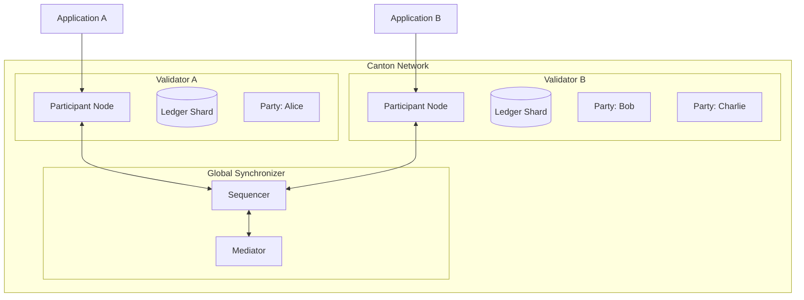
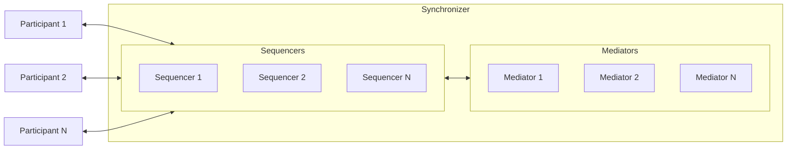
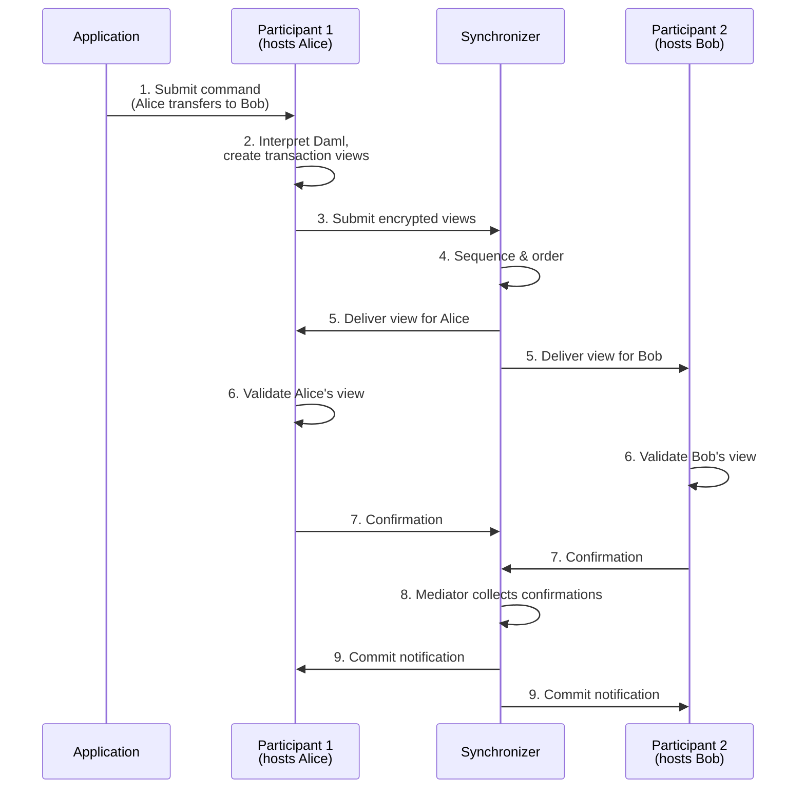
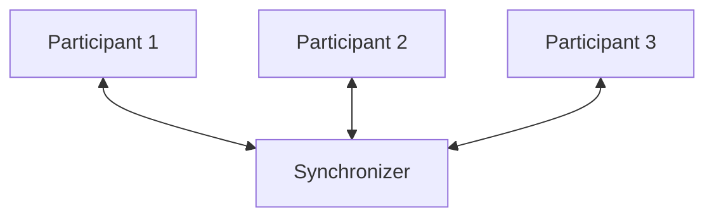
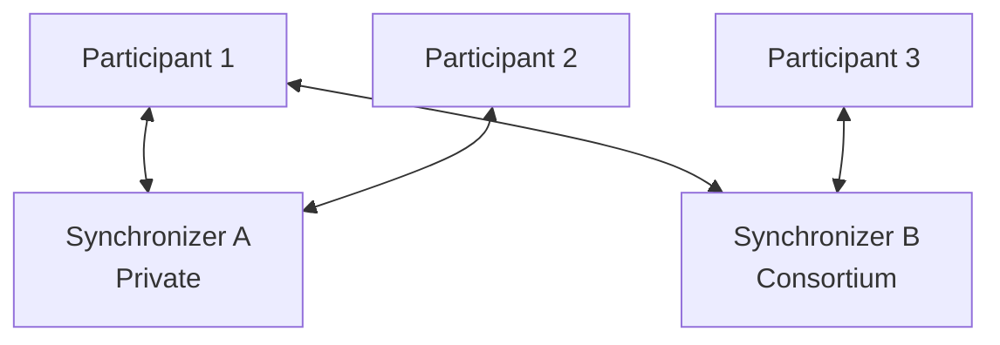
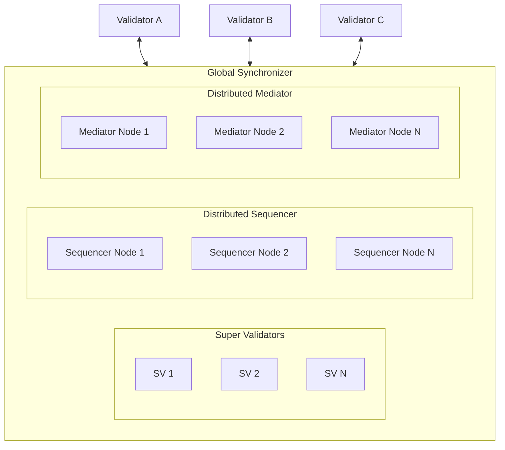
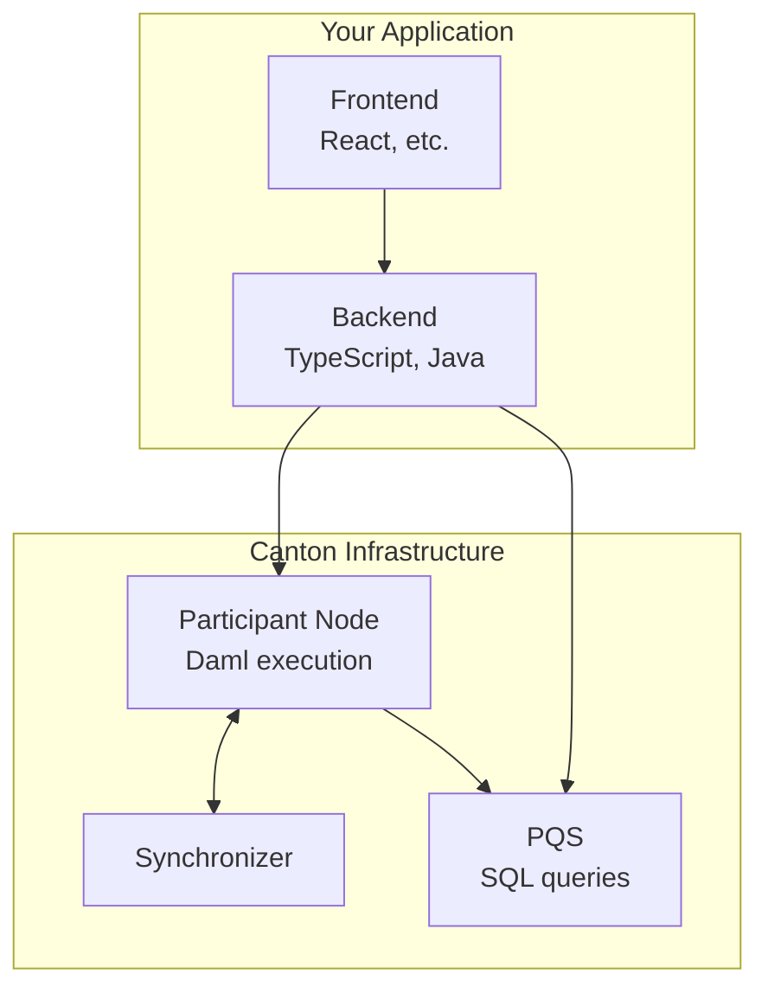

# 架构概览

> 可视化理解 Canton Network 各组件如何协同工作

Canton 的架构与传统区块链根本不同。理解这些组件对设计与调试 Canton 应用至关重要。

## 全局图景

Canton 将**协调**与**存储**分离：Synchronizer 协调交易排序；Participant 节点（验证者）为其托管的 Party 存储数据。



与以太坊每个节点存储全部状态不同，Canton 节点只存储其 Party 的数据。Synchronizer 负责协调，但从不存储交易内容。

## 核心组件

### 验证者（Validators）

验证者是 Canton 的工作负载核心。它们：

| 功能 | 说明 |
| ------------------------- | -------------------------------------------------------------- |
| **托管 Party** | 存储其托管 Party 的合约数据 |
| **执行 Daml 逻辑** | 当交易影响其 Party 时运行智能合约代码 |
| **验证交易** | 对其分片验证授权与正确性 |
| **暴露 Ledger API** | 为应用提供 gRPC/JSON API |

验证者是 Canton Network 中运营 Participant 节点的角色。Participant 节点（常简称 participant）是 Canton Network 内实体的私有、自主计算与存储单元。

**关键特征：**

* 每个 Participant 节点维护账本的**本地化、私有视图**
* Participant 节点只存储其托管 Party 作为利益相关方的合约
* 单个 Participant 可托管多个 Party
* Participant 可连接多个 Synchronizer

### Synchronizer

Synchronizer 在不查看交易内容的前提下协调交易排序与共识。它由两个组件构成：



**Sequencer**

* 在 Participant 之间排序并分发加密消息
* 为该 Synchronizer 上的交易提供全序
* **无法看到**解密后的交易内容
* 确保所有 Participant 以相同顺序接收来自该 Synchronizer 的消息

**Mediator**

* 促成共识协议
* 收集来自 Participant 的确认裁决
* 宣布交易裁决（提交或拒绝）
* **无法看到**解密后的交易内容

<Note>
  Synchronizer 是协调层，不是状态存储层。它从不存储或访问交易数据，仅处理加密消息与确认结果。
</Note>

### Party

Party 是 Canton 链上身份，类似其他链上的地址或外部拥有账户（EOA）。

```
alice::1220f2fe29866fd6a0009ecc8a64ccdc09f1958bd0f801166baaee469d1251b2eb72
└┬┘  └─────────────────────────────────────────┘
 name                              fingerprint (hash of public key)
```

**Party 能力：**

| 能力 | 说明 |
| ------------ | ---------------------------------------------- |
| **Validate** | 确认影响其合约的交易 |
| **Control**  | 发起特定操作（choice） |
| **Observe**  | 查看特定状态与交易 |

**本地 Party 与外部 Party：**

| 类型 | 密钥存储 | 控制 | 用例 |
| ------------------ | ----------------- | ---------------------------- | ------------------------------------ |
| **Local Party**    | 由验证者持有 | 验证者代签 | 更简单；验证者完全控制 |
| **External Party** | 外部持有 | 需显式签名 | 更强控制；类钱包体验 |

<Warning>
  与以太坊地址不同，Party 的创建有成本并在验证者上产生状态。它们不是临时的——请有意设计 Party 结构。
</Warning>

## 交易如何工作

### 交易流



### 分步说明

| 步骤 | 组件 | 动作 |
| ----------------- | ---------------------- | -------------------------------------------------- |
| **1. Submit**     | Application            | 经 Ledger API 向 Participant 发送命令 |
| **2. Interpret**  | Submitting Participant | 执行 Daml 代码，生成带视图的 transaction |
| **3. Submit**     | Submitting Participant | 向 Synchronizer 提交加密视图 |
| **4. Sequence**   | Sequencer              | 排序交易并分配时间戳 |
| **5. Distribute** | Sequencer              | 仅向有权 Participant 发送各视图 |
| **6. Validate**   | All Participants       | 各方独立验证其视图 |
| **7. Confirm**    | All Participants       | 向 Mediator 发送确认/拒绝裁决 |
| **8. Collect**    | Mediator               | 汇总裁决并确定结果 |
| **9. Commit**     | All Participants       | 将交易应用到本地账本分片 |

**要点：**

* 交易分解为**视图**，各方仅见其视图
* Synchronizer 排序但**从不解密**内容
* 确认需要相关 Participant 的**阈值一致**
* 各 Participant 只存储其已提交视图

## 网络拓扑选项

Canton 支持多种拓扑配置：

### 单 Synchronizer（简单）



用例：简单部署、测试、单组织应用。

### 多 Synchronizer（企业）



用例：不同工作流使用不同 Synchronizer；监管隔离；联盟治理。

### Global Synchronizer（Canton Network）



用例：公共 Canton Network；去中心化应用；跨组织工作流。

## 代码运行位置

| 组件 | 位置 | 技术 | 职责 |
| ------------------------------- | ------------------------------- | --------------------------------------- | -------------------------------------------- |
| **Smart Contracts (Templates)** | Participant nodes               | Daml                                    | 业务逻辑、授权、隐私规则 |
| **Backend Services**            | Your infrastructure             | Any language (TypeScript, Java, Python) | 链下自动化、集成 |
| **Frontend**                    | Browser/mobile                  | Any framework                           | 用户界面 |
| **Queries**                     | Participant (Ledger API) or PQS | gRPC, JSON, SQL                         | 读取账本状态 |



### 应用架构决策

| 决策 | 链上（Daml） | 链下（Backend） |
| ----------------------------- | ----------------- | -------------------- |
| **多方协议**    | ✓ 必需        |                      |
| **授权执行** | ✓ 推荐     | 可行但较弱  |
| **复杂业务逻辑**    | 可行          | ✓ 通常更易       |
| **外部 API 调用**        | 不可能      | ✓ 必需           |
| **高频操作** | 考虑批处理 | ✓ 更合适      |
| **审计轨迹要求**  | ✓ 内置        | 需自行实现       |

## 组件通信

### API 概览

| API                   | 协议      | 用例                              |
| --------------------- | ------------- | ------------------------------------- |
| **Ledger API (gRPC)** | gRPC/Protobuf | 高性能后端集成  |
| **Ledger API (JSON)** | HTTP/JSON     | 更简单集成、浏览器友好 |
| **Admin API**         | gRPC/Protobuf | 节点管理、Party 管理 |
| **PQS SQL API**       | PostgreSQL    | 复杂查询、报表            |

### Ledger API 操作

| 操作               | 说明                                               |
| ----------------------- | --------------------------------------------------------- |
| **Command Submission**  | 提交 Daml 命令（创建合约、exercise choice） |
| **Transaction Stream**  | 订阅己方 Party 的交易事件          |
| **Active Contract Set** | 查询当前活跃合约                          |
| **Completions**         | 跟踪命令完成状态                           |

## 下一步

* **[隐私模型详解](/zh/docs/canton/overview-learn-privacy-model)** — 子交易隐私深入
* **[Global Synchronizer](/zh/docs/canton/overview-understand-global-synchronizer)** — 公共网络基础设施
* **[验证者运维](/zh/docs/canton/global-synchronizer-understand-introduction)** — 部署与运营验证者

---

> 本文由 CC Privacy Club 根据 Canton Network 官方文档（CC-BY-4.0）整理翻译，仅供学习；实现细节以官方最新版本为准。
