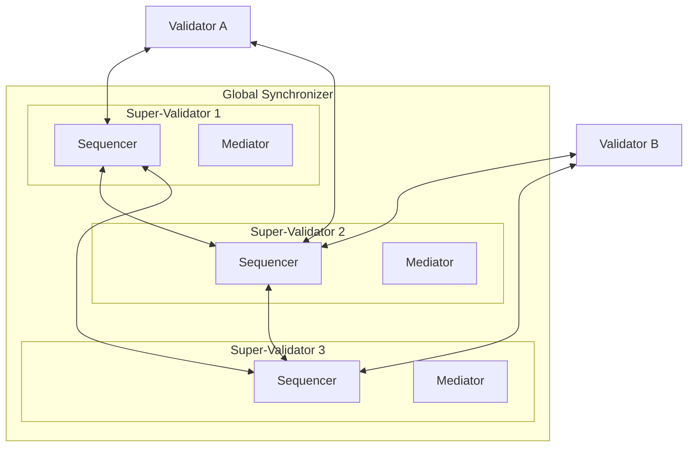

# Global Synchronizer 架构

> Global Synchronizer 如何在 Canton Network 上协调跨验证者交易

Global Synchronizer 是使不同验证者上 Party 之间能够交易的共享基础设施，由超级验证者（SV）在 Global Synchronizer Foundation 治理下运营。它协调交易排序与共识，但**从不**看到所处理交易的明文内容。

## 组件

Global Synchronizer 由分布在各 SV 节点上的多个 Sequencer 与 Mediator 组成。分布式架构提供拜占庭容错（BFT）——部分节点被攻破或故障时系统仍可正确运行。

### Sequencer

Sequencer 为同步器内所有消息提供全序。它从验证者接收加密交易消息，并以一致顺序投递给交易涉及的所有参与者。多个 Sequencer 运行在不同 SV 上，通过 BFT 共识就消息顺序达成一致。

Sequencer 只见加密信封，无法读取内容；可根据寻址元数据知道哪些参与者应收消息，但不知道交易在做什么。

### Mediator

Mediator 收集验证者的确认响应，判定交易是否获所有必需 Party 批准。与 Sequencer 一样，Mediator 在加密视图上操作——可验证正确 Party 已确认，而无需知道交易内容。

每个 SV 同时运行 Sequencer 与 Mediator。某笔交易的 Mediator 由首先处理该交易确认请求的 Sequencer 决定。

## 经同步器的交易流

验证者提交交易时：

1. 验证者向 Sequencer 发送加密交易视图，按参与 Participant 寻址
2. Sequencer 排序消息并分发给被寻址参与者
3. 各接收方解密视图、验证交易，向 Mediator 发送确认或拒绝
4. Mediator 汇总响应并确定交易结果
5. 结果经 Sequencer 广播给所有相关参与者
6. 各参与者将结果应用于本地账本

全流程通常在 1 秒内完成。同步器始终无法访问未加密交易数据——它在不知「交易内容」的情况下协调协议。

## BFT 保证

分布式设计意味着单个 SV 无法单方面审查交易、伪造确认或破坏排序。只要故障或恶意 SV 少于三分之一，同步器即可正确运行。具体 BFT 阈值由 Global Synchronizer Foundation 治理配置。

## 验证者与同步器

普通验证者（相对 SV）作为客户端连接同步器，不运行 Sequencer 或 Mediator。验证者只需出站连接 SV 端点，标准验证者无入站连接要求。

---

> 本文由 CC Privacy Club 根据 Canton Network 官方文档（CC-BY-4.0）整理翻译，仅供学习；实现细节以官方最新版本为准。
