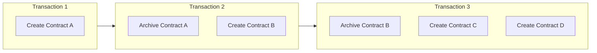
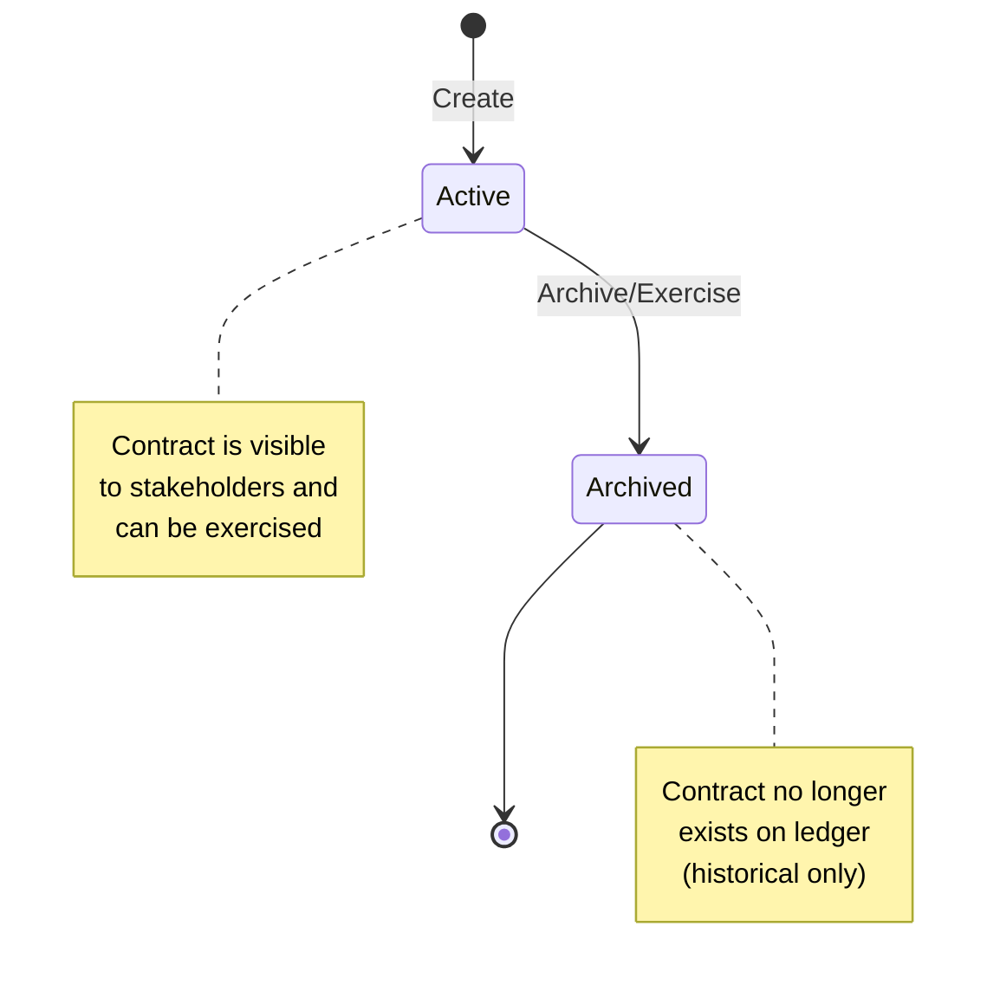
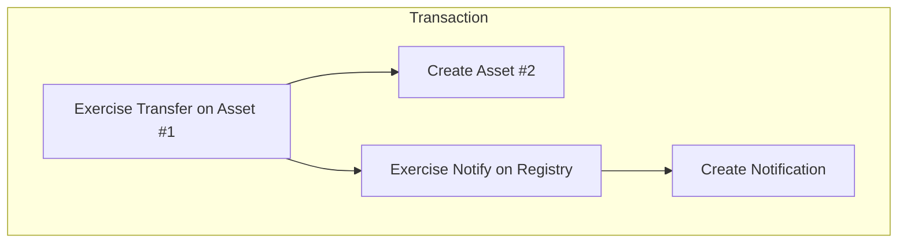
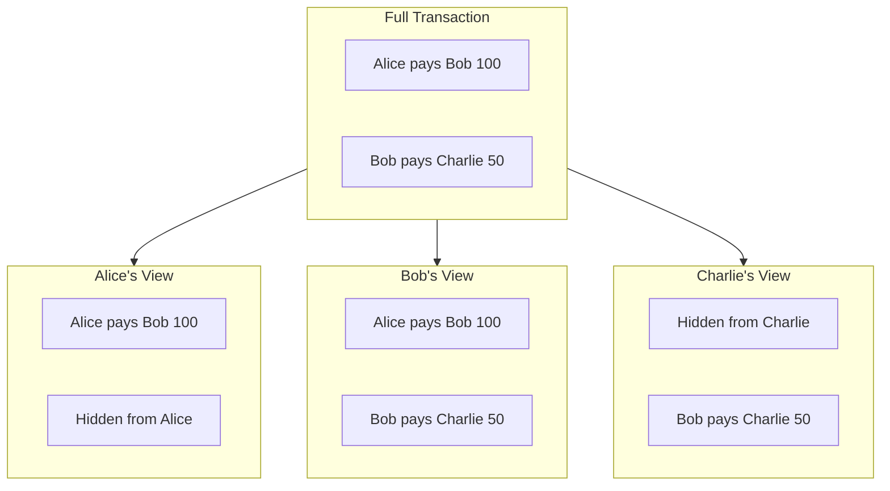

# 账本模型

> 理解 Canton 基于 UTXO 的账本模型：合约、利益相关方与交易

Canton 采用**扩展 UTXO（eUTXO）**账本模型：合约为离散对象，经创建与归档而非可变账户余额。该模型是 Canton 实现隐私与可组合性的基础。

## 合约即 UTXO

在 Canton 中，账本是**活跃合约**的集合。每个合约：

* 由交易创建
* 存在直至被另一交易归档
* 不可变
* 具有唯一 contract ID



### 为何 UTXO？

| 属性 | UTXO 模型 | 账户模型 |
| --------------------------- | ----------------------------------------------- | ---------------------------- |
| **并行性**             | 高——独立合约可并行处理  | 低——需账户锁     |
| **隐私**                 | 自然——每合约有特定利益相关方 | 难——账户聚合数据 |
| **可组合性**           | 内置——合约可相互引用         | 需精心设计      |
| **双花防护** | 结构性——合约仅归档一次               | 需序号    |

### 合约生命周期



## 利益相关方角色

每个合约有**利益相关方**——与合约有特定关系的 Party。角色决定可见性与授权。

### Signatories（签名方）

签名方是合约的主要权威方。

**属性：**

* 须授权合约创建
* 可授权合约归档（若为 consuming choice 的 controller）
* 始终可见合约及其全部操作
* 在 template 中用 `signatory` 定义

```haskell theme={"theme":{"light":"github-light","dark":"github-dark"}}
template Asset
  with
    issuer : Party
    owner : Party
  where
    signatory issuer, owner  -- Both must agree to create/archive
```

**何时使用：** 某方同意对合约存在至关重要时。

### Observers（观察方）

观察方可见合约但不能单方面操作。

**属性：**

* 可见合约及对其操作
* 不能归档或 exercise choice（除非同时为 controller）
* 用 `observer` 定义

```haskell theme={"theme":{"light":"github-light","dark":"github-dark"}}
template RegulatedAsset
  with
    owner : Party
    regulator : Party
  where
    signatory owner
    observer regulator  -- Regulator can see but not act
```

**何时使用：** 某方需为合规、审计或信息而可见时。

### Controllers（控制方）

控制方可对合约 exercise 特定 choice。

**属性：**

* 可 exercise 其控制的 choice
* 可见 choice 及其后果
* 按 choice 用 `controller` 定义

```haskell theme={"theme":{"light":"github-light","dark":"github-dark"}}
template Proposal
  with
    proposer : Party
    accepter : Party
  where
    signatory proposer
    observer accepter

    choice Accept : ContractId Agreement
      controller accepter  -- Only accepter can exercise
      do
        create Agreement with party1 = proposer, party2 = accepter
```

**何时使用：** 某方应能触发特定操作时。

### Actors（行为方）

Actors 是提交或授权交易的 Party。

### 角色对比

| 角色           | 可创建？  | 可见？              | 可 Exercise？       | 可归档？         |
| -------------- | ------------ | --------------------- | ------------------- | -------------------- |
| **Signatory**  | Yes          | Always                | If controller       | Must authorize       |
| **Observer**   | No           | Always                | If controller       | No                   |
| **Controller** | No           | Choice + consequences | Yes (their choices) | Via consuming choice |
| **Actor**      | If signatory | If stakeholder        | If controller       | If signatory         |

## 交易结构

Canton 中的交易是**动作**树。每个动作创建、exercise 或 fetch 合约。（*交易流中通常不返回 fetch。*）

### 动作类型

* **Create** 向账本添加新合约并返回 contract ID。
* **Exercise** 对合约执行 choice（可能归档）并返回 choice 结果及后果。
* **Fetch** 读取合约而不改状态，返回合约数据。

### 交易树

交易树记录单笔交易内全部 create、exercise、fetch 与 archive：



### Consuming 与 Non-Consuming Choice

**Consuming** choice（默认）在 exercise 时归档合约，用于状态转移与转让。**Non-consuming** choice 保持合约活跃，用于查询、通知与读取。

```haskell theme={"theme":{"light":"github-light","dark":"github-dark"}}
-- Consuming: archives the contract
choice Transfer : ContractId Asset
  controller owner
  do
    create this with owner = newOwner

-- Non-consuming: contract remains
nonconsuming choice GetBalance : Decimal
  controller owner
  do
    return balance
```

## 视图（Views）

每个利益相关方看到交易的**视图**：仅其有权查看的部分。

### 视图构成



### 可见性规则

1. **签名方**可见合约及其 consuming、non-consuming exercise
2. **观察方**可见合约及对其的 consuming exercise
3. **控制方**可见其可 exercise 的 choice 及后果

## 合约键（Contract Keys）

<Note>
  Contract keys 正在开发中，计划纳入 Canton 3.5。
</Note>

合约可有**键**——无需 contract ID 即可查找的标识符。

```haskell theme={"theme":{"light":"github-light","dark":"github-dark"}}
template Account
  with
    bank : Party
    owner : Party
    accountNumber : Text
  where
    signatory bank
    observer owner

    key (bank, accountNumber) : (Party, Text)
    maintainer key._1  -- bank maintains the key
```

支持**按键查找**。每个键有**维护方**（maintainer）。

<Warning>
  键在 synchronizer 内全局。请谨慎设计键，避免泄露合约是否存在的信息。
</Warning>

## 账本时间（Ledger Time）

Canton 使用**账本时间**进行合约操作。时间：

* 由 synchronizer 分配
* 在每个 synchronizer 上单调递增
* 用于基于时间的合约逻辑

```haskell theme={"theme":{"light":"github-light","dark":"github-dark"}}
choice ClaimAfterDeadline : ()
  controller beneficiary
  do
    assertDeadlineExceeded "claim-after-deadline" deadline
    -- ... claim logic
```

Canton 3.x 可用时间原语见 [Working with Time](/appdev/modules/m3-working-with-time)。

## 可组合性

UTXO 模型支持**原子组合**——单笔交易可影响多个合约，全有或全无。

```haskell theme={"theme":{"light":"github-light","dark":"github-dark"}}
-- Atomic swap: both transfers happen or neither does
choice ExecuteSwap : ()
  controller buyer
  do
    exercise assetId Transfer with newOwner = buyer
    exercise paymentId Transfer with newOwner = seller
```

账本强制该原子性——要么整笔 swap 提交，要么完全不提交。

## 相关主题

* [Contract Templates](/appdev/modules/m3-contract-templates) — 编写首个 Daml 合约
* [Choices](/appdev/modules/m3-choices) — 为合约添加行为
* [Privacy Model](/overview/learn/privacy-model) — 视图如何实现隐私

---

> 本文由 CC Privacy Club 根据 Canton Network 官方文档（CC-BY-4.0）整理翻译，仅供学习；实现细节以官方最新版本为准。
