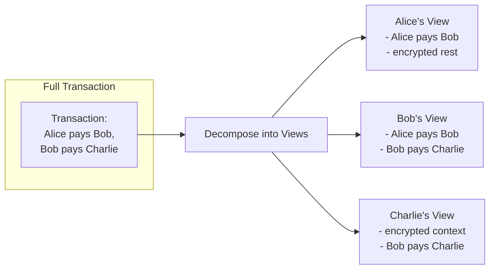

# 隐私模型详解

> 深入理解 Canton 独特的子交易隐私能力

Canton 的隐私模型是其定义性特征。本节说明子交易隐私如何工作、提供何种保证，以及隐私感知开发的常见模式。

## 区块链中的隐私问题

在多数区块链上，保证交易完整性需要全局可见性。每个验证者看到每笔交易以验证无双花且规则被遵守。

这带来固有张力：

| 要求 | 传统做法 | 问题 |
| ---------------- | ---------------------------------- | ----------------------- |
| **完整性**    | 验证者验证全部交易 | 需要可见性     |
| **验证** | 看到交易内容            | 暴露私有数据    |
| **隐私**      | 隐藏交易内容           | 削弱验证 |

传统区块链选择：完整性优于隐私。人人见一切。

### 为何阻碍企业采用

对受监管行业，全局可见性不可接受：

* **持仓可见**：竞争对手可见交易策略
* **抢跑风险**：观察者可利用交易信息
* **监管合规**：数据不得分享给未授权方
* **保密协议**：商业条款应限于当事方

## Canton 方案：子交易隐私

Canton 通过**子交易隐私**化解完整性—隐私张力：将交易分解为视图，各方仅见其验证自身部分所需内容。

### 工作原理

当交易涉及多方时，Canton 不向所有人发送完整交易，而是：

1. **分解**：按利益相关方关系将交易拆为**视图**
2. **加密**：各视图加密给对应接收方
3. **分发**：Synchronizer 仅向有权 Participant 投递视图
4. **验证**：各 Participant 独立验证其视图
5. **确认**：Participant 仅基于其视图确认



换言之，Participant 仅见其按隐私模型有权查看的交易部分；对其无权部分，既不见交易载荷，也不见涉及 Participant 或 Party 等元数据。

Synchronizer **看不到任何明文**——仅加密消息与确认结果。

### 各方可见内容

| Party       | 可见                                  | 不可见                                   |
| ----------- | ------------------------------------- | --------------------------------------------- |
| **Alice**   | 向 Bob 的付款                    | Bob 向 Charlie 的付款；Charlie 身份  |
| **Bob**     | 两笔付款（均涉及他） | -                                             |
| **Charlie** | 从 Bob 的收款                  | Alice 的参与；资金来源 |

Synchronizer 同样**看不到明文**——仅加密消息与确认结果。

## 利益相关方可见性规则

Canton 可见性遵循两条核心原则：

### 原则 1：Party 可见其有利害关系的操作

| 角色           | 可见性                                  |
| -------------- | ------------------------------------------- |
| **Signatory**  | 始终可见合约及其全部事件 |
| **Observer**   | 按声明可见合约   |
| **Controller** | 可见其可 exercise 的 choice              |

### 原则 2：见操作者见其后果

若你见某操作，则见其产生的 create/archive。这可独立验证——你可据所见结果确认操作正确执行。

### 可见性示例

```haskell theme={"theme":{"light":"github-light","dark":"github-dark"}}
template Payment
  with
    sender : Party
    receiver : Party
    amount : Decimal
  where
    signatory sender
    observer receiver
    
    choice Accept : ContractId Receipt
      controller receiver
      do
        create Receipt with payer = sender, payee = receiver, amount
```

| Party           | 合约可见性 | Choice 可见性     |
| --------------- | ------------------- | --------------------- |
| **sender**      | ✓ (signatory)       | ✓ (sees consequences) |
| **receiver**    | ✓ (observer)        | ✓ (controller)        |
| **anyone else** | ✗                   | ✗                     |

## 隐私保证

### Canton 保证什么

<Check>
  **交易内容**仅对授权方（signatories、observers、controllers）可见。
</Check>

<Check>
  **Synchronizer 运营方**无法读取交易数据——仅见加密消息。
</Check>

<Check>
  **无元数据泄露**：无权见某操作的 Party 不见其他 Participant 与 Party。
</Check>

<Check>
  **验证者仅存储**其托管 Party 的数据——无全局状态复制。
</Check>

## 隐私模式

### 模式 1：双边协议

仅两签名方可见合约。两方协议隐私最大化。

```haskell theme={"theme":{"light":"github-light","dark":"github-dark"}}
template BilateralContract
  with
    partyA : Party
    partyB : Party
    terms : Text
  where
    signatory partyA, partyB
    -- No observers: only signatories see this contract
```

**适用：** 两方需无第三方可见的私有协议。

**可见性：** 仅 `partyA` 与 `partyB`。

### 模式 2：通过 Observer 选择性披露

当第三方需可见但无需控制时，将其加为 observer。

```haskell theme={"theme":{"light":"github-light","dark":"github-dark"}}
template RegulatedAsset
  with
    owner : Party
    issuer : Party
    regulator : Party
    value : Decimal
  where
    signatory issuer
    observer owner, regulator

    choice Transfer : ContractId RegulatedAsset
      with
        newOwner : Party
      controller owner  -- owner can transfer unilaterally
      do
        create this with owner = newOwner
```

**适用：** 第三方需为合规、审计或信息而可见。

**可见性：** `issuer`（signatory）、`owner` 与 `regulator`（observers）。`owner` 亦为 `Transfer` 的 controller，可单方面执行。

### 模式 3：泄露（Divulgence）

合约用于交易时，交易当事方可能获知合约。此「divulgence」自动发生。

```haskell theme={"theme":{"light":"github-light","dark":"github-dark"}}
-- Contract held by Alice
template Asset with owner : Party where
  signatory owner

-- Alice uses her Asset in a transaction with Bob
template Trade
  with
    seller : Party  -- Alice
    buyer : Party   -- Bob
    assetId : ContractId Asset
  where
    signatory seller, buyer
    
    choice Execute : ()
      controller buyer
      do
        -- Bob sees the Asset contract through divulgence
        asset <- fetch assetId
        archive assetId
        -- ... transfer logic
```

**结果：** `Execute` 运行时，Bob（Trade 当事方）可见 Alice 的 Asset，即使他原非 observer。

**谨慎使用：** Divulgence 可能无意暴露信息。设计交易时须知晓何者被 divulge。

## 隐私与可审计性

Canton 可在不牺牲审计的前提下实现隐私。常见模式：

### 审计方作为 Observer

```haskell theme={"theme":{"light":"github-light","dark":"github-dark"}}
template AuditableTransaction
  with
    partyA : Party
    partyB : Party
    auditor : Party
    details : TransactionDetails
  where
    signatory partyA, partyB
    observer auditor  -- Auditor sees everything but cannot act
```

### 选择性审计权

```haskell theme={"theme":{"light":"github-light","dark":"github-dark"}}
template SelectivelyAuditable
  with
    owner : Party
    data : SensitiveData
    auditor : Party
  where
    signatory owner
    
    -- Non-consuming choice: reveals data without changing state
    nonconsuming choice Audit : AuditReport
      controller auditor
      do
        -- Auditor can request audit, seeing only what's returned
        return AuditReport with 
          timestamp = now
          summary = summarize data  -- Controlled disclosure
```

### 可审计性最佳实践

| 实践                     | 说明                                                              |
| ---------------------------- | ------------------------------------------------------------------------ |
| **显式审计 Party** | 需要审计轨迹处将审计方加为 observer                  |
| **审计 choice**            | 创建返回审计信息的 non-consuming choice               |
| **独立审计合约** | 无需全可见时用专用审计轨迹合约 |
| **限时访问**      | 用工作流模式授予临时审计访问                    |

## 常见隐私错误

### 错误 1：Observer 过度共享

```haskell theme={"theme":{"light":"github-light","dark":"github-dark"}}
-- BAD: Adding unnecessary observers
template OverShared
  with
    owner : Party
    counterparty : Party
    allUsers : [Party]  -- Why do all users need to see this?
  where
    signatory owner
    observer counterparty, allUsers  -- Privacy leak!
```

**问题：** `allUsers` 中每个 Party 都可见此合约，即使不需要。

**修复：** 仅添加真正需要可见性的 observer。

### 错误 2：忽视 Divulgence

```haskell theme={"theme":{"light":"github-light","dark":"github-dark"}}
-- Transaction reveals more than intended
choice RevealingChoice : ()
  controller buyer
  do
    -- Fetching this contract divulges it to all transaction stakeholders
    sensitiveAsset <- fetch sensitiveAssetId
    -- buyer now knows about sensitiveAsset, even if not originally an observer
```

**问题：** 在交易中组合合约可能向非原利益相关方暴露信息。

**修复：** 理解哪些合约被 fetch 以及谁见该交易。

### 错误 3：时序攻击

**问题：** 即使不见内容，观察者仍可能从以下推断信息：

* 交易发生时间
* 交易规模
* 活动模式

**修复：**

* 考虑批处理敏感操作
* 在适当时加入噪声或随机化
* 设计工作流以减少时序信息泄露

## 隐私设计检查清单

设计 Canton 应用时自问：

| 问题                          | 考量                                  |
| --------------------------------- | ---------------------------------------------- |
| **谁是 signatories？**      | 他们将始终见一切                |
| **谁需要 observe？**         | 有意添加 observer，非默认     |
| **何者被 divulge？**           | 追踪交易组合         |
| **合约键暴露什么？** | 键不应编码敏感关系 |
| **时序能暴露什么？**       | 考虑模式，非仅内容            |
| **验证者是谁？**          | 其见你的全部数据——谨慎选择      |

## 下一步

* **[Global Synchronizer](/zh/docs/canton/overview-understand-global-synchronizer)** — 公共网络基础设施
* **[Developer Track Module 3](/zh/docs/canton/appdev-modules-m3-dev-environment)** — 在代码中应用隐私模式
* **[Glossary](/zh/docs/canton/overview-understand-glossary)** — 含隐私相关术语

---

> 本文由 CC Privacy Club 根据 Canton Network 官方文档（CC-BY-4.0）整理翻译，仅供学习；实现细节以官方最新版本为准。
