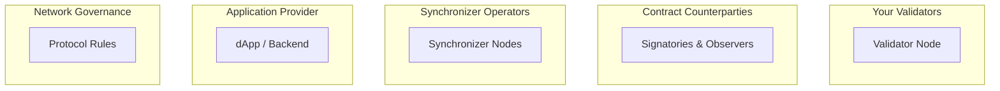

# 信任模型概览

> 在 Canton Network 中你需要信任谁、信任什么

Canton 的信任模型与传统区块链根本不同：不是「信任所有人」或「不信任任何人」，而是**选择性信任**——你为不同目的选择信任对象。

## 核心问题

任何分布式系统的关键是：**你需要信任谁、信任什么？**

Canton 将其拆为不同信任域，各有参与方与假设。

## 五个信任域

### 1. 你的验证者

**信任其：**

* 安全存储合约数据并对你可用
* 提供节点 RPC 并允许你提交交易
* 不向未授权方泄露你的数据
* 代表你的 Party 正确参与共识
* 若使用内部 Party：保管你的签名密钥

**不信任其：**

* 替你签名交易（若使用外部 Party）

**缓解：** 自建验证者；选择可信运营方；多验证者共同托管 Party；外部 Party 密钥；KMS/HSM 保护验证者密钥。

### 2. 合约对手方

**信任其：** 作为利益相关方诚实验证交易以便最终确认；不泄露与你共享的隐私数据。

**不信任其：** 账本完整性与一致性——只要你的验证者诚实，对手方无法就涉及你的交易最终确认无效交易。

**缓解：** Daml 授权规则；仅与可信对手方共享敏感数据；关键操作多签；密码学签名的审计轨迹。

### 3. 同步器

**信任其：** 以一致顺序向所有验证者投递消息；不无限期审查你的交易；保持可用；正确汇总确认票；投递准确裁决；私有同步器上保护交易元数据隐私。

**不信任其：** 隐私（无法读明文）；授权（无法伪造消息/交易）；一致性（无法批准无效交易，利益相关方会验证）。

**缓解：** 多独立运营方的 BFT 同步器；自建同步器。

### 4. 应用提供方

**信任其：** 若代用户提交交易则确实提交且不审查；正确实现链上/链下逻辑；若做 Web2 式登录则保护凭证/会话。

**缓解：** 链上 Daml 授权；外部 Party 签名；开源/审计应用；用自有验证者准备并提交交易。

### 5. 网络治理

**信任其：** 协议升级不破坏应用与合约；网络参数与流量成本公平；争议解决流程。

**缓解：** 透明治理（Canton Network 的 CIP）；退出权（迁移到其他同步器）；预见升级的合约设计。

## 一览

验证者见你的全部数据并可能阻止你。对手方只见其参与的合约，Daml 与 Canton 共识约束其行为。Sequencer/Mediator 仅处理加密数据，可暂时延迟但无法读或伪造消息。应用提供方与治理体的信任取决于设计与结构。

## 去中心化选项

**验证者层：** 单验证者信任单一运营方，或多宿主 Party 分散信任。

**同步器层：** 单运营方同步器信任单一实体；BFT Sequencer 将信任分散（约 2/3 节点诚实即可）；连接多同步器降低单点风险。

**Global Synchronizer：** 多独立 SV 运行 Sequencer/Mediator，BFT 容忍拜占庭故障至阈值，CIP 流程透明治理协议变更。

## Canton 与传统区块链

传统链上人人见每笔交易、每个节点验证，信任多数诚实。Canton 反转：仅利益相关方见交易、仅受影响方验证，主要信任自己的验证者；同步器只见加密数据；治理按同步器与网络分层。

## 相关主题

* [双层共识](/zh/docs/canton/overview-learn-two-layer-consensus)
* [架构概览](/zh/docs/canton/overview-learn-architecture)
* [隐私模型](/zh/docs/canton/overview-learn-privacy-model)

---

> 本文由 CC Privacy Club 根据 Canton Network 官方文档（CC-BY-4.0）整理翻译，仅供学习；实现细节以官方最新版本为准。
