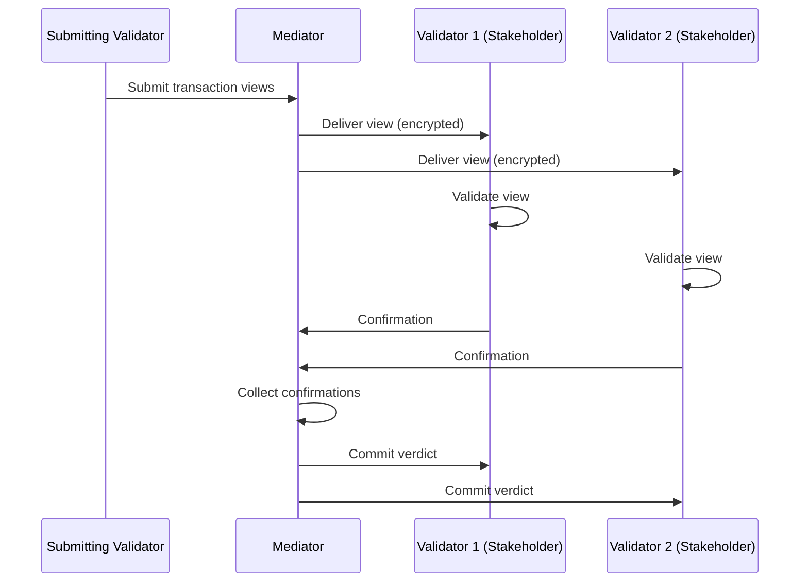
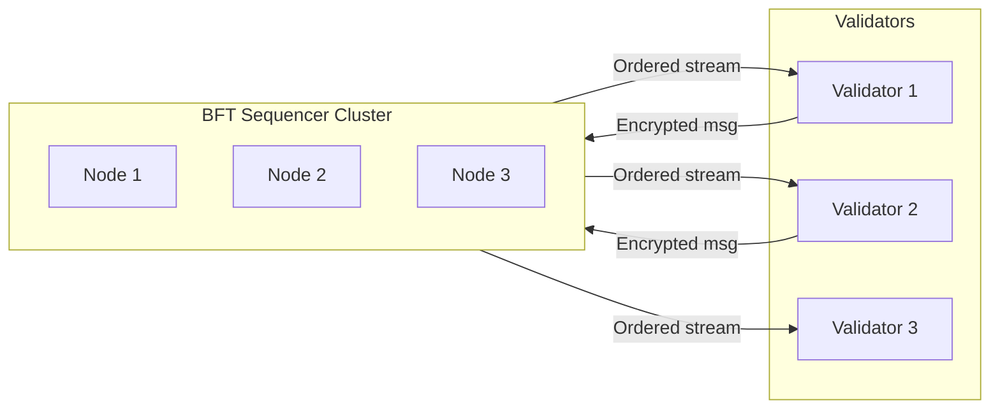
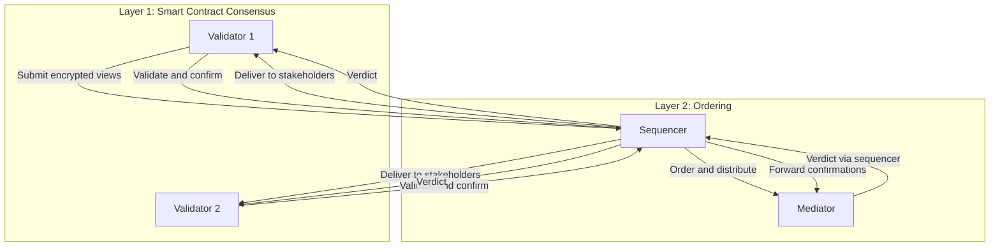

# 双层共识

> Canton 如何将智能合约验证与交易排序分离，以同时实现隐私与完整性

Canton 采用**双层共识**：**智能合约交易共识**与**排序共识**分离。这正是 Canton 能在保持完整性的同时实现隐私的原因。

## 为何需要两层？

传统区块链将排序与验证合并在单一共识中：每个验证者见每笔交易以验证正确性并达成一致顺序，紧密耦合带来固有隐私限制。

Canton 将二者解耦：

* **智能合约共识**验证交易正确性，仅受影响利益相关方参与，各方只见己方交易片段。
* **排序共识**建立全局交易顺序，同步器节点参与但只见加密消息。

## 第一层：智能合约共识（利益相关方证明）

Canton 的智能合约共识遵循**利益相关方证明（Proof of Stakeholder）**：仅对合约有利益的 Party 可验证影响该合约的交易。

### 工作流程

1. **识别利益相关方**：交易影响合约时识别全部利益相关方（签字方、观察方、控制方）
2. **视图分发**：各方仅收到有权查看的交易视图
3. **独立验证**：各方按 Daml 规则验证己方视图
4. **确认**：向 Mediator 发送确认或拒绝
5. **裁决**：足够确认后整笔交易提交或整体中止

非利益相关方完全不见该交易；仅受影响方做验证工作，Daml 授权由利益相关方自身强制执行。

信任假设直接：你信任签字方与控制方会正确验证己方部分；因其对合约有直接利益，有动机诚实验证。

## 第二层：排序共识（BFT 排序）

排序层为同步器上所有交易建立**全序**，使所有参与者从同一同步器以相同顺序看到事件，防止双花并保证一致性。

### 工作流程

同步器的 Sequencer：

1. 从参与者接收加密交易消息
2. 为该同步器分配全局唯一时间戳/序号
3. 按序将消息投递给所有有权接收方
4. 保证所有接收方看到相同顺序

### BFT 排序

去中心化同步器（如 Global Synchronizer）的排序使用拜占庭容错共识：

* 多个 Sequencer 节点运行排序协议
* 容忍至多 1/3 拜占庭（恶意）节点
* 基于 ISS（Insanely Scalable State-Machine Replication）算法
* 提供安全性与活性保证

所有验证者以相同顺序收消息；Sequencer 只见加密消息，排序不损害隐私；部分节点故障时协议仍可运行。

信任假设：恶意 Sequencer 少于 1/3；对 Global Synchronizer，信任分散在独立 SV 之间。

## 两层如何协作

流程始于排序层：验证者提交加密交易，Sequencer 分配全局顺序；Sequencer 向利益相关方分发视图，Mediator 获知达成裁决所需确认数；智能合约共识接管——各方验证并确认；Mediator 汇总后经 Sequencer 广播裁决。

## 分离的好处

**隐私不牺牲完整性。** 排序层防双花（完整性与一致性），智能合约层确保仅利益相关方见数据（隐私）；单层 alone 无法兼得。

**灵活信任模型。** 不同同步器可用不同排序信任模型（私有单运营方 Sequencer 或去中心化 BFT），智能合约共识层不变。

**可扩展性。** 排序层只做同步，负载轻；验证工作仅分布在受影响验证者，无需全局状态复制。

## 与其他方案对比

| 方案 | 排序 | 验证 | 隐私 |
| -------------------------- | ------------------ | -------------------------- | -------------------- |
| **传统区块链** | 所有验证者 | 所有验证者 | 无 |
| **L2 Rollup** | Sequencer | 欺诈/有效性证明 | 有限 |
| **Canton** | 同步器（BFT） | 仅受影响利益相关方 | 完整子交易级 |

## 相关主题

* [信任模型概览](/zh/docs/canton/overview-learn-trust-model)
* [架构概览](/zh/docs/canton/overview-learn-architecture)
* [隐私模型](/zh/docs/canton/overview-learn-privacy-model)

---

> 本文由 CC Privacy Club 根据 Canton Network 官方文档（CC-BY-4.0）整理翻译，仅供学习；实现细节以官方最新版本为准。
