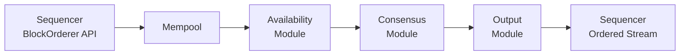

# 排序与共识

> Canton 排序层与拜占庭容错共识机制说明。

> 同步器排序架构——排序器、调解器、BFT 排序服务和受 ISS 启发的共识协议

排序共识层是Canton的[两层共识架构](/overview/reference/canton-protocol-specification)的一半。虽然智能合约共识层验证受影响各方之间的交易正确性，但排序层在给定同步器上建立单个全局事件序列。它无需访问交易内容即可完成此操作 - 有效负载保持端到端加密，并且订购基础设施只能看到元数据。

## 同步器组件

同步器由两种节点类型组成：**排序器**和**中介器**。它们共同提供经过身份验证的、有序的消息传递和交易完成。这两种类型都无法存储或访问解密的交易有效负载。

### 定序器节点

定序器提供经过身份验证、带时间戳的多播。它们是同步器的消息路由骨干。

* **同步器的总排序。** 提交给排序器的每批消息都会收到一个单调递增的值，该值充当时间戳。所有接收者都遵守从这些时间戳派生的相同全局排序。这种总排序通过为同步器上的每个状态更改提供序列中的确定性位置来防止双花。
* **加密有效负载转发。** 定序器转发不透明（加密）消息。他们看到元数据——收件人列表和消息大小——但看不到交易内容。加密密钥在参与者之间进行管理；定序器从不保存解密密钥。
* **发件人隐私。** 收件人不会获知发件人的参与方 ID。定序器在将消息传递给其他方之前剥离发送者信息。
* **流量管理。** 排序器强制执行流量限制，以保护同步器免受滥用和拒绝服务攻击。每个授权会员累积流量余额；超过会员可用余额的提交请求将被拒绝。流量成本随有效负载大小、接收者数量和每个事件的基本成本而变化。

参与者和调解者从不直接相互沟通。所有协议消息都流经定序器。

### 中介节点

中介者同步完成事务的两阶段提交协议。在排序器将加密的交易视图分发给受影响的参与者后，参与者验证他们的视图并通过排序器将确认响应（批准或拒绝）发送回调解器。

* **确认收集。** 中介者收集给定交易的所有确认参与者的确认响应。
* **发布判决。** 一旦调解器收到足够的响应来确定结果，它就会发布交易判决（提交或拒绝）。然后，定序器将此判决分发给所有受影响的参与者。
* **可见性有限。** 调解员可以查看通知者列表（哪些参与方参与哪些交易视图）和确认结果（每个视图批准/拒绝）。他们本身看不到加密的交易有效负载。

一个同步器可以运行多个中介组来分配工作负载。同步器所有者通过拓扑事务配置中介器组成员资格。

## BFT 订购服务

支持定序器的排序服务可以在不同的配置中运行。最显着的区别是集中式后端和拜占庭容错（BFT）后端之间。

当 BFT 排序器处于活动状态时，它在 Canton 排序器 JVM 进程中运行。它取决于用于消息签名、签名验证、密钥管理和治理（拓扑状态）的共置定序器。 BFT 排序器实现了`BlockOrderer` API，它允许排序器提交排序请求（写入）并订阅全局排序的交易流（读取）。

BFT 排序者提供两个保证：

* **安全（一致性）。** 所有正确的节点都会产生相同的有序输出。没有两个正确的排序器会提供冲突的事务排序。
* **活跃度（进度）。** 只要不超过容错阈值，系统就会继续对交易进行排序。

## BFT 信任模型

BFT 排序器使用标准拜占庭容错假设：* **故障阈值。** 不到三分之一的 BFT 排序节点可能同时表现出拜占庭故障（任意行为，包括崩溃、消息损坏或主动恶意）。对于总共 N 个节点，系统可以容忍 f 个拜占庭故障，其中 3f + 1 ≤ N。
* **协议法定人数。** 信任阈值 k = 下限(2N/3)。至少 k + 1 个节点必须同意才能在排序方面取得进展。
* **加密假设。** 对手可能拥有大量带宽和计算资源，但他们无法破坏标准加密原语（数字签名、哈希函数）。
* **共享命运。** BFT 排序节点及其共置定序器在共享命运模型下运行。如果其中一个受到损害，则另一个也应该被视为受到损害。
* **治理和入门。** 受信任的管理员管理 BFT 订购者配置。加入的新节点从对等定序器快照中获取正确的启动状态，这些快照捆绑了 BFT 元数据，例如纪元号、块号和时间戳。
* **存储完整性。** 假设底层数据库未损坏。

## BFT架构

BFT 排序器利用了两种已发布的算法：

**ISS（疯狂可扩展状态机复制）**是一种基于并行领导者的 BFT 复制协议。 ISS 激发了 BFT 排序器中的核心共识子协议。它将工作划分为固定区块长度的纪元，多个领导者在纪元的不同部分并行提议区块。这种并行负载平衡了与领导者角色相关的昂贵成本，而不会在某些领导者不可用时导致停机。

**Narwhal** 将数据传播与数据排序分开。 BFT 排序器将此想法应用到其预共识可用性子协议中：首先传播数据，然后共识排序对已可用数据而不是数据本身的引用。这种解耦减少了共识协议上的通信负载，而这往往是排序服务的瓶颈。

### 模块架构

BFT 排序器分为四个模块，形成管道：

**Mempool** — 通过 `BlockOrderer` API 从本地排序器接收排序请求。请求保存在内存队列中。当队列已满时，内存池通过拒绝传入请求来施加反压。当下游可用性模块请求数据时，mempool 会批量处理排队的请求并转发它们。

**可用性模块** — 实现受独角鲸启发的数据传播阶段。当可用性模块从内存池接收到批次时，它会在本地存储该批次并将其转发到其他 BFT 排序节点上的对等可用性模块。成功接收批次的每个对等方都会返回一个签名的可用性确认 (ACK)。该模块收集至少 f + 1 个不同的 ACK（其中 f 是可容忍的拜占庭错误的数量）以生成 **可用性证明 (PoA)**。它可以等待最多 N - f 个 ACK​​，以获得更强的保证。 PoA 证明至少有一个正确的节点保存数据并可以将其提供给任何需要它的节点。这可以防止拜占庭节点提出对实际不存在的数据的引用。

**共识模块** — 实现受 ISS 启发的排序协议。工作被分为固定块长度的离散时期。所有节点通过拓扑状态就每个时期的合格领导者集达成一致。领导者在整个 epoch 中被确定性地分配给区块，每个领导者使用源自 PBFT 的三相协议独立地排序其分配的区块：

1. **预准备。** 领导者广播包含 PoA 引用的排序块。
2. **准备。** 其他节点确认预准备。
3. **Commit。** 节点收到有效的pre-prepare和超过2/3的prepare消息后发送commit消息。

当节点收到有效的预准备和超过 2/3 的提交消息时，块被认为是有序的。**输出模块** — 根据共识输出重建完整的、全局排序的交易流。它使用 PoA 引用从可用性模块获取完整的请求数据（如果缓存，则在本地，如果没有缓存，则从远程对等点获取）。由于领导者并行对块进行排序，因此输出模块会将块重新排序为正确的全局顺序。它为每个区块分配严格递增的 BFT 时间戳——共识模块计算候选时间戳，输出模块确定性地调整它们以确保单调性。最终的有序流被传送到并置的定序器。

### 网络传输

BFT 排序节点进行点对点通信。每个节点都会为排序服务中的每个其他对等点建立一个 gRPC/HTTP2 流。这些连接使用 TLS 进行点对点身份验证和完整性。点对点 API 通常不公开；访问权限仅限于已知的 BFT 排序节点。

## 集中式与分散式选项

Canton 支持多个音序器后端。后端的选择决定了同步器的信任模型。

**集中式（单一数据库后端）。** 单一数据库提供排序。这是最简单的配置：延迟最低、最易于操作，但存在单点信任和故障。如果数据库或其操作员受到损害，排序完整性就会丢失。适用于同步器操作员受到所有参与者信任的私有同步器。请注意，集中订购者处于 Alpha 状态，尚未准备好投入生产。即使对于单序列器部署，此选项也将被删除，以支持运行本机 BFT 排序器。

**CometBFT 驱动程序。** 使用 [CometBFT](https://cometbft.com/) 的外部 BFT 订购服务。 Canton 包含一个集成 CometBFT 作为排序器后端的驱动程序。这通过已建立的共识引擎提供拜占庭容错，但作为定序器 JVM 外部的单独进程运行。

**原生 BFT 排序器。** 上面描述的受 ISS 启发的排序器，与排序器一起在进程中运行。这是 Canton 自己的 BFT 实现，专门针对定序器的要求而设计，并与 Canton 的拓扑和密钥管理紧密集成。

**全局同步器**使用 BFT 配置，由超级验证器操作。每个超级验证器都运行排序器和中介器节点，并且 BFT 排序器节点通过超级验证器基础设施进行点对点通信。私有同步器可以使用任何后端——为了简单起见，使用单数据库后端，或者当信任必须在多个操作员之间分配时使用 BFT 后端。

## 定序器保证

定序器，无论其后端如何，都为 Canton 协议提供以下保证：

* **总排序。** 所有收件人都会观察到相同的消息序列。这是防止双花并确保连接到同一同步器的参与者之间一致性的基础。
* **时间戳。** 每个消息批次都会收到一个单调递增的时间戳。这些时间戳驱动所有协议超时和排序决策。
* **经过身份验证的传递。** 排序器传递的消息经过签名，允许收件人验证消息是否确实经过排序（而不是由第三方伪造）。
* **有效负载隐私。** 交易有效负载在参与者之间进行加密。定序器传输密文，无法读取其路由的消息内容。
* **发件人隐私。** 定序器不会向收件人透露发件人的身份。这会阻止基于发送者-接收者相关性的流量分析。
* **流量管理。** 排序器强制执行每个成员的流量限制。会员通过基础分配（同步器时间内被动积累）积累流量并购买额外流量。超过成员可用流量平衡的提交将被拒绝，从而保护同步器免遭资源耗尽。

---

> 本文由 CC Privacy Club 根据 Canton Network 官方文档（CC-BY-4.0）整理翻译，仅供学习；实现细节以官方最新版本为准。
