# 超级验证者组件

> 超级验证者（Super Validator）基础设施组件参考。

> 构成全局同步器上超级验证器节点的组件的详细分解

超级验证器 (SV) 运行常规验证器运行的所有内容，以及全局同步器基础设施和治理工具。 SV 由通过 DSO 治理流程批准的主要机构运营，它们构成了 全局同步器 去中心化运营的支柱。

## 组件架构

SV 节点由三层组成：基本验证器堆栈、同步器基础设施和 SV 特定应用程序。

```mermaid theme={"theme":{"light":"github-light","dark":"github-dark"}}
flowchart TB
    subgraph SV["超级验证者 Node"]
        direction TB

        subgraph SVApps["SV-Specific Applications"]
            SVAPP[SV App<br>Governance]
            SVUI[SV Web UI<br>Dashboard]
            SCANAPP[Scan App<br>Transaction Index]
            SCANUI[Scan Web UI<br>Network Explorer]
        end

        subgraph SyncInfra["同步器 Infrastructure"]
            SEQ[Sequencer Node]
            MED[Mediator Node]
            BFT[CometBFT / BFT Orderer Node]
        end

        subgraph ValStack["Validator Stack"]
            VALAPP[Validator App]
            WALLET[Wallet UI]
            CNSUI[Canton Name Service UI]
            PART[Canton Participant<br>with Splice DARs<br>Ledger API &#8226; Admin API]
            JAPI[JSON API]
            SCANPROXY[Scan Proxy]
            DB[(PostgreSQL Databases)]
        end

        SVAPP --> PART
        SCANAPP --> PART
        VALAPP --> PART
        PART --> DB
        SEQ --> DB
        MED --> DB
        BFT --> SEQ
        JAPI --> PART
    end

    ExtVal[External Validators] <-->|Sequencer API| SEQ
    OtherSV[Other SV Nodes] <-->|BFT P2P + Gossip| BFT
    OtherSV <-->|Scan Backfill| SCANAPP
    Apps[Applications] --> PART
    Apps --> JAPI
    Public[Public Clients] --> SCANAPP
```

## 验证器堆栈

每个 SV 都包含完整的验证器堆栈。有关详细信息，请参阅[验证器节点组件](/zh/docs/canton/overview-reference-validator-node-components)参考。

验证器层提供：

* **验证器应用程序** -- 管理验证器生命周期、参与方加入、流量充值和钱包自动化
* **Canton 参与者** -- 托管各方、存储合约并参与 Canton 协议的 Daml 执行引擎。 Splice DAR（Canton Coin、治理、钱包）安装在参与者身上。
* **钱包 UI 和 Canton 名称服务 UI** -- 用于管理 Canton Coin 持有量和注册人类可读的政党名称的 Web 界面
* **Ledger API (gRPC) 和 JSON API** -- 面向应用程序的 API，用于提交命令和流交易
* **管理 API** -- 节点管理、参与方管理和身份操作
* **扫描代理** -- 提供针对多个 SV 托管的扫描 API 的 BFT 读取，因此验证器不需要信任单个 SV 的扫描实例
* **PostgreSQL 数据库** -- 参与者账本分片和应用程序状态的持久存储

## 同步器基础设施

SV 操作所有验证者（包括 SV 自己的参与者）连接的分布式同步器。每个 SV 运行每个同步器组件的一个实例，并且这些 SV 一起形成分布式全局同步器。

### 定序器节点

定序器为全局同步器提供经过身份验证、带时间戳的多播。它从参与者接收加密的交易消息，并以一致的、完整的顺序将它们传递给指定的接收者。

定序器不会解密消息内容。它根据加密的信封和元数据处理路由和排序。

在全局同步器中，每个 SV 运行一个定序器节点。验证器使用 BFT 定序器连接连接到多个 SV 定序器 - 读取和写入定序器的阈值以容忍故障或不可用的节点。

### 中介节点

中介器促进全局同步器上事务的两阶段提交协议。它从参与交易的利益相关者参与者那里收集确认判决，汇总这些判决，并声明交易结果（提交或拒绝）。

与定序器一样，中介器看不到解密的交易内容。它通过加密的确认消息进行操作。每个 SV 运行一个中介节点。调解器使用 BFT 状态机复制，以便只要有足够的调解器阈值是诚实且可用的，确认协议就会继续运行。

### CometBFT / BFT 排序节点

BFT 排序节点参与共识协议，该协议建立排序器处理的消息的总排序。当前的实现使用 [CometBFT](https://cometbft.com/)（以前称为 Tendermint），其中每个 SV 运行一个参与区块生产和投票的 CometBFT 验证器。

CometBFT 节点与所有其他 SV CometBFT 节点保持点对点连接，并通过专用的 TCP 八卦/共识通道进行通信（与验证器使用的 HTTPS API 分开）。 BFT 共识需要超过三分之二的 SV 节点同意才能生成区块，这意味着系统最多可以容忍`f` 拜占庭（故障或恶意）节点，其中`f = floor((n-1)/3)` 和 `n` 是 SV 的总数。

有关排序共识如何运作的更多信息，请参阅[排序共识](/zh/docs/canton/overview-reference-ordering-consensus)。

## SV 特定应用

这些 Splice 应用程序是 SV 节点所独有的，并提供治理参与和公共网络透明度。

### SV 应用程序

SV 应用程序管理 SV 对 DSO 治理的参与。通过它，SV：

* 对Canton 改进提案（CIP）进行投票
* 对网络参数变更进行投票（流量定价、奖励分配、升级时间表）
* 批准或拒绝新的 SV 入职请求
* 为 SV 赞助的验证者生成入职密码
* 管理SV的护身符（粤币）兑换率投票
* 将SV奖励优惠券分发给配置的受益人

SV 应用程序使用 Ledger API 连接到本地参与者并通过 OIDC 进行身份验证。

### SV 网页用户界面

SV Web UI 是用于治理和节点监控的操作员仪表板。它提供：

* DSO 治理概述（活跃投票、网络参数、SV 成员资格）
* CIP 和参数更改的投票创建和管理界面
* 验证者入门秘密生成
* CometBFT调试信息（对等连接、区块高度、共识状态）
* 全局同步器节点状态（排序器和中介器健康状况）

### 扫描应用程序

扫描应用程序在全局同步器上索引 DSO 方可见的交易历史记录。它订阅 SV 的参与者节点，并重建 Canton Coin 转账、治理操作、挖矿轮次和奖励分配的可查询视图。

每个 SV 都运行自己的 Scan App 实例。 Scan Apps 以 BFT 方式回填其他 SV Scan 实例的数据，使其记录在整个网络中保持一致。这使得公众可以比较多个 SV 托管的 Scan 实例的数据，而无需信任任何单个 SV。

### 扫描API

扫描 API 是扫描应用程序公开的公共 HTTP API。它提供：

* Canton Coin余额和转账历史
* 挖矿轮次数据（开放轮次、结束轮次、封闭轮次和发行信息）
* SV信息（身份、奖励权重、治理参与）
* 全局同步器连接信息（定序器 URL、包参考）
* 网络活动汇总统计
* 用于完整历史记录导出和 ACS 快照的批量数据 API

Scan API 使用 OpenAPI 规范进行记录。标记为 `external` 的端点旨在供第三方使用，并保持跨版本的向后兼容性。

## 网络连接

SV 节点有几个不同的网络连接要求，超出了常规验证者的需要。

**BFT 点对点连接**：每个 SV 的 CometBFT 节点在专用 P2P 端口（例如端口 `26<MIGRATION_ID>56`）上维护与每个其他 SV 的 CometBFT 节点的 TCP 连接。这些连接带有共识八卦协议。

**序列器 API**：SV 通过 HTTPS 公开其序列器，以便外部验证器（和其他 SV 的参与者）可以连接到它。验证器使用 BFT 定序器连接，同时读取和写入多个 SV 定序器。

**扫描回填**：每个 SV 的扫描应用程序连接到所有其他 SV 的扫描 API，以 BFT 方式回填和交叉检查交易历史记录。

**发起者连接**：加入新 SV 时，加入节点必须可以访问发起 SV 的排序器、扫描和 SV 应用程序端点。

## SV 的角色和职责

运行 SV 节点意味着同时履行多个角色：* **同步器操作符** -- 运行和维护验证器进行事务处理所依赖的排序器和中介器节点
* **BFT 共识参与者** -- 运行 CometBFT 排序节点，该节点有助于区块生产和消息排序
* **治理参与者**——对 CIP 进行投票，批准新的验证者和 SV，并通过 DSO 治理流程设置网络参数
* **扫描基础设施提供商** - 托管一个公共扫描实例，该实例对全局同步器活动进行索引以实现透明度和第三方集成
* **验证器运营商** - 主办各方，管理 Canton Coin 持有量，并像网络上的任何其他验证器一样运行应用程序

## 关键属性

每个 SV 都运行完整的堆栈：验证器层、同步器基础设施和治理应用程序。不存在部分 SV 部署——不运行所有组件的 SV 无法履行其在 DSO 中的角色。

SV 由通过 DSO 治理流程批准的机构运营。添加或删除 SV 需要进行治理投票，并达到现有 SV 批准的门槛。

BFT 订购服务要求超过三分之二的 SV 诚实以确保安全（无冲突订购）和活跃性（持续出块）。通过`n` SV，系统可以容忍高达`floor((n-1)/3)` 拜占庭错误。

SV 通过 Canton Coin 铸造机制从网络活动中获得奖励。基础设施运营、治理参与和验证者活动都有助于 SV 铸币权。

## 数据库要求

一个 SV 节点需要四个 PostgreSQL 实例（可以合并，但建议将其分开以提高操作灵活性）：

* **定序器数据库** -- 存储定序器状态和消息队列
* **中介数据库** -- 存储中介状态和确认数据
* **参与者数据库** -- 存储参与者的分类账分片（托管方的合约）
* **应用程序数据库** -- 存储 SV 应用程序、扫描应用程序、验证程序应用程序和钱包的状态

## 已部署的 Pod

Kubernetes 中运行的 SV 节点由以下 pod 组成（如`kubectl get pods`所示）：

* `global-domain-<M>-cometbft` -- CometBFT共识节点
* `global-domain-<M>-sequencer` -- 音序器节点
* `global-domain-<M>-mediator` -- 中介节点
* `participant-<M>` -- Canton参赛者
* `sv-app` -- SV治理应用
* `sv-web-ui` -- SV 操作员仪表板
* `scan-app` -- 扫描索引器和 API
* `scan-web-ui` -- 扫描网络浏览器 UI
* `validator-app` -- 验证器应用
* `wallet-web-ui` -- 钱包接口
* `ans-web-ui` -- Canton 名称服务接口
* `info` -- 节点信息服务
* `sequencer-pg`、`mediator-pg`、`participant-pg`、`apps-pg` -- PostgreSQL 实例

其中`<M>`是全局同步器当前的迁移ID。

---

> 本文由 CC Privacy Club 根据 Canton Network 官方文档（CC-BY-4.0）整理翻译，仅供学习；实现细节以官方最新版本为准。
