# 验证者节点组件

> Canton 验证者（参与方）节点组件架构参考。

> 验证器节点组件、API、数据存储和连接层的详细细分

Canton Network 上的验证者不仅仅是 Canton 参与者节点。它将 Canton 参与者与 Splice 应用层捆绑在一起——该软件实现 Canton Coin、钱包、Canton 名称服务和网络管理自动化。本页描述了每个组件层以及各层之间的关系。

## 组件架构

```mermaid theme={"theme":{"light":"github-light","dark":"github-dark"}}
flowchart TB
    subgraph UI["Application Layer (Web UIs)"]
        direction TB
        WUI[Wallet UI]
        CNSUI[Canton Name Service UI]
    end

    subgraph APIS["External APIs"]
        direction TB
        VALAPI[Validator App API]
        JAPI[JSON API &#40;HTTP&#41;]
        SCANP[Scan Proxy]
    end

    subgraph SPLICE["Splice Layer"]
        direction TB
        VAPP[Validator App]
        SDARS[Splice DARs<br>Amulet &#8226; Wallet &#8226; Name Service]
        TSDARS[Token Standard DARs]
    end

    subgraph PARTICIPANT["Canton Participant"]
        direction TB
        LAPI[Ledger API &#40;gRPC&#41;]
        AAPI[Admin API]
        ENGINE[Daml Engine]
        ACS[(活跃合约集)]
        PROTO[Protocol Layer<br>preparation &#8226; validation &#8226; confirmation]
    end

    subgraph DATA["Data Layer"]
        direction TB
        PQS[PQS<br>Participant Query Store]
        PG[(PostgreSQL)]
    end

    subgraph SYNC["同步器 Connections"]
        direction TB
        GS[全局同步器<br>via sequencer&#40;s&#41;]
        PS[Private 同步器&#40;s&#41;<br>optional]
    end

    WUI --> VALAPI
    CNSUI --> VALAPI
    VALAPI --> VAPP
    VAPP --> LAPI
    SDARS --> ENGINE
    TSDARS --> ENGINE
    LAPI --> ENGINE
    JAPI --> LAPI
    PQS --> LAPI
    ENGINE --> ACS
    ENGINE --> PROTO
    AAPI --> PARTICIPANT
    PARTICIPANT --> PG
    PQS --> PG
    PROTO <--> GS
    PROTO <--> PS
    SCANP --> GS
```

## 应用层

参与节点

  仔细观察参与者节点

  示意图：

  * PN 连接到多个同步器（稍后将在单独的部分中充实细节）
  * gRPC Ledger API 访问可隔离多个用户，管理 API 用于操作员访问
  * 私人合约存储 (PCS) 包括历史数据，而 ACS 不包括。

##

应用程序层包含每个验证器部署附带的 Web UI。

**钱包用户界面**——基于浏览器的界面，供验证器操作员（以及可选的托管用户）管理 Canton Coin 持有量、查看交易历史记录、接受或发送转账要约以及监控奖励收集。钱包 UI 与验证器应用程序 API 进行通信。

**Canton 名称服务 (CNS) UI** —— 一个基于浏览器的界面，用于购买和管理映射到网络上各方标识符的人类可读名称。 CNS 名称的工作方式类似于 DNS 记录：一方可以注册全局唯一名称（例如，`alice.unverified.cns`）并使用它来代替完整的一方标识符。

两个 UI 都通过外部 OIDC 提供程序（例如 Auth0 或 Keycloak）对用户进行身份验证，并在验证器入口后面充当单页应用程序。

## 拼接层

拼接层是验证者与普通 Canton 参与者的区别所在。

### 验证器应用程序

验证器应用程序是位于 Web UI 和 Canton 参与者之间的后端进程。它：

* 管理参与者与全局同步器的连接（并在中断或迁移后重新连接）
* 自动化入职：向赞助超级验证者呈现入职秘密并完成握手
* 上传并审查参与者的 Splice DAR 包
* 分配各方并管理用户到各方的映射
* 运行钱包自动化——收集验证者奖励、执行定期订阅付款以及购买流量
* 公开 REST API 界面，涵盖钱包操作、用户管理、CNS 条目管理、外部签名和扫描代理端点（请参阅下面的 [API](#apis)）

### 拼接 DAR

Splice DAR 是实现 Canton Network 内置应用程序的 Daml 软件包。它们作为普通智能合约在 Canton 参与者上运行，包括：* **Amulet** -- Canton Coin 的 Daml 逻辑：铸造轮数、奖励优惠券、持有费和硬币转移
* **钱包** -- 转账优惠、购买流量请求、订阅付款和扫码自动化
* **Amulet 名称服务 (ANS)** -- 名称注册、更新和解析

### 代币标准 DAR

代币标准 DAR 实施 [Canton Network 代币标准 (CIP-0056)](https://github.com/global-synchronizer-foundation/cips/blob/main/cip-0056/cip-0056.md)。它们提供了一个标准化接口，用于通过 Daml 接口传输 Canton Coin（以及可能的其他代币）。与 Canton Coin 集成的应用程序应该针对这些接口而不是较低级别的 Amulet 合约进行构建。

## Canton参赛者

Canton参与者是执行Daml智能合约并参与Canton交易协议的核心运行时。它具有三个主要子组件。

### Daml 引擎

Daml 引擎解释并执行 Daml 智能合约代码。当应用程序通过 Ledger API 提交命令时，Daml 引擎：

1. 解析并验证命令
2. 评估 Daml 代码以生成事务树——根操作及其所有后果
3. 计算隐私视图分解（各方只能看到他们有权看到的子视图）

### 有效合约集 (ACS)

ACS 是参与者对活跃合约的本地预测。它仅包含参与者托管的一方是利益相关者（签署人或观察员）的合同。 ACS 存储在参与者的 PostgreSQL 数据库中。

当交易提交时，参与者存档已使用的合约并插入新创建的合约。当交易被拒绝时，锁定的合约将被释放。因此，ACS 从参与者的角度反映了账本的当前状态。

### 协议层

协议层处理多步Canton交易协议：

* **准备**：提交参与者构造确认请求，将交易嵌入 Merkle 树中，并创建每个接收者的加密信封
* **提交**：加密信封被发送到排序器进行排序和分发
* **验证**：接收参与者根据 Daml 引擎和本地合约状态验证他们的观点
* **确认**：参与者通过排序器向调解器发送批准或拒绝响应
* **结果**：中介者聚合响应并通过排序器声明提交或回滚；参与者应用结果

有关这些步骤的完整说明，请参阅[事务生命周期](/overview/reference/transaction-lifecycle)。

## API

验证器为不同的消费者公开多个 API 接口。

### 账本 API (gRPC)

Ledger API 是 Canton 参与者的主要应用程序接口。它是一个 gRPC 服务，具有以下关键服务端点：

* **命令提交服务** -- 提交Daml命令（创建、执行）以供执行
* **命令完成服务** -- 轮询提交命令的结果
* **交易服务**——流式传输对一组各方可见的已提交交易
* **主动合同服务** -- 获取一组参与方当前 ACS 的快照
* **State Service** -- 查询活跃合约和交易树

应用程序使用根据配置的 OIDC 提供商验证的 JWT 令牌对 Ledger API 进行身份验证。

### JSON API

JSON API 是 Ledger API 的 HTTP 和 WebSocket 包装器。它将 JSON 请求转换为 gRPC 调用并返回 JSON 响应。在 Canton 3.x 中，JSON API 集成到 Canton 参与者进程中（而不是像 2.x 中那样是单独的 sidecar）。许多后端应用程序直接使用 gRPC Ledger API —— 对于高吞吐量后端，建议使用 gRPC。通过 ingress 配置时，JSON API 端点通常在 `/api/json-api` 处公开。

### 管理API

管理 API 提供节点管理功能。通过它，运营商可以：

* 管理同步器连接（连接、断开、重新连接）
* 上传 DAR 包（也可通过 Ledger API 获取）
* 分配和管理各方
* 查询拓扑状态和节点身份
* 配置修剪计划

默认情况下，管理 API 不会通过入口公开，并且应仅限于受信任的操作员。

### 验证器应用程序 API

验证器应用程序在端口 5003 上公开 REST API，其端点按功能分组：* **钱包API** (`/v0/wallet/*`) -- 创建转账优惠、购买流量、查询余额和交易历史
* **用户管理 API** (`/v0/admin/users/*`、`/v0/register`) -- 验证器上托管的上线和下线用户
* **CNS API** (`/v0/entry/*`) -- 创建并列出 Canton 名称服务条目
* **外部签名API** (`/v0/admin/external-party/*`) -- 为Canton Coin建立和运营外部签名方
* **验证者管理API** (`/v0/admin/participant/*`) -- 查询参与者身份和同步器连接配置

### 扫描代理

扫描代理 (`/v0/scan-proxy/*`) 提供对超级验证器托管的公共扫描 API 数据的 BFT 读取访问权限。扫描代理不是信任单个 SV 的扫描实例，而是将每个查询广播到多个 SV 扫描服务并返回共识结果。端点包括查询护身符规则、开放挖矿回合、CNS 条目和传输命令状态。

## 数据层

### PostgreSQL

参与者将其状态存储在 PostgreSQL 数据库中。主要商店包括：

* **账本存储** -- 已提交的交易和 ACS
* **定序器客户端存储** -- 从同步器接收的消息
* **拓扑存储** -- 身份映射、密钥注册和参与方分配（请参阅[拓扑](/overview/reference/topology)）
* **验证器应用商店** -- 验证器应用程序自身的运行状态

Splice 应用程序层（验证器应用程序、钱包自动化）在同一 PostgreSQL 实例中使用其他数据库模式。

操作员可以配置参与者修剪以删除超出保留窗口的历史事务，仅保留 ACS。这可以防止数据库无限增长，但需要根据预期停机时间仔细调整保留窗口的大小。

### PQS（参与者查询存储）

PQS 是一个可选的读取端组件，它订阅参与者的 Ledger API 事务流并将非规范化投影写入其自己的 PostgreSQL 数据库中。应用程序通过标准 SQL (JDBC) 而不是 gRPC Ledger API 查询 PQS。

当应用程序需要以下功能时，PQS 非常有用：

* 基于 SQL 的合约负载查询（Ledger API 不索引模板字段）
* SQL 跨合约数据连接以构建预测（例如，连接多个模板类型）
* 历史合同数据保留，用于审计跟踪和合规性查询
* 分析或报告工作量否则会使参与者超负荷
* 命令提交（Ledger API）和读取查询（PQS 数据库）之间的 CQRS 式分离

PQS 不会写入账本——它是交易数据的被动消费者。

## 同步器连接

验证器连接到一个或多个同步器。每个连接都涉及到同步器定序器节点的经过身份验证的通道，验证器通过这些通道与更广泛的同步器基础设施（包括中介器）进行通信。

### 全局同步器

Canton Network 上的每个验证器都连接到全局同步器。该连接承载：

* 涉及 Canton Coin、CNS 条目和全球同步器上任何其他合约的交易的加密确认请求和响应
* 参与者之间进行ACS承诺交换以验证状态一致性
* 拓扑交易（参与方分配、包审查、密钥轮换）

定序器端点 URL 和连接参数通常是在登录期间从 Scan API 获取的。默认情况下，验证器连接到多个定序器端点以实现 BFT 容错，尽管操作员可以选择配置单个可信定序器。

### 私有同步器

验证器可以连接到全局同步器之外的其他同步器。私有同步器由企业或财团为自己的应用领域运营。不同同步器上的合约可以通过重新分配（转移）操作进行交互，即将合约从一个同步器移动到另一个同步器。

多同步器连接使单个验证器能够托管参与跨不同应用程序域的工作流程的各方，同时通过全局同步器结算费用。

## 交通管理

向全局同步器提交交易会消耗流量。每个参与者都有免费的基本费率流量限额，该限额会在可配置的时间窗口内重新生成。超出该基线，验证者必须通过燃烧 Canton Coin 来购买额外的流量。验证器应用程序包括内置的充值自动化：操作员配置目标吞吐量，应用程序自动购买流量以保持足够的平衡。如果流量余额低于保留阈值，验证器应用程序将暂停其自己的账本提交，以保留足够的余额用于充值交易。

流量统计是针对每个参与者的——同一验证器上托管的所有各方共享一个流量平衡。

## Kubernetes Pod 拓扑

验证器的典型 Kubernetes 部署会创建以下 Pod：

* `postgres` -- PostgreSQL 实例
* `participant` -- Canton参与者流程
* `validator-app` -- 拼接验证器应用程序后端
* `wallet-web-ui` -- 钱包 UI 前端
* `ans-web-ui` -- Canton 名称服务 UI 前端

每个 Pod 作为单独的 Kubernetes 部署（或 PostgreSQL 的有状态集）运行。参与者必须在验证程序应用程序启动之前运行，并且 PostgreSQL 必须在两者之前运行。

## 各层如何关联

普通的 Canton 参与者可以执行 Daml 合约并连接到同步器，但它不了解 Canton Coin、钱包或 Canton 名称服务。 Splice 层通过将 Daml 包 (DAR) 部署到参与者并运行验证器应用程序作为对账本事件做出反应的自动化层来添加这些知识。

从参与者的角度来看，Splice DAR 只是像其他任何 Daml 包一样。验证器应用程序只是另一个 Ledger API 客户端。这种区别很重要，因为升级 Splice 层（新的 DAR 版本、新的验证器应用程序版本）与升级 Canton 参与者运行时无关，尽管两者都必须与网络强制要求的版本保持兼容。

## 相关页面

<CardGroup cols={2}>
  <Card title="交易生命周期" icon="arrows-spin" href="/overview/reference/transaction-lifecycle">
    Canton 协议如何处理事务从提交到提交的过程。
  </Card>

  <Card title="Topology" icon="sitemap" href="/overview/reference/topology">
    身份管理、密钥注册和参与方映射。
  </Card>

  <Card title="超级验证器组件" icon="server" href="/overview/reference/super-validator-components">
    超级验证器在标准验证器之外运行的附加组件。
  </Card>

  <Card title="Canton Coin Tokenomics" icon="coins" href="/overview/reference/canton-coin-tokenomics">
    铸造、燃烧、奖励和燃烧-铸造平衡机制。
  </Card>
</CardGroup>

---

> 本文由 CC Privacy Club 根据 Canton Network 官方文档（CC-BY-4.0）整理翻译，仅供学习；实现细节以官方最新版本为准。
