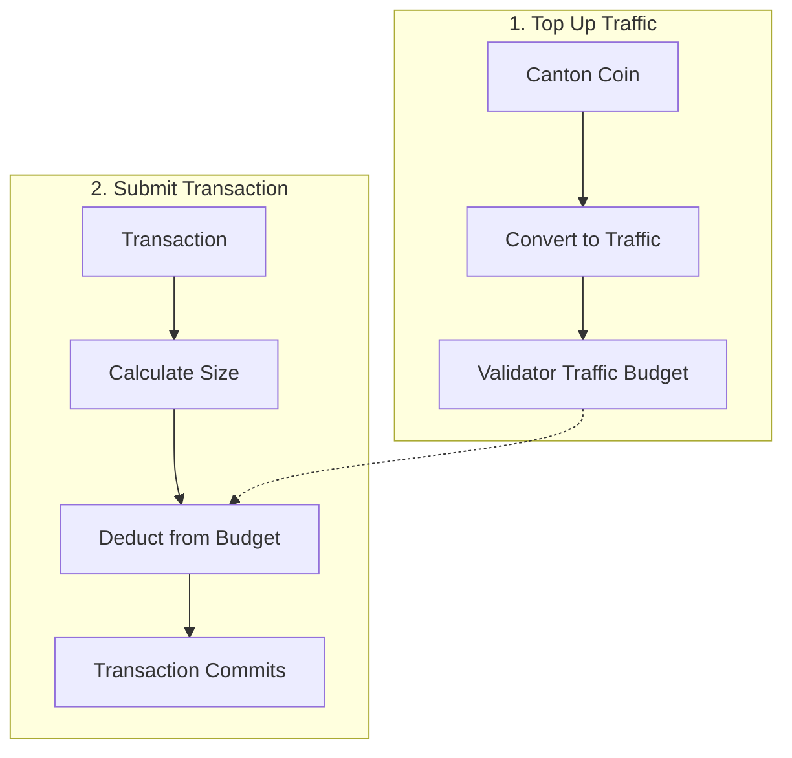

# Canton Coin

> Global Synchronizer 原生代币 Canton Coin 概念说明。

> 了解 Canton Coin 在网络经济中的作用

Canton Coin (CC) 是 全局同步器 的原生实用代币，为网络运营提供经济基础。

## 什么是 Canton Coin？

Canton Coin 是用于以下用途的原生代币：

|使用 |描述 |
| ------------------------------------------ | -------------------------------------------------- |
| **交易费用（流量）** |提交交易时支付网络使用费 |
| **验证者奖励** |激励基础设施运营商|
| **治理** |超级验证者质押 CC 参与 |

Canton Coin 是通过 [Splice](https://github.com/canton-network/splice) 实现的，Splice 是去中心化 Canton 同步器的开源基础设施。

## 流量：交易费用

「流量」是 Canton 对交易费用的术语。要在全局同步器上进行交易，您需要在验证器的流量预算中添加流量积分。

**两步过程：**

1. **充值**：将 Canton Coin 转换为流量积分，添加到验证人的流量预算中
2. **消费**：提交交易时，从预算中扣除流量积分

流量积分不可转让——CC 一旦转化为流量，只能用于支付交易费用。

### 流量如何运作

流量成本取决于：

|因素 |影响 |
| ---------------------------- | --------------------------------- |
| **交易规模** |较大的交易成本更高 |
| **计算复杂度** |更复杂的操作成本更高 |
| **网络需求** |可能随网络负载变化|

### 交通管理

为确保您的交易能够得到处理：

1. **维持验证者流量预算中的流量积分**
2. **充值** 当预算不足时将CC转换为流量积分
3. **监控使用情况**以规划成本

<Note>
  如果验证器的流量预算耗尽，交易将会失败。验证者可以配置自动充值，以便在余额低于阈值时自动将 CC 转换为流量积分。
</Note>

## 获取Canton Coin

如何获得 CC 取决于环境：

|环境 |方法|
| ------------ | ---------------------------------------------------- |
| **本地网络** |自动可用（测试CC）|
| **开发网** |水龙头（“敲击”）提供测试 CC |
| **测试网** |水龙头提供测试CC |
| **主网** |通过网络活动购买或赚取 |

### DevNet/TestNet 龙头

在测试网络上，您可以“点击”免费测试CC：

1. 访问您的钱包界面
2. 使用水龙头/水龙头功能
3.接收测试CC（无实际值）

测试CC是有速率限制的，没有经济价值。

### 主网获取

在主网上，CC具有真正的经济价值：

|方法|描述 |
| -------------------- | --------------------------------- |
| **交流** |从支持的交易所购买 |
| **网络活动** |通过验证者操作赚取收益 |
| **直接转账** |从其他方接收 |

## 验证者奖励

在全局同步器上运行的验证者可以通过以下方式获得 CC：

|奖励类型 |描述 |
| ----------------------- | --------------------------------- |
| **活跃度奖励** |用于维护节点可用性|
| **交易奖励** |流量费分成|

超级验证者对于操作同步器基础设施有额外的奖励机制。

## 代币经济学

全球同步器的代币经济学旨在：|目标|机制|
| ----------------------------------- | ------------------------ | |
| **维持基础设施** |运营商奖励 |
| **确保公平定价** |市场驱动的流量成本|
| **促进治理协调** |基于股权的参与 |
| **促进网络发展** |收养激励措施 |

有关详细的代币经济学，请参阅 [canton.foundation](https://canton.foundation)。

## Canton Coin 与其他加密货币

|方面|Canton Coin |其他 L1 代币 |
| -------------------- | ------------------------ | ---------------- |
| **主要用途** |网络实用程序 |变化 |
| **隐私** |私人余额 |经常公开 |
| **支架可见** |仅适用于有权方 |公共|
| **交易费用** |流量付费 |支付燃气费 |

### 持股隐私

与大多数余额公开可见的加密货币不同：

* 您的 CC 余额仅对您和有权方可见
* 转账详情在发送方和接收方之间保密
* 没有公开的富豪榜或余额查询

## 集成注意事项

### 对于应用程序开发人员

|考虑|方法|
| ---------------------- | ---------------------------------------------------- |
| **流量估算** |估算用户运营成本 |
| **充值流量** |构建自动或用户触发的充值 |
| **错误处理** |优雅处理余额不足|
| **用户交流** |告知用户流量费用|

### 对于验证者

|考虑|方法|
| -------------------------------------- | -------------------------------------------------------------------------- |
| **流量预算监控** |跟踪您的主办方的流量积分余额 |
| **自动充值** |配置自动CC → 预算低时流量转化 |
| **奖励管理** |处理获得的 CC 奖励 |

## 后续步骤

<CardGroup cols={2}>
  <Card title="用户钱包" icon="wallet" href="/integrations/wallets/for-users">
    管理您的Canton Coin。
  </Card>

  <Card title="验证器操作" icon="server" href="/global-synchronizer/understand/introduction">
    经营并赚取奖励。
  </Card>
</CardGroup>

---

> 本文由 CC Privacy Club 根据 Canton Network 官方文档（CC-BY-4.0）整理翻译，仅供学习；实现细节以官方最新版本为准。
