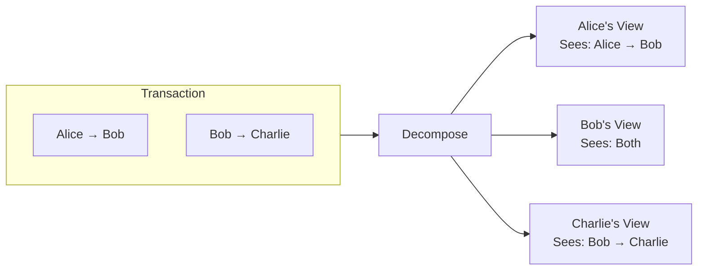
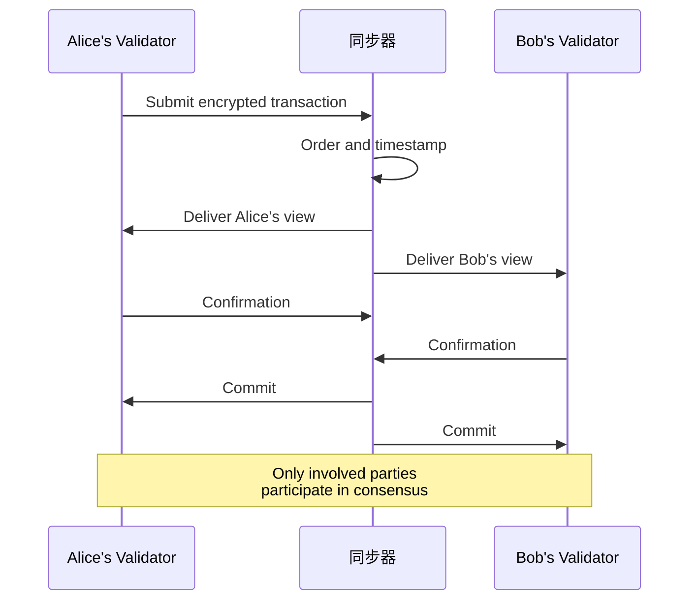
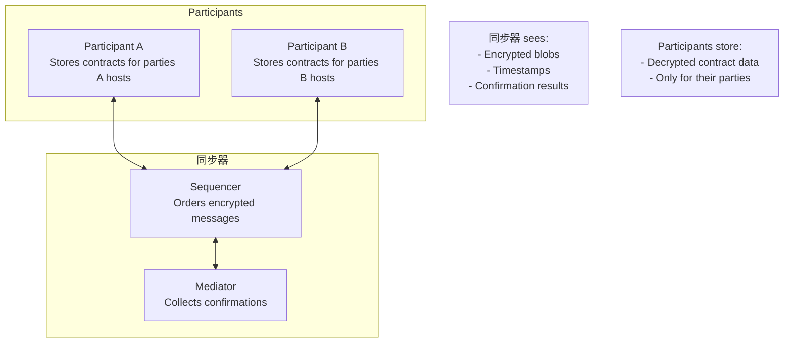
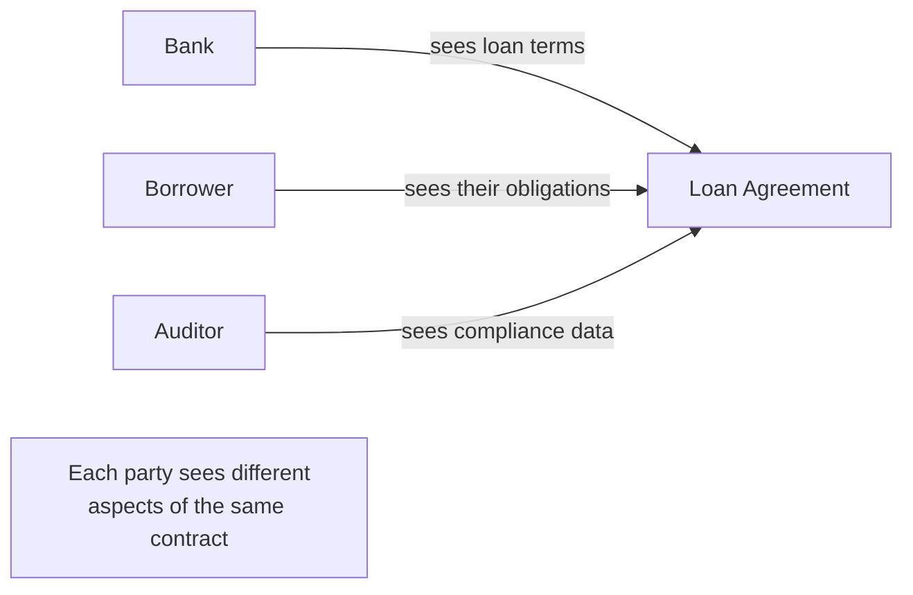

# Canton 的解决方案

> Canton 对区块链「透明 vs 隐私」根本张力的架构性解答。

> Canton 如何在不牺牲诚信的情况下实现隐私

Canton 通过三个架构支柱解决了隐私与完整性的权衡问题，这三个架构支柱共同提供强大的隐私保证和区块链级完整性。

## 第一支柱：子交易隐私

Canton 的核心创新是**子交易隐私**。这在两个层面上起作用：

1. **交易隔离**：不同的交易完全分开——无关方甚至不知道其他交易的存在
2. **查看分解**：在单个交易中，不同方只能看到其相关部分

### 视图如何工作

当交易涉及多方时，Canton 不会将整个交易发送给每个人。相反：

1. **分解**：根据利益相关者关系将交易拆分为视图
2. **加密**：每个视图都针对其特定接收者进行加密
3. **分发**：同步器仅向每个参与者分发授权视图
4. **验证**：每个参与者独立验证他们的观点
5. **确认**：参与者仅根据自己的观点进行确认

在此示例中，单个原子交易将价值从 Alice 转移到 Bob 再转移到 Charlie。但爱丽丝从未了解查理，查理也从未了解爱丽丝。

### 各方看到的内容

|参与方 |看到 |没看到 |
| ---------------- | -------------------------------- | -------------------------------------------------------- |
| **爱丽丝** |她向鲍勃付款|鲍勃向查理付款；查理的身份|
| **鲍勃** |两项付款（均涉及）|没有什么隐藏的|
| **查理** |他从鲍勃那里收到的收据|爱丽丝的参与；原始出处|
| **同步器** |仅限加密消息 |任意交易内容 |

这不仅仅是隐藏数据，它还为信息流提供了数学上强制的边界。

## 支柱 2：利益相关者共识证明

传统区块链要求所有验证器验证所有交易。 Canton 采用了不同的方法：**只有交易中的利益相关者需要确认**。

### 为什么这有效

考虑一下：为什么验证者需要验证他们不参与的交易？

在传统区块链中，验证者会验证所有内容以防止双花并确保规则得到遵守。但如果只有 Alice 和 Bob 受到交易的影响，则只有 Alice 和 Bob 需要验证它。只要：

* Alice的验证者确认Alice授权了该交易
* Bob 的验证者确认 Bob 收到了他应该收到的信息
* 双方同意交易有效

那么交易就有效了。 Charlie 的验证器不需要看到它、验证它，甚至不需要知道它的存在。

### 缺乏全球知名度的诚信

这种方法保持了完整性，因为：

* **防止双花**：Alice 的验证器跟踪 Alice 的合约；不能花费不存在的东西；以信誉良好的代币为例，发行需要获得发行人的批准。
* **授权执行**：只有被声明为控制者的各方才能行使选择权
* **一致性**：同步器确保所有各方看到一致的事件顺序
* **原子性**：要么所有相关方都确认，要么交易被拒绝

## 第三支柱：不可见的同步**同步器**（排序器+中介节点）同步交易排序和确认，而无需查看交易内容。

### 同步器的作用

|功能|描述 |
| ---------------- | ------------------------------------------------------------------------ |
| **订购** |为交易和事件分配时间戳和总顺序 |
| **分布** |将加密视图路由至授权参与者 |
| **调解** |收集确认并宣布结果 |
| **一致性** |确保所有参与者看到相同的顺序 |

### 同步器不能做什么

|限制|保证|
| ----------------------- | ------------------------------------------------------------------ |
| **阅读内容** |只能看到加密的视图 |
| **识别最终用户** |了解路由各方，但不了解其背后的人员/系统 |
| **修改交易** |只能通过或拒绝|
| **存储状态** |没有持久化的交易数据 |

### 信任模型

同步器的有限能力是一个特性，而不是限制：

* **您无需信任同步器** 与您的数据 — 它无法读取您的数据
* **您确实信任同步器**的订购和可用性
* **同步器无法作弊**，因为它看不到正在同步的内容

这种关注点分离意味着：

* 隐私是通过加密方式而不是通过策略来强制执行的
* 同步器操作员无法提取交易情报
* 添加更多同步器操作符不会扩大数据暴露

## 支柱如何协同工作

这三大支柱是相互依存的：

|支柱|启用|
| -------------------------------------- | ---------------------------------------------------- |
| **子交易隐私** |可独立验证的观点 |
| **利益相关者证明** |缺乏全球知名度的共识 |
| **无可见性同步** |无需暴露数据即可订购 |

他们共同创建了一个系统：

1.各方仅收到自己的观点
2.各方仅验证自己的观点
3. 同步器永远看不到任何视图
4. 如果所有利益相关者都确认，交易将自动提交

## 现实世界的影响

该架构支持传统区块链上不可行的用例：

### 机密多方工作流程

多个组织可以共享一个工作流程，每个组织只能看到自己的部分：

### 隐私保护和解

交易双方在观察者看不到价格的情况下进行结算：

* 买家看到：收到资产、付款
* 卖方看到：资产已转移，付款已收到
* 市场：看不到价格或派对

### 监管合规性

满足数据保护要求，同时维护共享事实：

* 数据保留在有权方手中
* 为具有审计权的人提供审计追踪
* 最大限度地减少跨境数据流动

## 后续步骤

<CardGroup cols={2}>
  <Card title="用例" icon="building" href="/zh/docs/canton/overview-understand-use-cases">
    请参阅 Canton 的具体实例。
  </Card><Card title="核心概念" icon="book" href="/zh/docs/canton/overview-understand-core-concepts">
    了解参与方、验证者和同步者。
  </Card>

  <Card title="架构深度探究" icon="diagram-project" href="/zh/docs/canton/overview-learn-architecture">
    了解组件如何在技术上协同工作。
  </Card>

  <Card title="隐私模型" icon="lock" href="/zh/docs/canton/overview-learn-privacy-model">
    详细探讨隐私保证。
  </Card>
</CardGroup>

---

> 本文由 CC Privacy Club 根据 Canton Network 官方文档（CC-BY-4.0）整理翻译，仅供学习；实现细节以官方最新版本为准。
