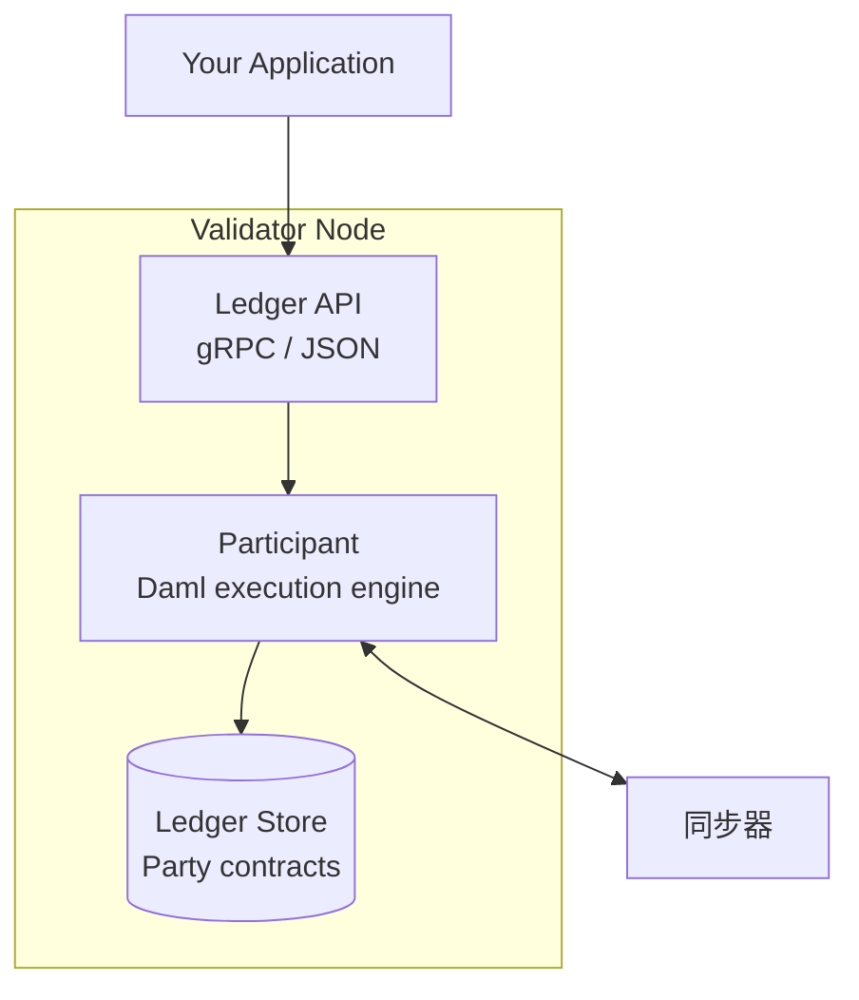
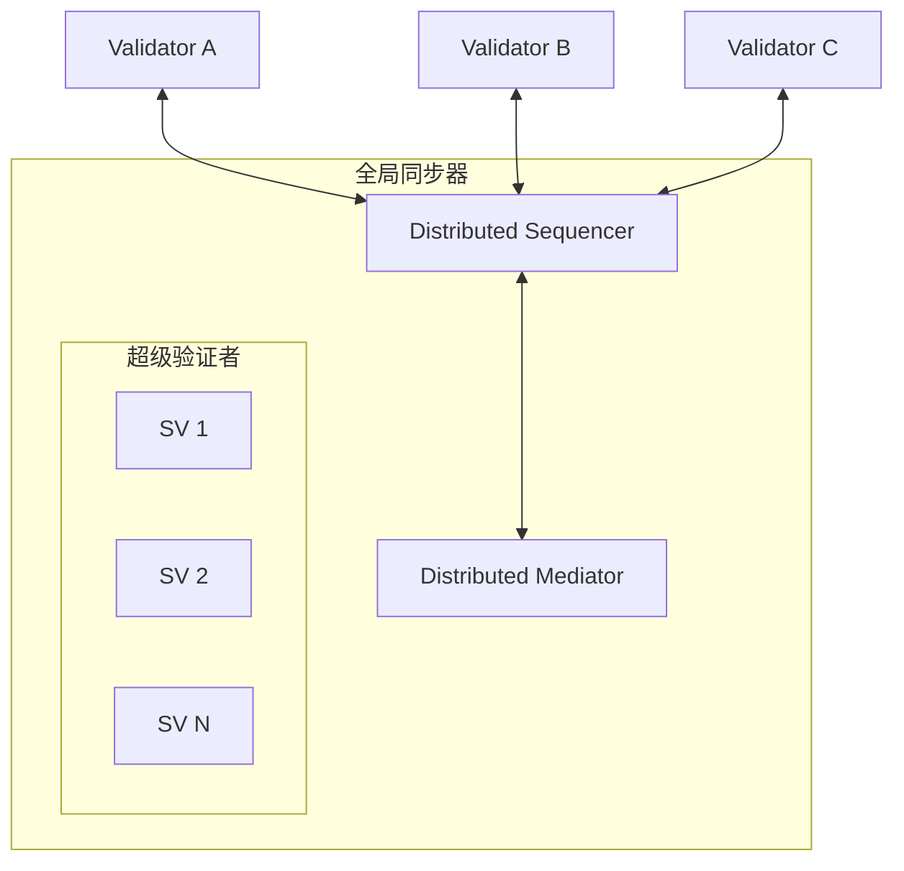
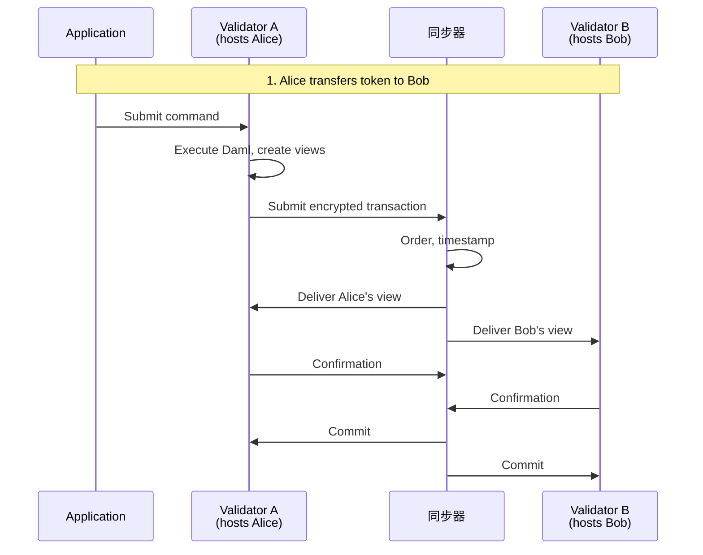

# 核心概念

> Canton Network 核心概念速览。

> Canton Network 的基本构建模块：各方、验证器、同步器和智能合约

了解 Canton 需要掌握四个基本概念：**各方**、**验证者**节点、**同步器**和**模板**（智能合约）。本页介绍了每一个并解释了它们如何协同工作。

## 参与方 (Party)

**参与方 (Party)** 是 Canton 的账本身份，类似于其他区块链上的地址或帐户，但具有明确的授权语义。

### 参与方标识符格式

```
alice::1220f2fe29866fd6a0009ecc8a64ccdc09f1958bd0f801166baaee469d1251b2eb72
└┬┘  └─────────────────────────────────────────┘
name                                fingerprint (hash of public key)
```

### 参与方 (Party)做什么

|能力|描述 |
| ------------ | --------------------------------------------------- |
| **签署** |授权合同创建（作为签署人）|
| **行动** |执行合同选择（作为控制者）|
| **参见** |观察合同和交易（作为利益相关者） |
| **验证** |确认影响其合约的交易 |

### 本地与外部各方

|类型 |钥匙持有者 |使用案例|
| ------------------ | ---------------- | ---------------------------------------------------------------- |
| **本地参与方** |验证者 |更简单；验证者代表一方签名。有利于自动化。 |
| **外部方** |外部系统|用户钱包；需要明确的签名工作流程 |

<Note>
  与以太坊地址不同，各方在验证器上创建状态并产生与创建相关的成本。精心设计参与方结构——不要创建不必要的参与方。
</Note>

### 合同中的各方角色

各方以三种角色与合约互动：

```haskell theme={"theme":{"light":"github-light","dark":"github-dark"}}
template Asset
  with
    issuer : Party   -- Will be signatory
    owner : Party    -- Will be observer and controller
    auditor : Party  -- Will be observer
  where
    signatory issuer        -- Must authorize creation; always sees contract
    observer owner, auditor -- Can see contract

    choice Transfer : ContractId Asset
      with newOwner : Party
      controller owner      -- Only owner can exercise this choice
      do create this with owner = newOwner
```

|角色 |可以创建 |可以看到 |可以行动 |
| -------------- | -------------- | ---------------- | -------------------- |
| **签署人** |必须授权 |永远 |如果也是控制器|
| **观察员** |没有 |是的 |如果也是控制器|
| **控制器** |没有 |锻炼时|是（具体选择） |

<Note>
  **利益相关者**=签署者+观察员。利益相关者是所有可以看到合同的各方。当托管方是利益相关者时，验证者会为其托管方存储合同。
</Note>

## 验证者（参与者节点）

**验证者**主持各方，存储他们的合同数据，并参与 Canton 协议。验证器包含一个参与者节点（Daml 执行引擎）和一个验证器进程。

### 验证器做什么

|功能|描述 |
| ---------------------------------- | ---------------------------------------------------- |
| **举办派对** |为其主办方存储合同 |
| **执行Daml** |运行智能合约逻辑 |
| **验证交易** |验证授权及正确性 |
| **公开 API** |为应用程序提供Ledger API |

### 验证器架构



### 主要特征* 每个验证者都维护账本的**本地化私有视图**（称为*活动合约集*）
* 验证者仅存储托管方为利益相关者的合约
* 多个参与方可以托管在一个验证器上
* 验证器可以连接到多个同步器
* 一个聚会可以在多个验证器上托管

<警告>
  您的托管验证器会看到您的所有数据。仔细选择你的验证者——这是一种信任关系。
</警告>

## 同步器

**同步器**在不查看交易内容的情况下协调交易排序和共识。它由两个部分组成：

### 音序器

排序器排序并分发消息：

|功能|描述 |
| ---------------- | -------------------------------------- |
| **订单** |分配时间戳和总排序 |
| **分发** |将加密邮件路由至收件人 |
| **一致性** |确保所有参与者看到相同的订单 |

定序器**不**：

* 解密消息
* 查看交易内容
* 永久存储交易数据（尽管它可能会缓存它）
* 了解涉及哪些最终用户（尽管它是根据参与方信息进行路由的）

### 调解员

中介者促进确认交易的共识协议：

|功能|描述 |
| ------------- | -------------------------------------------------------- |
| **收集** |收集参与者的确认|
| **聚合** |确定是否达到共识阈值 |
| **声明** |宣布交易结果（提交/拒绝）|

调解员**不**：

* 查看交易内容
* 了解正在确认的内容
* 商店确认详情

### 全局同步器

**全局同步器**是Canton Network的公共同步器：



* 由**超级验证者**（主要机构）运营
* 去中心化——没有单一操作员控制它
* 使用**Canton Coin（CC）**购买流量支付交易费用
* 由 **全球同步器基金会** 管理

## 智能合约（模板）

Canton 中的智能合约是使用 **Daml** 定义的，这是一种专为多方工作流程而构建的语言。 Daml **模板**通常定义：

* **数据**：合约持有哪些信息
* **各方**：谁可以查看合同并按照合同行事
* **选择**：可以采取哪些行动

### 模板结构

```haskell theme={"theme":{"light":"github-light","dark":"github-dark"}}
template Token
  with
    -- Data fields
    owner : Party
    issuer : Party
    amount : Decimal
  where
    -- Authorization
    signatory issuer
    observer owner

    -- Actions
    choice Transfer : ContractId Token
      with
        newOwner : Party
      controller owner
      do
        create this with owner = newOwner
```

### 合约是不可变的

与状态可变的 Solidity 合约不同，Daml 合约（模板实例）是不可变的。它们只能是`created`或`archived`。

|坚固性|达姆尔 |
| ------------------------ | | ------------------------------------------------ |
|就地修改状态 |存档旧合同，创建新合同 |
| `balances[addr] = newValue` | `create Token with owner = newOwner` |
|状态历史隐式 |通过合约明确状态历史 |

这种不变性是 Canton 隐私和完整性保证的关键。

### 选择：消费与非消费

|类型 |效果|使用案例|
| ----------------- | ----------------------- | ------------------------------------------------------ |
| **消费** |合同存档 |状态转换、转移 |
| **非消耗** |合同仍然有效 |监听客户端的查询、读取操作、事件 |```haskell theme={"theme":{"light":"github-light","dark":"github-dark"}}
-- Consuming: archives the contract
choice Transfer : ContractId Token
  controller owner
  do create this with owner = newOwner

-- Non-consuming: contract stays active
nonconsuming choice GetBalance : Decimal
  controller owner
  do return amount
```

## 组件如何协同工作

完整的交易流程涉及所有四个概念：



|步骤|组件|行动|
| ---- | ---------------- | ---------------------------------------------------- |
| 1 | **应用** |通过 Ledger API 提交命令 |
| 2 | **验证者A** |执行 Daml，创建事务视图 |
| 3 | **同步器** |订购、分发加密视图 |
| 4 | **验证者** |验证各自的观点|
| 5 | **同步器** |收集确认，声明提交 |
| 6 | **验证者** |存储承诺合同|

## 汇总表

|概念|它是什么 |关键属性|
| ---------------- | ---------------------------------- | --------------------------------------- |
| **派对** |账本身份 |具有明确的授权角色 |
| **验证器** |节点托管方|仅存储托管方的数据 |
| **同步器** |协调层|看不到内容就下单|
| **模板** |智能合约定义|定义数据、各方和选择 |
| **合同** |模板实例|不可变；变更创建新合同|

## 后续步骤

<CardGroup cols={2}>
  <Card title="架构深度探究" icon="diagram-project" href="/overview/learn/architecture">
    了解组件如何在技术上协同工作。
  </Card>

  <Card title="全局同步器" icon="globe" href="/overview/understand/global-synchronizer">
    了解公共协调层。
  </Card>

  <Card title="隐私模型" icon="lock" href="/overview/learn/privacy-model">
    详细了解子交易隐私。
  </Card>

  <Card title="开始构建" icon="code" href="/appdev/get-started/choose-your-path">
    开始在 Canton 上发展。
  </Card>
</CardGroup>

---

> 本文由 CC Privacy Club 根据 Canton Network 官方文档（CC-BY-4.0）整理翻译，仅供学习；实现细节以官方最新版本为准。
