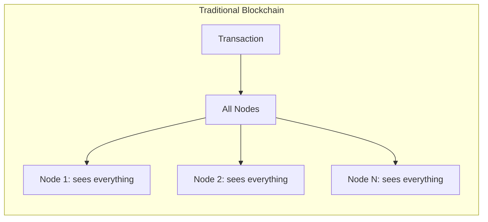
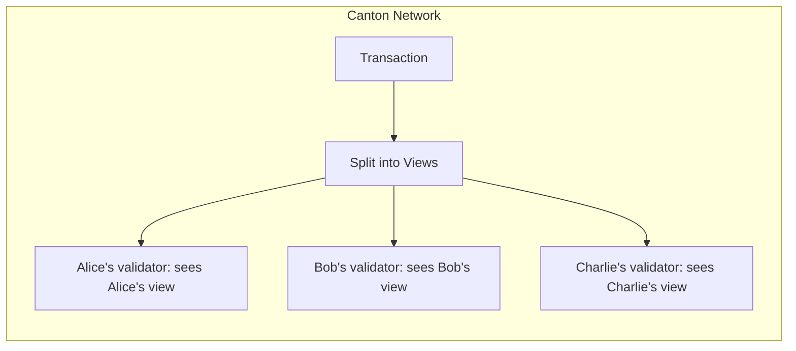
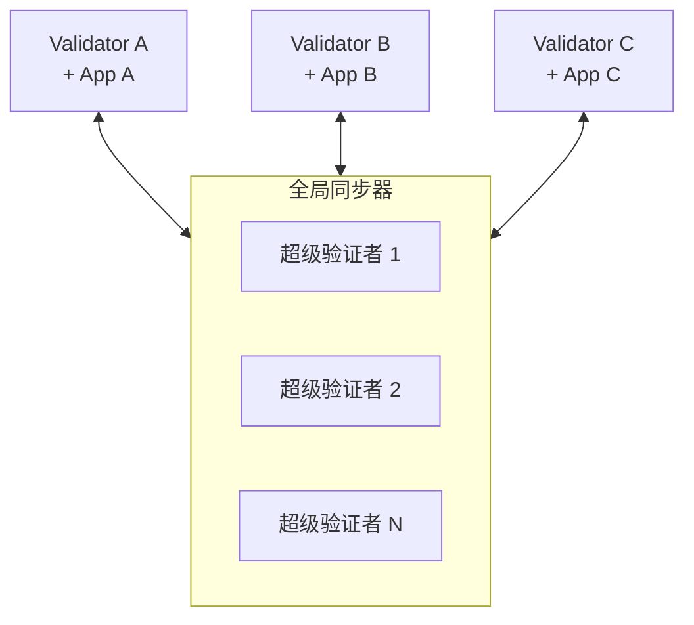

# 五分钟概览

> Canton Network 五分钟快速入门。

> 快速介绍 Canton Network 的隐私保护区块链方法

Canton Network 是一个公共区块链，它解决了一个基本问题：如何在不向所有人暴露敏感数据的情况下获得区块链的好处（共享真相、自动化、可审计性）？

## 核心洞察

传统区块链将所有数据复制到所有节点。这提供了强大的完整性保证，但无需额外的层即可防止隐私。

Canton 颠覆了这个模型：**数据只传送到需要传送的地方**。各方只能看到他们有权看到的内容，但系统保持与完全复制的区块链相同的完整性保证。





## 它是如何实现这一目标的

Canton通过三项关键创新实现了这一目标：

### 1. 子交易隐私

交易被分解为**视图**。各方仅收到根据其角色（签署人、观察员、控制人）有权查看的观点。

如果爱丽丝在一次原子交易中向鲍勃付款，而鲍勃向查理付款：

* Alice 看到她向 Bob 付款
* Bob 看到了两笔付款（他都参与了这两笔付款）
* 查理只能看到鲍勃的收据
* 没有其他人看到任何东西

### 2. 同步器仅同步，不存储事务状态

**全局同步器**对交易进行排序并促进达成共识，但从不查看交易内容。它仅处理加密消息和确认结果。

这种分离意味着：

* 没有可以读取所有数据的中心点
* 同步不可见
* 验证者为其托管方存储数据

### 3. 智能合约定义隐私

隐私并不是一个附加功能。 Daml 智能合约明确声明：

* **签字人**：谁必须授权并始终查看合同
* **观察者**：可以看到但不能采取行动的人
* **控制器**：谁可以执行特定操作

```haskell theme={"theme":{"light":"github-light","dark":"github-dark"}}
template Asset
  with
    owner : Party
    issuer : Party
    regulator : Party
  where
    signatory issuer      -- Must authorize; always sees
    observer owner, regulator  -- Can see

    choice Transfer : ContractId Asset
      with newOwner : Party
      controller owner    -- Only owner can execute the Transfer choice
      do create this with owner = newOwner
```

## 网络

Canton Network包括：

|组件|角色 |
| ----------------------- | -------------------------------------------------------------------- |
| **全局同步器** |由超级验证者运营的公共同步层 |
| **验证者** |托管各方并存储其合约数据的节点 |
| **Canton Coin (CC)** |交易费用原生代币 |
| **应用** |您在其之上构建的内容 |



每个验证器通常运行一个或多个应用程序。应用程序还可以与其他应用程序组合 - 使用其发布的 Daml 包在现有功能之上构建，同时保护隐私。

## 为什么这很重要

Canton 支持传统区块链上不可行的用例：|使用案例|为何 Canton 有效？
| ------------------------ | | ------------------------------------------------------------------------ |
| **受监管的金融** |数据由有权方保留；合规成为可能 |
| **多方工作流程** |共享真相，但没有共享可见性 |
| **保密协议** |条款仅对签署者可见 |
| **位置隐私** |交易策略受保护 |

## 有什么不同

如果您来自其他区块链：

|传统区块链|Canton |
| -------------------------- | --------------------------------------- |
|每个人都看到一切|各方只看到他们的观点|
|全局状态复制 |每方分布式状态 |
|隐私=附加层|隐私=核心协议|
|汽油费|交通费|
| EOA/地址 |参与方 |
|可变合约 |不可变；变更创建新合同|

## 后续步骤

<CardGroup cols={2}>
  <Card title="为什么选择 Canton？" icon="问题" href="/zh/docs/canton/overview-understand-the-problem">
    深入了解 Canton 要解决的问题。
  </Card>

  <Card title="核心概念" icon="book" href="/zh/docs/canton/overview-understand-core-concepts">
    了解各方、验证器、同步器和智能合约。
  </Card>

  <Card title="对于以太坊开发者" icon="ethereum" href="/zh/docs/canton/appdev-modules-m2-canton-for-ethereum-devs">
    将您的区块链知识转移到广州。
  </Card>

  <Card title="Architecture" icon="diagram-project" href="/zh/docs/canton/overview-learn-architecture">
    了解组件如何协同工作。
  </Card>
</CardGroup>

---

> 本文由 CC Privacy Club 根据 Canton Network 官方文档（CC-BY-4.0）整理翻译，仅供学习；实现细节以官方最新版本为准。
