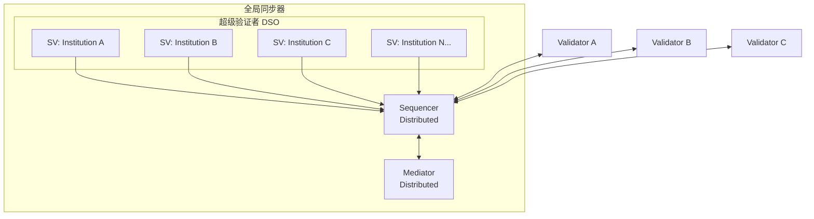
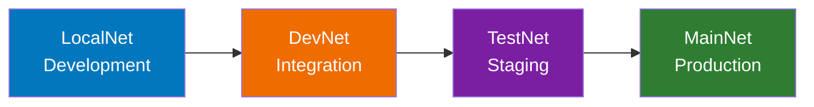

# 全局同步器

> Canton Network 公共协调层 Global Synchronizer 说明。

> Canton Network 公共基础设施骨干

全球同步器是 Canton Network 的公共基础设施骨干，是由超级验证者运营的去中心化同步器。

## 它是什么

全局同步器是：

* 由多个独立方操作的**同步器实例**（多个定序器+中介节点的 BFT 配置）
* **去中心化**：没有单一实体控制它
* **Canton Network 应用程序的默认协调层**
* 由 **Canton 基金会** 管理（隶属于 Linux 基金会）

注意事项：

* 全球同步器**不是**独立于 Canton Network 的区块链
* 验证器存储自己的状态；全局同步器**不是**一个单独的存储层
* 私有同步器也可以存在；所有 Canton 应用程序**不需要**全局同步器

## Canton Coin (CC)

Canton Coin是全球同步器的原生实用代币，用于：

|使用 |描述 |
| ------------------------------------------ | --------------------------------------------------------------------------- |
| **交易费用（流量）** |提交交易时支付网络使用费 |
| **基础设施奖励** |激励同步器运营商提供基础设施|
| **治理参与** |超级验证者质押 CC 参与治理 |

Canton Coin 通过 **Splice** 实现，这是一组参考应用程序，为去中心化同步器提供经济和治理基础设施。

### 流量（交易费用）

「流量」是 Canton 对交易费用的术语。当您通过全球同步器提交交易时，您以Canton Coin支付流量费用。

流量成本很大程度上取决于：

* 交易规模
* 计算复杂度
* 当前网络需求

### 获取Canton Coin

|环境 |方法|
| ------------ | -------------------------------------------------------------------- |
| **本地网络** |本地测试CC没有实际价值|
| **开发网** |水龙头（“敲击”）提供测试 CC |
| **测试网** |水龙头提供测试CC |
| **主网** |从交易所购买或通过网络活动赚取 |

## 网络环境

Canton Network 在四种环境中运行，每种环境在开发生命周期中都有不同的目的。

|环境 |目的|如何访问 | CC型 |
| ------------ | ------------------- | -------------------------------- | ---------------- |
| **本地网络** |本地发展|在您的机器上本地运行 |测试（无值）|
| **开发网** |集成测试| VPN 凭证 + SV 赞助 |测试（水龙头）|
| **测试网** |暂存/验证 |申请流程 |测试（水龙头）|
| **主网** |生产|全面入职|真正的价值|

### 本地网络

<Note>
  LocalNet 模拟一个完全在您的计算机上运行的全局同步器 - 无需外部网络。
</Note>

* **目的**：开发和初始测试
* **访问**：安装了 Daml SDK 的任何人
* **限制**：单机；不测试真实的网络行为

**何时使用**：编写和测试 Daml 合约；初始应用程序开发；学习 Canton。

### 开发网

* **目的**：与真实网络基础设施的集成测试
* **访问**：需要 VPN 凭证和超级验证者赞助
* **CC**：通过水龙头（“点击”）测试可用的代币

**何时使用**：测试多验证器工作流程；验证网络集成；生产前测试。

**访问流程**：1. 联系超级验证者赞助商
2. 接收VPN凭证
3. 配置您的验证器以进行连接
4. 点击测试 CC

### 测试网

* **目的**：暂存环境；生产前的最终验证
* **访问**：通过Canton Network申请流程
* **CC**：测试代币；没有实际价值

**何时使用**：最终集成测试；性能验证；用户验收测试；练习 CN 和应用程序升级。

### 主网

* **目的**：生产环境
* **访问**：完整的入职流程
* **CC**：被批准为特色应用后的实际经济价值

**何时使用**：生产部署；真实交易；实时应用程序。

<Note>
  DevNet、TestNet 和 MainNet 都运行在由相同超级验证者运营的基础设施上。区别在于准入要求以及Canton Coin是否具有真正的经济价值。
</Note>

### 环境进展

在环境中移动需要：

* **LocalNet → DevNet**：VPN 访问、SV 赞助
* **DevNet → TestNet**：应用程序批准、运营准备
* **测试网 → 主网**：全面上线、生产准备情况审核

## 超级验证者

超级验证者（SV）是运行全局同步器基础设施的实体。

### 职责

|责任|描述 |
| ---------------------------- | ------------------------------------------------------ |
| **基础设施运营** |运行定序器和中介器节点 |
| **治理参与** |对网络参数和升级进行投票 |
| **验证者赞助** |赞助新验证者加入网络 |
| **奖励分配** |接收和分发验证者奖励 |

### 去中心化同步器运营商 (DSO)

一组超级验证者运行节点共同组成了DSO。 DSO 统称：

* 操作同步器基础设施
* 做出治理决策
* 管理拼接应用程序
* 吸引新参与者

超级验证者包括主要的金融机构和技术提供商。目前的名单由Canton基金会维护。

## 成为验证者

作为全局同步器的验证者参与：

### 选项

|方法|描述 |努力|控制|
| -------------------- | -------------------------------------------------- | ------ | -------- |
| **节点即服务** |使用提供商来托管您的验证器 |最少 |中等|
| **自托管** |运行您自己的验证器基础设施 |大多数|完整|

### 要求

1. **获得赞助**：超级验证者必须赞助您的入职
2. **部署基础设施**：设置具有所需规范的验证器节点
3. **连接到同步器**：配置网络连接
4. **管理升级**：网络频繁升级；验证者必须跟上步伐

### 赞助流程

1. 联系超级验证者（列表可在 [canton.foundation](https://canton.foundation) 获取）
2. 描述您的用例和组织
3. 完成任何必需的协议
4. 获得赞助和访问凭证

<Note>
  对于应用程序开发人员来说，更简单的路径通常是使用现有的验证器（节点即服务）而不是自托管。这提供了网络访问而无需运营开销。
</Note>

## 治理

### Canton基金会

**Canton 基金会 (GSF)** 是 Linux 基金会下的一个独立的非营利机构，负责管理 全局同步器。

**职责**：

* 设置网络策略和参数
* 协调升级和维护
* 监督超级验证者的参与
* 管理 Splice 代码库治理
* 审查和委托特色应用程序

### 决策

治理决策遵循结构化流程：

1. **提案**：任何 SV 都可以提出变更建议
2. **讨论**：SV 讨论影响和修改
3. **投票**：SV根据治理规则进行投票
4. **实施**：批准的变更已实施

### 受监管的内容|面积 |示例 |
| ----------------------- | ------------------------------------------------ |
| **协议参数** |交易限制、时间窗口 |
| **经济参数** |费用结构、奖励分配|
| **会员资格** | SV 入场、验证者要求 |
| **升级** |协议版本、升级时间表 |

## 熔接应用

**Splice** 是一个开源项目（在 Hyperledger Labs 下），为操作、资助和管理去中心化 Canton 同步器提供基础设施。

### 组件

|组件|目的|
| ----------------- | ------------------------------------------ |
| **Canton Coin** |原生代币实施 |
| **验证器应用程序** |验证者节点管理 |
| **钱包** | CC的用户钱包 |
| **扫描** |网络浏览器|
| **治理** |投票和提案管理 |

### 代币标准

Splice 包含用于在 Canton Network 上创建代币的代币标准 ([CIP-0056](https://github.com/canton-foundation/cips/blob/main/cip-0056/cip-0056.md))。这提供了：

* 代币操作的标准接口
* 应用程序之间的互操作性
* 一致的钱包集成

## 升级注意事项

全局同步器和验证器目前升级频繁，预计明年升级速度会放缓。作为验证者或应用程序开发人员，期望：

|频率|类型 |影响 |
| ------------------ | ---------------- | ------------------------------------------------ |
| **每周-每月** |小更新 |最小；通常向后兼容 |
| **季刊** |功能发布 |可能需要应用程序更新 |
| **根据需要** |安全补丁|批判的;需要快速部署|

### 保持最新状态

* **监控公告**：订阅 Canton Network 通讯
* **在 DevNet/TestNet 上测试**：在主网升级之前验证兼容性
* **计划维护时段**：安排更新时间
* **维护回滚能力**：如果需要，有恢复程序
* **加入社区频道**：[#gsf-global-synchronizer-appdev](https://daholdings.slack.com/archives/C08FQRCRFUN)、[#gsf-outreach](https://daholdings.slack.com/archives/C08PT9P8ERM)、 [#validator-操作](https://daholdings.slack.com/archives/C08AP9QR7K4)

## 后续步骤

* **[词汇表](/概述/理解/词汇表)** - 术语参考
* **[验证器操作](/global-synchronizer/understand/introduction)** - 部署您自己的验证器
* **[部署进度](/appdev/modules/m5-deployment-progression)** - 跨环境部署应用程序

  # 同步器

  深入研究同步器架构；功能需求已在protocols.rst中确定

  ## 定序器

  * 会员；信封和收件人，包括投影（保密递送）
  * 订购保证
    * 作为单独的协议层排序（见下文）
  * 交通管理
  * 流量积分由排序器管理并由排序器操作员充值
  * 时间来源
    * 账本时间、提交时间（重命名为准备时间？？？）、偏差

  ## 调解者

  \<[https://github.com/DACH-NY/canton/issues/25653](https://github.com/DACH-NY/canton/issues/25653)>

  Mediator = 两阶段提交协调器

  * 获取预期法定人数列表（目前是一棵树）
    * 在有限的时间内删除重复请求

  ### 排序层

  \<[https://github.com/DACH-NY/canton/issues/25653](https://github.com/DACH-NY/canton/issues/25653)> \* API 规范

  * 链接集成概述
    * 彗星BFT
    * DA BFT（一旦我们有这方面的文档）
    * DB 定序器（一旦我们准备好）
  * 没有提及 Fabric / Besu

  \<[https://github.com/DACH-NY/canton/issues/25653](https://github.com/DACH-NY/canton/issues/25653)> \* 删除所有实现细节（特别是内部架构）

  * 如果合适，将它们移至“子网”章节。

---

> 本文由 CC Privacy Club 根据 Canton Network 官方文档（CC-BY-4.0）整理翻译，仅供学习；实现细节以官方最新版本为准。
