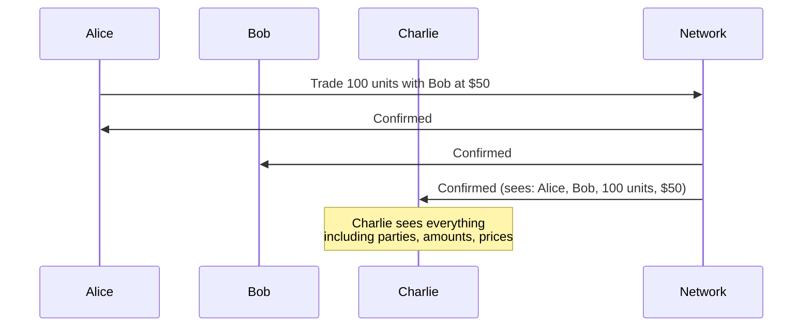

# Canton 要解决的问题

> 区块链「透明 vs 隐私」矛盾与 Canton 的切入点。

> 了解区块链系统中隐私与公众可见性的权衡

区块链技术承诺在彼此不完全信任的各方之间共享真相。但传统区块链通过完全的公众可见性来实现这种信任——每个人都可以看到一切。对于许多现实世界的应用程序来说，这是一个破坏性的事情。

## 公众可见度问题

考虑一下当 Alice 与 Bob 交易时以太坊上会发生什么：

1. Alice 提交交易
2. 交易进入mempool（所有人可见）
3. 矿工/验证者将其包含在区块中
4. 网络中的每个节点都存储交易
5. 任何人都可以永远查询交易明细

这意味着：

* Charlie 可以看到 Alice 与 Bob 进行了交易
* Charlie 可以看到价格、资产和金额
* Charlie 可以分析 Alice 随着时间的推移的交易模式
* 如果查理是一名竞争对手，他现在拥有宝贵的情报

## 为什么隐私很重要

公共透明度问题不是理论上的。它阻碍了真正的采用：

### 抢跑风险

当事务在执行之前和执行期间可见时，观察者可以利用该信息。在传统金融中，这是非法的。在公共区块链上，它是结构性的。

### 竞争情报

每笔交易都揭示信息：

* **交易策略**：模式分析揭示您的方法
* **业务关系**：与您进行交易的人揭示了合作伙伴
* **头寸大小**：竞争对手了解您的曝光度
* **定价信息**：交易对手看到您的其他交易

### 监管障碍

许多行业对数据都有法律要求：

* **金融法规**：客户数据必须受到保护
* **数据主权**：信息不得离开某些司法管辖区
* **保密义务**：合同隐私要求

### 商业现实

没有企业会将敏感的业务逻辑和交易放在竞争对手可以读取的系统上。时期。

## 不完美的缓解解决方案

业界尝试了多种方法来为公共区块链添加隐私：

### 私人频道

像 Hyperledger Fabric 这样的系统为参与者子集创建单独的通道。

**问题：**

* 碎片：跨通道没有共享状态
* 复杂性：管理频道成员资格
* 互操作性有限：跨渠道交易困难

### 零知识证明

ZK-rollups 和基于 ZK 的系统在不泄露内容的情况下证明交易有效性。

**问题：**

* 计算开销：证明生成成本高昂
* 复杂性：ZK电路难以开发和审核
* 表达能力有限：并非所有业务逻辑都符合ZK约束
* 可信设置要求：某些系统需要信任假设

### 第 2 层解决方案

将交易移出主链并定期在链上结算。

**问题：**

* 数据可用性：L2 运营商通常可以看到所有交易
* 信任假设：用户必须信任L2运营商
* 结算延迟：最终确定需要等待 L1 确认
* 桥接风险：在层之间移动资产会引入攻击面

### 静态加密

加密存储在链上的数据。

**问题：**

* 密钥管理：谁拥有解密密钥？
* 元数据暴露：交易模式仍然可见
* 未来的漏洞：今天的加密数据明天可能会被解密
* 计算限制：无法轻松计算加密数据

## 基本面紧张

这些方法都将隐私视为添加到公共系统之上的东西。他们是在对抗架构，而不是与它合作。

根本的张力是：

|要求|传统方法|结果 |
| ---------------- | ---------------------------------- | ----------------------- |
| **诚信** |所有节点验证所有交易 |需要可见性 |
| **验证** |验证者查看交易内容 |暴露私人数据 |
| **隐私** |隐藏交易内容 |破坏验证 |传统区块链迫使你做出选择：完整性或隐私。

## Canton的洞察力

Canton通过改变“共识”的含义来解决这种紧张局势：

* 验证者不需要查看他们不参与的交易
* 交易各方可以达成共识
* 协调员可以在不查看交易内容的情况下订购交易

这不是一种解决方法，而是一种不同的架构基础。隐私内置于交易的运作方式中，而不是置于顶层。

<Note>
  Canton 将这种方法称为“子交易隐私”。每一方只能看到他们根据自己的角色（签名者、观察者、控制者）有权看到的交易部分。该系统无需全局可见性即可保持完整性。
</Note>

## 后续步骤

<CardGroup cols={2}>
  <Card title="Canton 的解决方案" icon="lightbulb" href="/zh/docs/canton/overview-understand-cantons-solution">
    了解 Canton 如何解决隐私与完整性的权衡问题。
  </Card>

  <Card title="隐私模型" icon="lock" href="/zh/docs/canton/overview-learn-privacy-model">
    深入研究子交易隐私机制。
  </Card>
</CardGroup>

---

> 本文由 CC Privacy Club 根据 Canton Network 官方文档（CC-BY-4.0）整理翻译，仅供学习；实现细节以官方最新版本为准。
