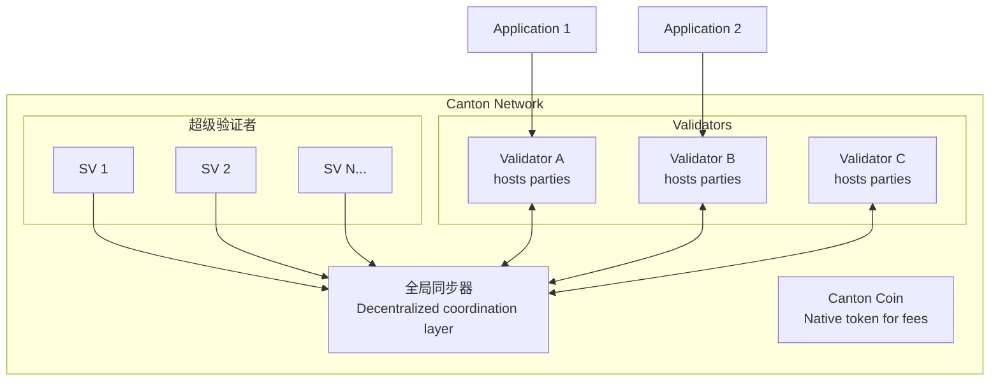

# 什么是 Canton Network

> Canton Network 是什么、与公链有何不同、何时适合使用。

> 适用于受监管资产和多方工作流程的隐私区块链

Canton Network 是一个公共第一层区块链，专为保护隐私交易而设计。与所有交易对所有参与者都可见的传统区块链不同，Canton 可以选择性披露——各方只能看到他们有权看到的数据。

## 60 秒推介

Canton Network 解决了区块链中的一个基本矛盾：**透明度与隐私**。像以太坊这样的传统区块链提供完整性和去中心化，但将所有交易数据暴露给每个网络参与者。这使得它们不适合受监管的金融市场、机密业务流程以及数据隐私不可协商的任何应用程序。

Canton 提供：

* **子交易隐私**：同一交易中的不同方只能看到其相关部分
* **去中心化共识**：没有单一实体控制网络
* **监管合规性**：数据归拥有者所有
* **水平可扩展性**：添加节点进行扩展，无需全局状态复制

## Canton 要解决的问题

考虑一个简单的例子：爱丽丝想与鲍勃交易资产。在以太坊上，这种交易对每个人都是可见的——查理、戴夫和数千名匿名观察者可以看到价格、交易方和资产详细信息。

在受监管的金融领域，这是不可能的。位置可见性可以实现抢先交易。交易模式揭示了交易策略。合规性要求可能禁止与未经授权的各方共享某些数据。

Canton 通过从根本上改变数据的分发位置来解决这个问题。在大多数区块链中，所有状态和事务都会复制到所有节点。在 Canton，状态和交易仅分发到智能合约中指定的节点。这不是一个附加的隐私层——它是核心架构原则。

## Canton 有何不同

Canton 与其他区块链平台在三个基本方面有所不同：

### 子交易隐私

其他区块链在事后才添加隐私（ZK-rollups、私人通道），而 Canton 将隐私构建到协议层中。交易被分解为“视图”，各方只能看到自己的部分。

### 同步器与全球共识

Canton 不使用所有节点都复制的单一区块链。相反，**同步器**在不存储状态的情况下协调共识，而**参与者节点**（验证器）仅接收和存储与其托管方相关的数据。

### Daml 智能合约

Canton 使用 Daml，这是一种专为多方工作流程而构建的语言。与 Solidity 的命令式模型不同，Daml 提供：

* 明确的授权声明（谁可以做什么）
* 内置隐私控制（谁可以看到什么）
* 不可变合约（状态变化创建新合约）

## Canton Network 生态系统

**关键部件：**

* **全局同步器**：由超级验证者运营的公共协调层
* **Canton Coin (CC)**：用于交易费用和验证者奖励的原生实用代币
* **验证者**：托管各方并存储其合约数据的参与者节点
* **应用程序**：您构建的内容 - 通过 Ledger API 连接到验证器

## 谁使用 Canton

Canton Network 于 2023 年 5 月推出，得到了银行、市场基础设施和交易领域主要金融机构的支持。目前参会名单请参见[Canton Network 网站](https://www.canton.network/)。这种机构支持验证了 Canton 针对企业用例的方法，但也意味着该平台主要是为具有直接支持关系的企业开发人员而发展的。随着全球同步器的推出，任何建设金融基础设施的人都可以接入 Canton Network。

## 何时使用 Canton

### 理想用例

|使用案例|为何适合 Canton|
| --------------------------------------------------- | ------------------------------------------------------------------------------------------ |
| **需要保密的多方工作流程** |参与者不应看到彼此的头寸（例如银团贷款、贸易融资）|
| **受监管资产的代币化** |合规性需要数据主权（例如证券、房地产）|
| **跨组织流程** |没有共享可见性的共享状态（例如供应链、联盟应用程序）|
| **隐私保护 DeFi** |头寸和投资组合保持私密（例如交易、借贷）|

### 不太理想的用例

|使用案例|为何可能不适合 Canton|
| ------------------------------------------------ | ------------------------------------------------------------------------------------------ |
| **完全公开的应用程序** |透明度是特征，而不是限制（例如公共治理、公开拍卖）|
| **简单的单方应用程序** |分布式账本属性没有任何好处|
| **需要 EVM 互操作性** | Canton 本身并不与以太坊智能合约互操作
| **匿名公众参与** |Canton 参与方具有身份；真正的匿名系统需要不同的方法|

## 后续步骤

* **[Canton for Blockchain Developers](/zh/docs/canton/appdev-modules-m2-canton-for-ethereum-devs)** - 将您现有的区块链知识映射到 Canton 概念
* **[架构概述](/zh/docs/canton/overview-learn-architecture)** - 了解 Canton 的组件如何协同工作
* **[隐私模型解释](/zh/docs/canton/overview-learn-privacy-model)** - 深入探讨子交易隐私

---

> 本文由 CC Privacy Club 根据 Canton Network 官方文档（CC-BY-4.0）整理翻译，仅供学习；实现细节以官方最新版本为准。
